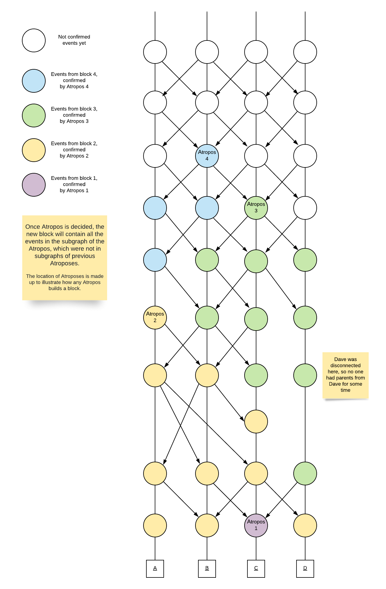

## Definitions

```validator``` - node which has a right to create events

```Atropos``` - root which was elected as a block head

```decided frame``` -  frame, which has decided all its roots. In other words, it’s a frame which has decided its Atropos

```subgraph of event A``` - graph which contains events which ```A``` observes.
In other words, it's a graph which contains only ```event A``` and ```A's ancestors```.

```Quorum``` - the quorum is defined as 2/3W+1, where W is the total validation stake.
```go
QUORUM=TotalStake*2/3 + 1
```

## forklessCause(A, B)
```event A is forkless caused by event B``` means:

In subgraph of ```event A```,  ```A``` didn’t observe any forks from ```B’s creator``` and
at least ```QUORUM``` non-cheater validators have observed ```event B```.

A note for experienced readers:
> forklessCause is a stricter version of "happened-before" relation, i.e.
if B forkless causes A, then B is happened before A.
> 
> Yet, unlike "happened-before" relation, forklessCause isn't transitive because it returns
false if fork is observed. So if A forkless causes by A, and B forkless causes C, it doesn't
mean that A forkless causes C. However, if there's no forks in the graph, then
forklessCause is always transitive.

## Roots
Event is a root, if it is forkless caused by ```QUORUM``` roots on previous frame.
The root starts new frame. Every event's frame cannot be less than self-parent's frame.
The lowest possible frame number is ```1```.

In more detail, the validator is free to choose
 any pair of frame/isRoot, as long as the pair qualifies the requirements:
```go
// check frame & isRoot
function verifyRootCondition(e Event)
    // e.selfParent.Frame is 0 if no self-parent
    if !e.IsRoot {
        // not allowed to advance frame if not root
        return e.Frame == e.selfParent.Frame
    } else {
        // always explicitly check forklessCause condition because forklessCause isn't transitive
        return e.Frame > e.selfParent.Frame AND (e.Frame == 1 OR (e is forklessCaused by {QUORUM} roots on e.Frame-1))
    }
```

A note for experienced readers:
> The definition of roots is originally drawn from a multi-round election.
Their intuition may be described as below:
> 
> Similar to separation of an election into rounds, the graph gets separated into frames.
Roots on a frame participate in election of all the roots on prior frames.
Roots could be seen as virtual voters on a frame,
which either DIRECTLY vote FOR/AGAINST roots on previous frame, or
vote FOR/AGAINST a root on a past frame
AS MAJORITY OF observed votes from roots on previous frame.

#### Roots example

The letter in event's name stands for validator's address, it's upper case if event is root.
First number stands for frame number, second number is event's sequence number.

Examples of the roots logic:
- A1.01 is a root, because it's first Alice's event.
- a1.03 isn't a root, because although it observes 3 roots at frame 1 (A1.01, C1.01, D1.01), it's forkless caused only by 1 root ar frame 1 (A1.01).
- A2.04 is a root, because it's forkless caused by at least 3 roots at frame 1 (A1.01, B1.01, D1.01). It receives new frame 2.


## Consensus algorithm
During connection of every root y, one iteration of the inner loop is executed.
The procedure calculates the coloring of the graph. Each root of the graph
may get one of the colors {decided as candidate, decided as not a candidate}, and a special temporary state {not decided}.
Once root has received one of the colors,
all other nodes will calculate exactly the same color, unless more than 1/3W are Byzantine.
This property of the coloring is the core of consensus algorithm.

```go
function decideRoots
    for x range roots: lowestNotDecidedFrame + 1 to up
        for y range roots: x.frame + 1 to up
            if x.root == false OR y.root == false OR x.frame >= y.frame
                continue
            round = y.frame - x.frame
            if round == 1
                y.vote[x] = see(x, y)
                x.candidate = nil
            else
                prevVoters = getRoots(y.frame-1) // contains at least {QUORUM} events, from definition of root
            
                yesVotes
                noVotes
                for prevVoter range prevVoters
                    if forklessCause(x, prevVoter) == TRUE
                        yesVotes = yesVotes + prevVoter's STAKE
                    else
                        noVotes = noVotes + prevVoter's STAKE
                // if the number of votes TRUE equals number of votes FALSE then a result vote is TRUE)
                y.vote[x] = (yesVotes - noVotes) >= 0
                if yesVotes >= QUORUM
                    x.candidate = TRUE // decided as a candidate
                    break	
                if noVotes >= QUORUM
                    x.candidate = FALSE // decided as a non-candidate
                    break
```

Once we have a coloring, identical on all the nodes, it allows us to define Atropos as one
of the {decided as candidate} roots.

```go
function chooseAtropos
    decided = decideRoots() // the set of decided roots
    roots = getRoots(frame)
    candidates // the set of candidate roots
    for root range roots
        if root.candidate == NULL // not decided
            break frame loop
        if root.candidate == TRUE
            candidates.add(root)
        if root.candidate == FALSE
            continue // NOTE: has 3 states {null, true, false}
    root = candidates.get(0)
    if candidates.length > 1
        // the hashFunction uniquely identifies the Atropos.
        root = hashFunction(candidates) 
    root.Atropos = true
```

Describing all the reasons why exactly the coloring will be calculated consistently, and why
exactly it allows us to build the aBFT consensus algorithm, is out of the scope of this doc.

Yet, long story short, the following factors are involved:

- If it was observed that a root has received V>=```QUORUM``` votes for one of the colors,
it means that, for any other root on next frame, its
```prevVoters``` (contains at least ```QUORUM``` events, from definition of root)
will overlap with V,
and the result of the overlapping will contain more than 1/2 of the ```prevVoters```
(it's crucially important that ```QUORUM``` is 2/3W+1, not just 2/3W). Which means that
ALL the roots on next frame will vote for the same color unanimously.
- Due to the ```forklessCause``` relation, if no more than 1/3W are Byzantine,
a malicious validator may have multiple roots on the same frame (due to forks),
but no more than one of the roots may be voted YES.
Algorithm assigns a color only in round >=2, so ```prevVoters``` is "filtered"
by ```forklessCause``` relation, to prevent deciding differently due to forks.
- If a root has received at least one YES vote, then it exists in the graph.
Moreover, non-existing events (from an offline validator) will be decided NO unanimously.
This way, non-existing event cannot get {decided as candidate} color,
and hence cannot become Atropos.
- Technically, the election may take forever. Practically, however, the elections end mostly in 2nd or 3rd round.
It would be possible to add a round wtih pseudo-random votes every C's round,
but it was considered as an unnecessary complexity.

## Atropos calculation example

The following example may be launched as ```go test ./poset -run TestPosetRandomRoots -v```

Network parameters in the example: 4 validators with equal stakes, maximum number of parents is 2

#### ASCII scheme
The letter in event's name stands for validator's address, it's upper case if event is root.
First number stands for frame number, second number is event's sequence number.

If you have problem with reading the ASCII scheme, you can use the "Steps" section to
determine the parents list of an event.
```
A1.01    
 ║         ║        
 ╠════════ B1.01    
 ║         ║         ║        
 ╠════════─╫─═══════ C1.01    
 ║         ║         ║         ║        
 ╠════════─╫─═══════─╫─═══════ D1.01    
 ║         ║         ║         ║        
 a1.02════─╫─═══════─╫─════════╣        
 ║         ║         ║         ║        
 ║         b1.02════─╫─════════╣        
 ║         ║         ║         ║        
 ║         ║         c1.02═════╣        
 ║         ║         ║         ║        
 a1.03════─╫─════════╣         ║        
 ║         ║         ║         ║        
 ╠════════ B2.03     ║         ║        
 ║         ║║        ║         ║        
 ║         ║╚═══════─╫─═══════ d1.02    
 ║         ║         ║         ║        
 ║         ║         C2.03═════╣        
 ║         ║         ║         ║        
 A2.04════─╫─════════╣         ║        
 ║         ║         ║         ║        
 ║         b2.04═════╣         ║        
 ║         ║║        ║         ║        
 ║         ║╚═══════─╫─═══════ D2.03    
 ║         ║         ║         ║        
 ║         ║         c2.04═════╣        
 ║         ║         ║         ║        
 ║         ║         ╠════════ d2.04    
 ║         ║         ║         ║        
 A3.05════─╫─═══════─╫─════════╣        
 ║         ║         ║         ║        
 ╠════════ B3.05     ║         ║        
 ║         ║         ║         ║        
 ║         ╠════════ C3.05     ║        
 ║         ║         ║         ║        
 ║         ╠════════─╫─═══════ D3.05    
 ║         ║         ║         ║        
 a3.06════─╫─═══════─╫─════════╣        
 ║         ║         ║         ║        
 ║         b3.06════─╫─════════╣        
 ║         ║         ║         ║        
 ║         ║         c3.06═════╣        
 ║         ║         ║         ║        
 ║         B4.07═════╣         ║        
 ║         ║         ║         ║        
 ║         ║         ╠════════ d3.06    
 ║         ║         ║         ║        
 A4.07════─╫─═══════─╫─════════╣        
 ║         ║         ║         ║        
 a4.08═════╣         ║         ║        
 ║║        ║         ║         ║        
 ║╚═══════─╫─═══════ C4.07     ║        
 ║         ║         ║         ║        
 ║         b4.08═════╣         ║        
 ║         ║         ║         ║        
 a4.09═════╣         ║         ║        
 ║3        ║         ║         ║        
 ║╚═══════─╫─═══════─╫─═══════ D4.07    
 ║         ║         ║         ║        
 ║         ║         c4.08═════╣        
 ║         ║         ║         ║        
 ║         b4.09═════╣         ║        
 ║         ║         ║         ║        
 ║         ╠════════ c4.09     ║        
 ║         ║         ║         ║        
 A5.10════─╫─════════╣         ║        
 ║         ║         ║         ║        
 ╠════════ B5.10     ║         ║        
 ║         ║3        ║         ║        
 ║         ║╚═══════─╫─═══════ d4.08    
 ║║        ║         ║         ║        
 ║╚═══════─╫─═══════─╫─═══════ D5.09    
 ║         ║         ║         ║        
 ║         ║         C5.10═════╣        
 ║         ║         ║         ║        
 ╠════════─╫─═══════─╫─═══════ d5.10    
 ║         ║         ║         ║        
 a5.11════─╫─═══════─╫─════════╣        
 ║         ║         ║         ║        
 ╠════════ b5.11     ║         ║        
 ║         ║         ║         ║        
 ║         ╠════════ c5.11     ║        
 ║         ║         ║         ║        
 A6.12════─╫─════════╣         ║        
 ║         ║         ║         ║        
 ║         ╠════════─╫─═══════ d5.11    
 ║         ║         ║         ║        
 ║         b5.12════─╫─════════╣        
 ║         ║         ║         ║        
 ║         ╠════════ C6.12     ║        
 ║         ║         ║         ║        
 ╠════════─╫─═══════─╫─═══════ D6.12    
 ║         ║         ║         ║        
 a6.13════─╫─═══════─╫─════════╣        
 ║         ║         ║         ║        
 ║         B6.13════─╫─════════╣        
 ║         ║         ║         ║        
 a6.14═════╣         ║         ║        
 ║║        ║         ║         ║        
 ║╚═══════─╫─═══════ c6.13     ║        
 ║         ║         ║         ║        
 ╠════════─╫─═══════ C7.14     ║        
 ║║        ║         ║         ║        
 ║╚═══════─╫─═══════─╫─═══════ d6.13    
 ║         ║         ║         ║        
 ║         b6.14════─╫─════════╣        
 ║         ║         ║         ║        
 a6.15═════╣         ║         ║        
 ║         ║         ║         ║        
 ║         B7.15═════╣         ║        
 ║         ║║        ║         ║        
 ║         ║╚═══════─╫─═══════ d6.14    
 ║         ║         ║         ║        
 ║         ║         c7.15═════╣        
 ║         ║         ║         ║        
 ╠════════─╫─═══════─╫─═══════ D7.15    
 ║         ║         ║         ║        
 A7.16════─╫─═══════─╫─════════╣        
 ║         ║         ║         ║        
 ║         b7.16════─╫─════════╣        
 ║         ║         ║         ║        
 ║         ║         c7.16═════╣        
 ║         ║         ║         ║        
 a7.17════─╫─════════╣         ║        
 ║         ║         ║         ║        
 ║         ║         ╠════════ d7.16    
 ║         ║         ║         ║        
 ║         b7.17════─╫─════════╣        
 ║         ║         ║         ║        
 ║         ║         c7.17═════╣        
 ║         ║         ║         ║        
 a7.18════─╫─════════╣         ║        
 ║         ║         ║         ║        
 ╠════════─╫─═══════ c7.18     ║        
 ║║        ║         ║         ║        
 ║╚═══════─╫─═══════─╫─═══════ d7.17    
 ║         ║         ║         ║        
 ║         B8.18════─╫─════════╣        
 ║         ║         ║         ║        
 ║         b8.19═════╣         ║        
 ║         ║║        ║         ║        
 ║         ║╚═══════─╫─═══════ D8.18    
 ║         ║         ║         ║        
 A8.19════─╫─═══════─╫─════════╣        
 ║         ║         ║         ║        
 ╠════════─╫─═══════ C8.19     ║        
 ║         ║         ║         ║        
 ╠════════─╫─═══════─╫─═══════ d8.19    
 ║         ║         ║         ║        
 a8.20════─╫─═══════─╫─════════╣        
 ║         ║         ║         ║        
 ║         B9.20════─╫─════════╣        
 ║         ║         ║         ║        
 ║         ║         C9.20═════╣        
 ║         ║         ║         ║        
 ║         ║         ╠════════ D9.20    
```


#### Steps
The log of the consensus - you may see which events were decided as Atroposes,
with this specific events connection order.
```
Connected event {name=A1.01, parents=[], frame=1, root}
Connected event {name=B1.01, parents=[A1.01], frame=1, root}
Connected event {name=C1.01, parents=[A1.01], frame=1, root}
Connected event {name=D1.01, parents=[A1.01], frame=1, root}
Connected event {name=a1.02, parents=[A1.01, D1.01], frame=1}
Connected event {name=b1.02, parents=[B1.01, D1.01], frame=1}
Connected event {name=c1.02, parents=[C1.01, D1.01], frame=1}
Connected event {name=a1.03, parents=[a1.02, c1.02], frame=1}
Connected event {name=B2.03, parents=[b1.02, a1.03], frame=2, root}
Connected event {name=d1.02, parents=[D1.01, b1.02], frame=1}
Connected event {name=C2.03, parents=[c1.02, d1.02], frame=2, root}
Connected event {name=A2.04, parents=[a1.03, C2.03], frame=2, root}
Connected event {name=b2.04, parents=[B2.03, C2.03], frame=2}
Connected event {name=D2.03, parents=[d1.02, B2.03], frame=2, root}
Connected event {name=c2.04, parents=[C2.03, D2.03], frame=2}
Connected event {name=d2.04, parents=[D2.03, c2.04], frame=2}
Connected event {name=A3.05, parents=[A2.04, d2.04], frame=3, root}
Connected event {name=B3.05, parents=[b2.04, A3.05], frame=3, root}
Connected event {name=C3.05, parents=[c2.04, B3.05], frame=3, root}
Connected event {name=D3.05, parents=[d2.04, B3.05], frame=3, root}
Connected event {name=a3.06, parents=[A3.05, D3.05], frame=3}
Connected event {name=b3.06, parents=[B3.05, D3.05], frame=3}
Connected event {name=c3.06, parents=[C3.05, D3.05], frame=3}
Connected event {name=B4.07, parents=[b3.06, c3.06], frame=4, root}
Connected event {name=d3.06, parents=[D3.05, c3.06], frame=3}
Connected event {name=A4.07, parents=[a3.06, d3.06], frame=4, root}
Connected event {name=a4.08, parents=[A4.07, B4.07], frame=4}
Connected event {name=C4.07, parents=[c3.06, A4.07], frame=4, root}
Connected event {name=b4.08, parents=[B4.07, C4.07], frame=4}
Connected event {name=a4.09, parents=[a4.08, b4.08], frame=4}
Connected event {name=D4.07, parents=[d3.06, A4.07], frame=4, root}
Connected event {name=c4.08, parents=[C4.07, D4.07], frame=4}
Connected event {name=b4.09, parents=[b4.08, c4.08], frame=4}
Connected event {name=c4.09, parents=[c4.08, b4.09], frame=4}
Connected event {name=A5.10, parents=[a4.09, c4.09], frame=5, root}

    Frame 1 is decided: Atropos is D1.01. Election votes:
    Every line contains votes from a root, for each subject. y is yes, n is no. Upper case means 'decided'. '-' means that subject was already decided when root was processed.
    B2.03: ynyy
    C2.03: yyyn
    A2.04: yyyn
    D2.03: ynyy
    A3.05: YnYy
    B3.05: -n-y
    C3.05: -y-y
    D3.05: -y-y
    B4.07: -n-Y
    A4.07: -y--
    C4.07: -y--
    D4.07: -y--
    A5.10: -Y--

    Frame 2 is decided: Atropos is A2.04. Election votes:
    Every line contains votes from a root, for each subject. y is yes, n is no. Upper case means 'decided'. '-' means that subject was already decided when root was processed.
    A3.05: nyyy
    B3.05: nyyy
    D3.05: yyyy
    C3.05: yyyy
    A4.07: yYYY
    B4.07: n---
    D4.07: y---
    C4.07: y---
    A5.10: Y---
    
    Frame 3 is decided: Atropos is D3.05. Election votes:
    Every line contains votes from a root, for each subject. y is yes, n is no. Upper case means 'decided'. '-' means that subject was already decided when root was processed.
    A4.07: yyyy
    B4.07: yyyn
    D4.07: yyyy
    C4.07: yyyy
    A5.10: YYYY

Connected event {name=B5.10, parents=[b4.09, A5.10], frame=5, root}
Connected event {name=d4.08, parents=[D4.07, b4.08], frame=4}
Connected event {name=D5.09, parents=[d4.08, a4.09], frame=5, root}
Connected event {name=C5.10, parents=[c4.09, D5.09], frame=5, root}
Connected event {name=d5.10, parents=[D5.09, A5.10], frame=5}
Connected event {name=a5.11, parents=[A5.10, d5.10], frame=5}
Connected event {name=b5.11, parents=[B5.10, a5.11], frame=5}
Connected event {name=c5.11, parents=[C5.10, b5.11], frame=5}
Connected event {name=A6.12, parents=[a5.11, c5.11], frame=6, root}
Connected event {name=d5.11, parents=[d5.10, b5.11], frame=5}
Connected event {name=b5.12, parents=[b5.11, d5.11], frame=5}
Connected event {name=C6.12, parents=[c5.11, b5.12], frame=6, root}
Connected event {name=D6.12, parents=[d5.11, A6.12], frame=6, root}

    Frame 4 is decided: Atropos is D4.07. Election votes:
    Every line contains votes from a root, for each subject. y is yes, n is no. Upper case means 'decided'. '-' means that subject was already decided when root was processed.
    A5.10: yyyy
    B5.10: yyyy
    D5.09: yyny
    C5.10: yyyy
    A6.12: YYyY
    C6.12: --y-
    D6.12: --Y-

Connected event {name=a6.13, parents=[A6.12, D6.12], frame=6}
Connected event {name=B6.13, parents=[b5.12, D6.12], frame=6, root}
Connected event {name=a6.14, parents=[a6.13, B6.13], frame=6}
Connected event {name=c6.13, parents=[C6.12, a6.13], frame=6}
Connected event {name=C7.14, parents=[c6.13, a6.14], frame=7, root}
Connected event {name=d6.13, parents=[D6.12, a6.13], frame=6}
Connected event {name=b6.14, parents=[B6.13, d6.13], frame=6}
Connected event {name=a6.15, parents=[a6.14, b6.14], frame=6}
Connected event {name=B7.15, parents=[b6.14, C7.14], frame=7, root}
Connected event {name=d6.14, parents=[d6.13, b6.14], frame=6}
Connected event {name=c7.15, parents=[C7.14, d6.14], frame=7}
Connected event {name=D7.15, parents=[d6.14, a6.15], frame=7, root}
Connected event {name=A7.16, parents=[a6.15, D7.15], frame=7, root}
Connected event {name=b7.16, parents=[B7.15, D7.15], frame=7}
Connected event {name=c7.16, parents=[c7.15, D7.15], frame=7}
Connected event {name=a7.17, parents=[A7.16, c7.16], frame=7}
Connected event {name=d7.16, parents=[D7.15, c7.16], frame=7}
Connected event {name=b7.17, parents=[b7.16, d7.16], frame=7}
Connected event {name=c7.17, parents=[c7.16, d7.16], frame=7}
Connected event {name=a7.18, parents=[a7.17, c7.17], frame=7}
Connected event {name=c7.18, parents=[c7.17, a7.18], frame=7}
Connected event {name=d7.17, parents=[d7.16, a7.17], frame=7}
Connected event {name=B8.18, parents=[b7.17, d7.17], frame=8, root}

    Frame 5 is decided: Atropos is B5.10. Election votes:
    Every line contains votes from a root, for each subject. y is yes, n is no. Upper case means 'decided'. '-' means that subject was already decided when root was processed.
    A6.12: yyyn
    D6.12: yyyy
    C6.12: yyyn
    B6.13: yyyy
    C7.14: YYYy
    B7.15: ---y
    D7.15: ---y
    A7.16: ---y
    B8.18: ---Y
    
    Frame 6 is decided: Atropos is B6.13. Election votes:
    Every line contains votes from a root, for each subject. y is yes, n is no. Upper case means 'decided'. '-' means that subject was already decided when root was processed.
    A7.16: yyyn
    B7.15: yyyn
    D7.15: yyyn
    C7.14: yyyn
    B8.18: YYYN

Connected event {name=b8.19, parents=[B8.18, c7.18], frame=8}
Connected event {name=D8.18, parents=[d7.17, B8.18], frame=8, root}
Connected event {name=A8.19, parents=[a7.18, D8.18], frame=8, root}
Connected event {name=C8.19, parents=[c7.18, A8.19], frame=8, root}
Connected event {name=d8.19, parents=[D8.18, A8.19], frame=8}
Connected event {name=a8.20, parents=[A8.19, d8.19], frame=8}
Connected event {name=B9.20, parents=[b8.19, d8.19], frame=9, root}
Connected event {name=C9.20, parents=[C8.19, d8.19], frame=9, root}
Connected event {name=D9.20, parents=[d8.19, C9.20], frame=9, root}
```

## Events connection order
Root's votes don't depend on events connection order, because
votes are built upon root's subgraph.

With a different events connection order,
the election may be decided by partially different events,
but the decided colors will be the same (unless more than 1/3W are Byzantine).

## Blocks
Once Atropos is decided, the new block will contain all the
events in the subgraph of the Atropos,
which were not in subgraphs of previous Atroposes.

The events in block are ordered by Lamport time, then by event hash.
Ordering by Lamport time ensures that parents are ordered before childs.

Block contains only ```MaxValidatorEventsInBlock``` highest events from each validator without forks (non-cheaters).
The reason of the constraint is to prevent potentially infinite blocks.


