**Fantom:**

**Architecture - Finality**

Fantom is a set of modular architecture components that each function
individually and holistically as a new decentralized service.

We start from the most basic design and add complexity with each step.
This will illustrate the necessity of each component and its relation in
the ecosystem.

**Architecture: State**

At the core, is the state, described as an account ledger of addresses
and balances.

**Architecture: Accounts**

An address is a public and private key pair. The public component of the
account is the address in the public account ledger included in the
State.

**Architecture: p2p**

Data is propagated to all participating nodes via a gossip based p2p
implementation. Explained as having awareness of your nearest neighbors
and telling them something that they don't know.

**Architecture: Transactions**

An address can sign a special type of payload, called a transaction, a
transaction specifies a value transfer from the signing party to the
destination party.

A transaction is propagated to all participating nodes via a gossip
based p2p implementation.

When a transaction is received the state will check that the signature
is valid for the sending party, and that they do have the available
balances (in the state) for the value transfer.

With the above, we can transfer value from *a* to *b* and all nodes will
agree on the current state.

**Architecture: Step 1**

With the above, we have explained a value transfer system. The above
components will allow you to send value from your account to another
account and have it be cryptographically secure.

What happens when *a* with a balance of 1, sends 1 to *b* and 1 to *c*,
which transaction do we choose?

**Architecture: Consensus**

We need the nodes to agree which one to choose. Consensus, is a process
whereby the nodes can form agreement on a given outcome. In its most
basic implementation this is a vote, consider 10 nodes, 6 votes for the
transaction to *b* and 4 vote for the transaction to *c*. We can discard
*c*. What happens when the vote is 5 vs 5? At this point we need an
arbitrator, we could at random select a node, and that node has the
final decision rights.

Instead of having this conflicting state, let’s allow 1 transaction
every epoch (for example 10 minutes), so we need a method which can
prove that roughly 10 minutes passed. We build a puzzle that we know
based on its difficulty, should take roughly 10 minutes to solve. To
solve the puzzle you have to guess the answer, if you successfully guess
the answer, you can submit the transaction. The other nodes can quickly
validate that you guessed the answer correctly, and they all accept your
transaction.

Node 1 could be guessing the puzzle with transaction *b* and Node 2
could be guessing the puzzle with transaction *c*, the one that wins is
determined by the node that solves the puzzle first.

**Architecture: Chain**

What happens when both nodes guess the puzzle right at the same time and
both transactions are propagated? Or when the vote is 5 vs 5. This is
considered a forked state. The system will continue. A new transaction
comes in and the voting or guessing begins again.

This round Node 1 wins the puzzle first and accepts the new transaction,
the longest chain is now transaction *b* and the new transaction. When
received by nodes that accepted transaction *c*, they see that more
"work" (2 rounds of guessing) has been done on *b* vs *c* (only 1 round
of guessing), so they discard *c* and use the *b* chain. This is the
longest chain principle. This also means that neither *b* nor *c* were
ever finalized.

If a longer chain were to come along, all transactions could be
reversed.

**Architecture: Blocks**

Can a system be functional that allows 1 transaction every 10 minutes?
Instead, we look for a mechanism whereby we can include more than one
transaction, we pack these transactions into a group, we call this group
a block.

Now we have a blockchain.

**Architecture: Block Time & Size**

Ethereum has a block time of 13 seconds. Ethereum has a gas limit on
blocks (maximum amount of transactions that can be fit into a block).
Bitcoin has a size limit (maximum amount of transaction bytes that can
be fit into a block.

So why not simply increase the block size and decrease the block time?

Each time the block size is increased it takes longer to propagate
through the network. The longer a block takes to propagate the higher
the increased likelihood of forks. This means more time spent
re-ordering.

If you decrease the block time. You increase the likelihood of more
blocks being created. Ethereum had to create the uncle principal for
blocks, since the block time is so small. An uncle is a valid block that
was simply created at the same time, instead of discarding it, Ethereum
allows a block creator to include uncles it is aware of and rewards the
miner accordingly

As we can see, decreasing block times or increasing block sizes have
system repercussions that must be addressed.

**Architecture: Finality**

Finality is the concept of how long it takes for a transaction to be
finalized. In Proof-of-Work solutions a transaction is never truly
finalized, but you can assume with a high degree of certainty that in
Bitcoin after 3 blocks have been added on top of the block containing
your transaction, that that transaction is final. So finality in Bitcoin
is roughly 30-40 minutes (10 minutes per block)

**Architecture: Step 2**

We have already identified a few constraints. We can list them as
follows;

-   Synchronous transaction processing

-   Slow & no finality

**Architecture: DAG**

A Directed Acyclic Graph allows for blockchain-like patterns that allow
for multiple branches. A blockchain can be seen as a single branch
system, trimming branches as new blocks are added onto longer chains.
This does not allow for asynchronous processing of events.

Another kind of data structure exists that does allow for asynchronous
event based processing, called the Directed Acyclic Graph. The term
itself has multiple implementations though, so let’s first discuss a
few.

-   Nano, is an account based DAG (Technically incorrect, it is a block
    > lattice) using Proof of Stake.

-   Iota, is a transaction based DAG (Tangle) using Proof of Work.

-   HashGraph, is a gossip based DAG using HashGraph.

-   Fantom, is a gossip based blockchain DAG.

-   Avalanche, is a UTXO based DAG.

The problem here is visualization. That which is complex to understand
is complex to adopt. A blockchain is easy to visualize. It’s a linked
list. We take transactions, put them in a block, the block references
the previous block. It’s a concept we know and visualize from childhood.
Stacking blocks on top of each other.

Now visualize a DAG? Even if you know what one looks like, now think
about each one described in the examples above?

Blockchain as a word has become interesting. It describes both a
structure, and a category. DAGs can also be blockchains (category) even
if they can’t be blockchains (structure).

So given that so many different implementations exist. How do we
demystify a DAG? Do we even have to? Why do we even want to use a DAG?

-   A block, is singular (synchronous).

-   A DAG, is plural (asynchronous).

Does a DAG given the same constraints as a blockchain perform better?
Finality can only occur once consensus has been reached. Even in a DAG
this needs 2n/3 consensus. Could we have packed the same amount of
transactions into the block as it took to reach 2n/3 consensus? From t=0
till 2n/3 consensus, how many transactions could we confirm vs how many
could we pack in a block?

DAGs will often talk about faster confirmation times. But it excludes
finality from this conversation. It will mention asynchronous
processing, but not discuss 2n/3 consensus.

If one node accepts a transaction in a blockchain, then that transaction
has been asynchronously processed and it has incredibly fast
confirmation times. But it has not reached consensus, or fake finality
(fake, since no PoW based blockchain has true finality).

Given that a transaction in a DAG is only finalized after 2n/3 and thus
only confirmed after 2n/3, is it really faster?

Then we start with the infinite scalability theorem. The more
participants in a network the greater the scalability. This ignores 2n/3
and network propagation.

So which is truly better? Blockchain, block lattice, HashGraph,
Avalanche? Does each one have a specific use case? Is that like asking
which is better? MySQL, MariaDB, PostgreSQL, MongoDB?

Consider a DAG with 2n/3 confirmation time. Let us consider finality / n

Transactions Per Second (To Finality) vs Node Participation

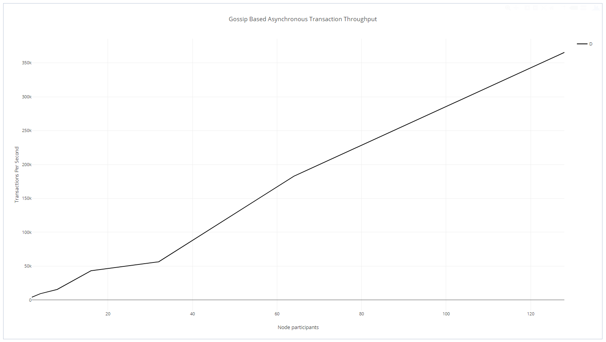

Asynchronous Transactions Per Second

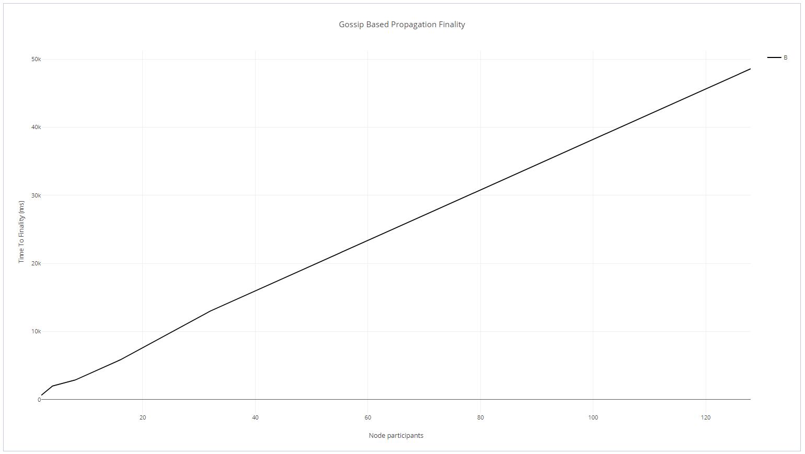

Time To Finality (ms) vs Node Participation (Appendix A for supporting
data)

We make the following assumptions;

-   100 transactions created every block

-   TTF O(n log n)

-   1 second block times

DAG: Each node can produce 1 block every second, TTF increases 0(n log
n) with participation

Blockchain: Each node can produce 1 block every second, TTF[1] remains
fixed

At 1 node

DAG: 100 @ 1s TTF

Blockchain: 100 @ 1s TTF

2 nodes

DAG: 200 @ 2s TTF

Blockchain: 100 @ 1s TTF

8 nodes

DAG: 800 @ 8s TTF

Blockchain: 100 @ 1s TTF

We can see where this is going.

**Architecture: Step 3**

With the above we have confirmed that asynchronous processing is
possible, but transactional throughput is limited by finality. Next we
explore how finality is achieved in DAG based systems.

**Architecture: 2n/3 Asynchronous Byzantine Fault Tolerant Consensus
Algorithms**

Asynchronous Byzantine Fault Tolerant Consensus Algorithms are primarily
gossip based algorithms. They define the concept that gossiping about
gossip allows us to achieve consensus.

We have 3 nodes A, B, and C. A receives a message and it decides it is
going to tell B. When B receives this message it decides it will tell C
about the message, and that A told it the message.

We can observe a few interesting results.

1.  With just 2 message synchronizations all 3 participants are aware of
    > the message

2.  Because C knows that A told the message to B, it has a rough order
    > of when the message was received. Before C and before B

All we want to achieve is ordering. What the message was doesn’t matter,
we simply want to know when it was received. So let’s add another
message.

A receives a message (1) and tells B. C receives a message (2) and tells
A. B having received the message (1) from A tells C. A having received
the message (2) from C tells B. Let’s break this down.

A -&gt; B

C -&gt; A

B -&gt; C

A -&gt; B

At this point what does A know? It knows it received message (1) before
message (2)

B knows it received message (1) before message (2)

C knows that A received message (1) before C received message (2)

So because we gossiped about gossip, we can establish an order of
messages received.

The above gives us ordering, but we also want finalization. Some point
in time we can assume the message is true because 2/3n of the network
participants are aware of the message. To facilitate this we establish
the concept of rounds. A round is complete when 2/3n of the participants
are aware of a message.

How do we know that 2/3n of participants are aware of a message? We
could simply ask each participant. But this has message overhead, so
instead, we can use our gossip about gossip to establish if a node is
aware of the message or not.

In the above example, A asks the question, do I know about message(1)?
Yes, A then asks, does B know about message (1)? Yes, A then asks, does
C know about message (1)? Yes. So A can “guess” that both B and C will
vote for message (1), because both of them can “see” it.

We do the same for B, do I know about message (1)? Yes, does A know
about message (1)? Yes, does C know about message (1)? Yes.

Lastly, we do the same for C, do I know about message (1)? Yes, does A
know about message (1)? Yes, does B know about message (1)? Yes.

By virtue of virtual voting, we could decide (thanks to the gossip about
gossip structure) the ordering and if 2/3n of participants are aware of
the message.

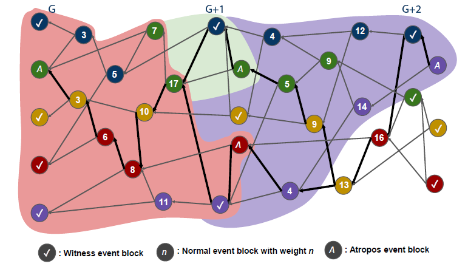

Above illustration shows 3 rounds, G, G+1, and G+2

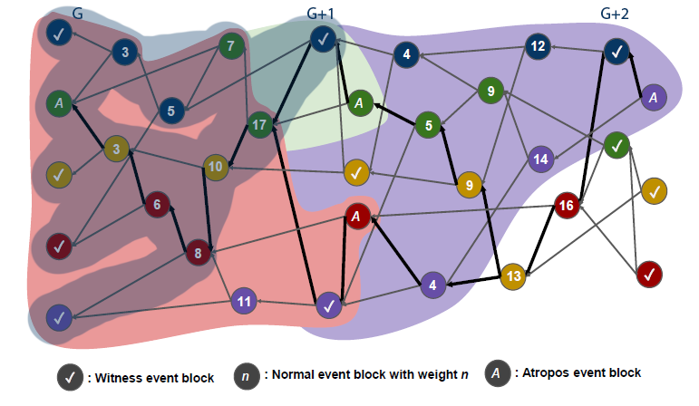

In round G+1, blue can “see” round G blue, green, yellow, red, and
purple.

In round G+1, green can “see” round G blue, green, yellow, red, and
purple.

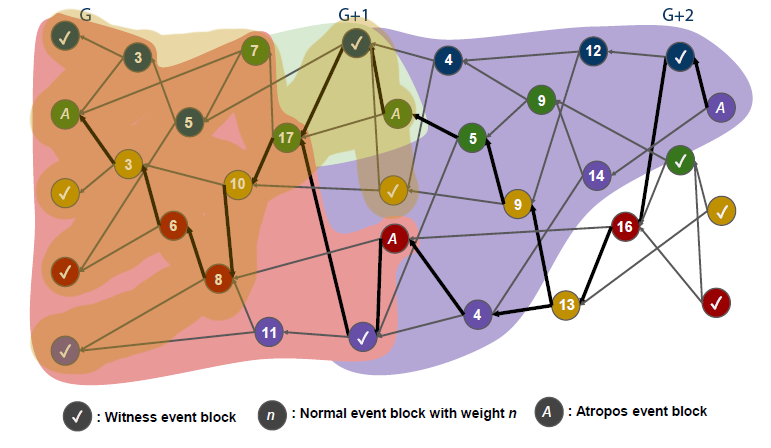

In round G+1, yellow can “see” round G blue, green, yellow, red, and
purple.

In round G+1, red can “see” round G blue, green, yellow, red, and
purple.

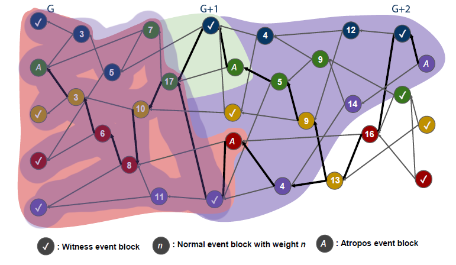

In round G+1, purple can “see” round G blue, green, yellow, red, and
blue.

In the above context, in G+1, we would have the following “virtual
votes”

Blue votes yes for blue, green, yellow, red, and purple

Green votes yes for blue, green, yellow, red, and purple

Yellow votes yes for blue, green, yellow, red, and purple

Red votes yes for blue, green, yellow, red, and purple

Purple votes yes for blue, green, yellow, red, and purple

With virtual voting the nodes know that all the events in G are famous.

**Architecture: O(n log n)**

What if we could approach O(log n) with Finality in a asynchronous
directed acyclic graph? With the current design of asynchronous
byzantine fault tolerant consensus algorithms a lot of processing occurs
event creation. This assumes an event must first be created, and then
for each event the virtual vote has to be tested.

Instead consider a consensus first design. When an event block is
created, a way to be able to immediately decide if the event is a
witness, and if its linked events are accepted by 2n/3 participating
nodes.

This would decrease our finality from *g+2* to *g* leaning us closer to
O(n)

The time complexity of the Lachesis algorithm means that a much faster
performance speed can be achieved with O(N Log(N)).

The performance speed according to the time complexity O(N2) and O(N
Log(N)) (n refers to number of nodes) is shown below.

n square = n \* n n

Log N = n \* log(n)

n\*n vs n \* log(n)

n vs log(n)

If n=10, nlog(n) \~ 2.3

If n=100, nlog(n) \~ 4.6

If n=1,000, nlog(n) \~ 6.9

If n=10,000, nlog(n) \~ 9.21

If n=100,000, nlog(n) \~ 11.5

If n=1,000,000, nlog(n) \~ 13.8

**Architecture: Flag Table**

How can this be accomplished? The change itself is fairly
straightforward, we add another in memory object called the Flag Table
(or Share Table)

The flag table stores share information from an event block to each
Witness, which is how many nodes share the Witness. Flag table is
utilized for assigning Atropos event block (Finalized block).

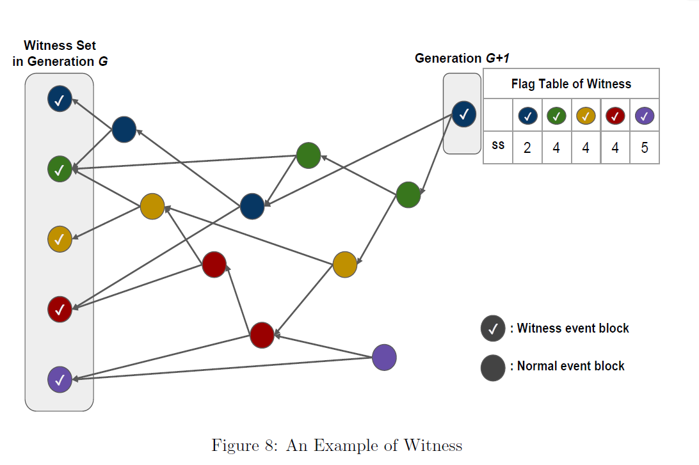

Figure 8 shows an example of a flag table of a Witness. In Figure 8, a
circle indicates an event block and a circle with ✓ mark means a
Witness. There are five participant nodes in this example and event
blocks are classified into different colors according to nodes that
generate the event blocks. When an event block is added to the OPERA
chain (DAG), the depth first search (Flag table selection) runs to check
whether the event block is a Witness. The event block in generation G+1
in Figure 8 is the first Witness of G + 1. The Flag table is a 2 x n
matrix where n is the number of nodes. According to this structure, the
flag table in Figure 8 has a 2 x 5 matrix. The first row indicates the
hash value of previous Witness created by participant nodes and second
row means the number of nodes from the event block to previous Witness.
We can consider the number of nodes on the paths as the share. For
example, the value of the first Witness (Blue) is 2. It means that the
event blocks on all paths from the Witness in G + 1 to the first Witness
in G are generated by two nodes.

**Architecture: Simulation**

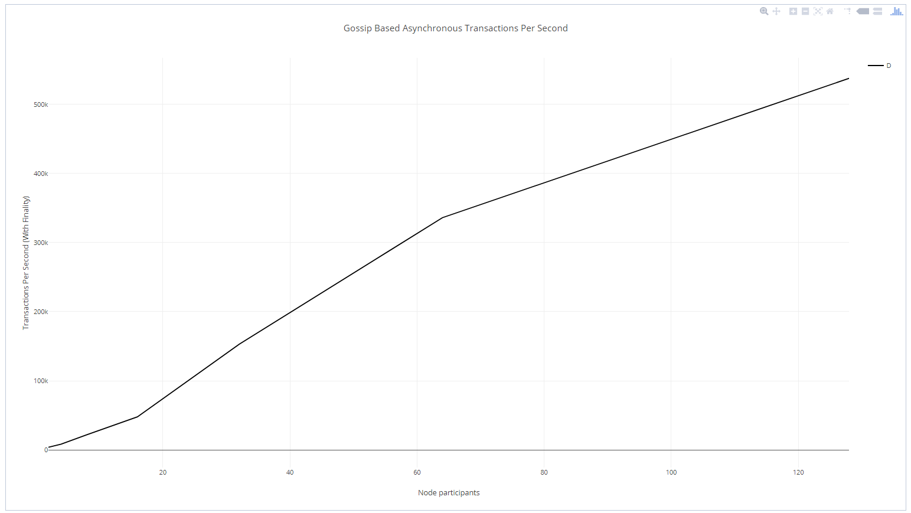

Gossip Based Asynchronous Transactions Per Second

The implementation of the flag table allows us to increase the time to
finality for witness creation.

**Architecture: Randomized Node Selection**

Another key component of asynchronous byzantine fault tolerant consensus
algorithms are their random selection mechanism. Whereby a new node to
gossip to is selected at random. This randomness increases the
likelihood of duplicate events over time.

For finality we have confirmed that witness selection is key in the
generation of a new round and thus 2n/3 finalization. Let’s design a
mechanism whereby we improve our option for witness selection.

**Architecture: Cost Function**

A key difference in the Lachesis protocol is the in-height vector
selection of Nodes known as the Cost Function.

The following is an excerpt from our technical paper;

We define Cost Function (*CF*) for preventing the creation of
isolated nodes and ensuring the even distribution of connections between
nodes. When a node creates an event block, the node selects another node
with a low cost function result, and we refer to the top event block of
the reference node. An equation (1) of *CF* is as follows,

*CF = I/H* (1)

where *I* and *H* denote certain values of in-degree vector and height
vector respectively. If the number of nodes with the lowest
*CF* is more than two, one of the nodes is selected at
random. If we select the node that has the highest *H*, we have a high
probability to create a Witness (*H* indicates that the communication
frequency of the node is high).

**Algorithm 2** Node Selection

1: **procedure** Node Selection

2: **Input**: Height Vector *H*, In-degree Vector *I*

3: **Output**: reference node *ref*

4: min\_cost ← INF

5: *sref* ← None

6: **for** *k* *ϵ* *Node\_Set* **do**

7: *cf* ← *Ik/Hk*

8: **if** min\_cost &gt; *cf* **then**

9: min\_cost ← *cf*

10: *sref* ← k

11: **else if** min\_cost equal *cf* **then**

12: *sref* ← *sref* ∪ *k*

13: *ref* ← random select in *sref*

Algorithm 2 shows the selection algorithm for a reference node. The
algorithm operates for each node to select a reference node. Line 4 and
5 set the min\_cost and *Sref* to an initial state. Line 7
calculates the cost function *cf* for each node. In line 8,
9, and 10, we find the minimum value cf and set *Sref*
accordingly. Line 13 selects randomly one node ID from *Sref*
as the selected reference node. The time complexity of Algorithm 2 is
O(n), where n is the number of nodes.

After the reference node is selected, two nodes communicate and share
information. A node creates an event block by referring to the top event
block of the reference node. The Lachesis protocol communicates
asynchronously.

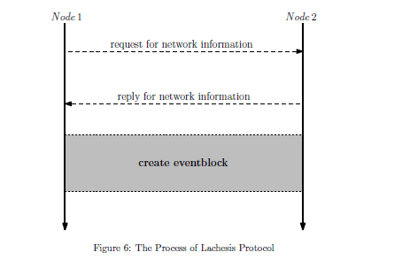

Let’s practically explain what is happening above

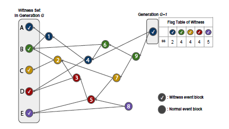

Node A, B, C, D, & E

Height Vector for all Nodes

| A   | B   | C   | D   | E   |
|-----|-----|-----|-----|-----|
| 0   | 0   | 0   | 0   | 0   |

In-degree Vector for all Nodes

| A   | B   | C   | D   | E   |
|-----|-----|-----|-----|-----|
| 0   | 0   | 0   | 0   | 0   |

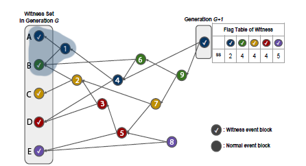

Node A receives a set of transactions, it wants to initiate a
synchronization event.

*CF = I/H* (1)

Node A has the following Height and In-degree Vector

Height Vector for all Nodes

| A   | B   | C   | D   | E   |
|-----|-----|-----|-----|-----|
| 0   | 0   | 0   | 0   | 0   |

In-degree Vector for all Nodes

| A   | B   | C   | D   | E   |
|-----|-----|-----|-----|-----|
| 0   | 0   | 0   | 0   | 0   |

For purposes of *CF\ * It calculates *Sref* as

A: - (Self)

B: 0 (0/0)

C: 0 (0/0)

D: 0 (0/0)

E: 0 (0/0)

We do a random select between B, C, D, and E

Node A synchronizes data to Node B

Node A

Height Vector for all Nodes

| A   | B   | C   | D   | E   |
|-----|-----|-----|-----|-----|
| 1   | 0   | 0   | 0   | 0   |

In-degree Vector for all Nodes

| A   | B   | C   | D   | E   |
|-----|-----|-----|-----|-----|
| 0   | 1   | 0   | 0   | 0   |

Node B

Height Vector for all Nodes

| A   | B   | C   | D   | E   |
|-----|-----|-----|-----|-----|
| 1   | 0   | 0   | 0   | 0   |

In-degree Vector for all Nodes

| A   | B   | C   | D   | E   |
|-----|-----|-----|-----|-----|
| 0   | 1   | 0   | 0   | 0   |

Node A created an Event Block (1), this increases its Height Vector by
+1

Node B Event Block B is referenced by Event Block (1) (Edge from 1 to
B), this increases the in-degree vector by +1

So we end up with

Height Vector

A+1

In-degree Vector

B+1

And the events are synchronized between the two nodes.

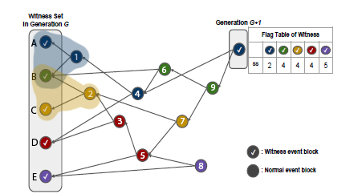

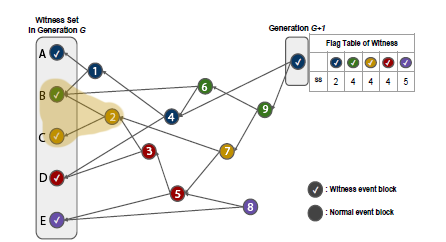

Node C has the following Height and In-degree Vector

Height Vector for all Nodes

| A   | B   | C   | D   | E   |
|-----|-----|-----|-----|-----|
| 0   | 0   | 0   | 0   | 0   |

In-degree Vector for all Nodes

| A   | B   | C   | D   | E   |
|-----|-----|-----|-----|-----|
| 0   | 0   | 0   | 0   | 0   |

For purposes of *CF\ * It calculates *Sref* as

A: 0 (0/0)

B: 0 (0/0)

C: - (Self)

D: 0 (0/0)

E: 0 (0/0)

We do a random select between A, B, D, and E

Node C synchronizes data to Node B

Node B

Height Vector for all Nodes

| A   | B   | C   | D   | E   |
|-----|-----|-----|-----|-----|
| 1   | 0   | 0   | 0   | 0   |

In-degree Vector for all Nodes

| A   | B   | C   | D   | E   |
|-----|-----|-----|-----|-----|
| 0   | 1   | 0   | 0   | 0   |

The above is our starting point.

Node C created an Event Block (2), this increases its Height Vector by
+1

Node B Event Block B is referenced by Event Block (2) (Edge from 2 to
B), this increases the in-degree vector by +1

So we end up with

Height Vector

C+1

In-degree Vector

B+1

And the events are synchronized between the two nodes.

Node B

Height Vector for all Nodes

| A   | B   | C   | D   | E   |
|-----|-----|-----|-----|-----|
| 1   | 0   | 1   | 0   | 0   |

In-degree Vector for all Nodes

| A   | B   | C   | D   | E   |
|-----|-----|-----|-----|-----|
| 0   | 2   | 0   | 0   | 0   |

Node C

Height Vector for all Nodes

| A   | B   | C   | D   | E   |
|-----|-----|-----|-----|-----|
| 1   | 0   | 1   | 0   | 0   |

In-degree Vector for all Nodes

| A   | B   | C   | D   | E   |
|-----|-----|-----|-----|-----|
| 0   | 2   | 0   | 0   | 0   |

We modify our simulation to use our cost function

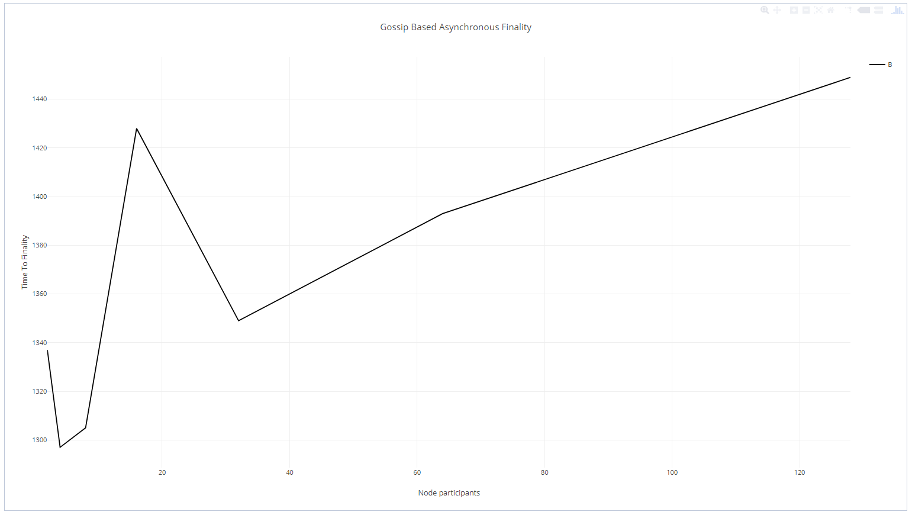

Gossip Based Asynchronous Finality with Cost Function

Finality still degrades as node participation increases, but the
degradation is significantly less severe. What is the trade off here
however? The Cost Function gravitates towards high *H* nodes, consider
*H* as an index of event blocks, if Node A has created 20 event blocks,
then Node A has an *H* of 20, so the more event blocks created, the
higher the likelihood of being selected.

The implications here are

-   Favor nodes with longer network participation

-   Not all nodes have the same DAG view (High *H* nodes will higher
    > higher probability)

-   Faster finality, less decentralization

What is the effect on transactions for those specific high *H* nodes?

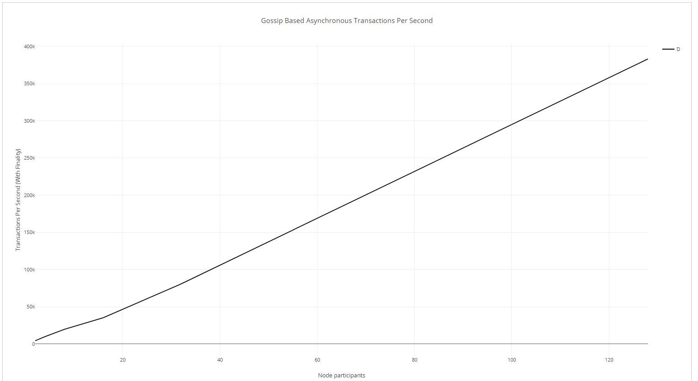

Gossip Based Cost Function Transactions Per Second

Not surprising, since we know throughput increases for the selection of
*H* nodes while excluding the rest of the network.

**Appendix A**

Network latency will reduce tps. The time complexity of the Lachesis
algorithm means that a much faster performance speed can be achieved
with O(N Log(N)).

The performance speed according to the time complexity O(N2) and O(N
Log(N)) (n refers to number of nodes) is shown below.

n square = n \* n n

Log N = n \* log(n)

n\*n vs n \* log(n)

n vs log(n)

If n=10, nlog(n) \~ 2.3

If n=100, nlog(n) \~ 4.6

If n=1,000, nlog(n) \~ 6.9

If n=10,000, nlog(n) \~ 9.21

If n=100,000, nlog(n) \~ 11.5

If n=1,000,000, nlog(n) \~ 13.8

Now, let’s consider node participation

2 nodes

500 transactions every 500 milliseconds for each node

Event blocks created every 100 milliseconds

Node ID:
5feceb66ffc86f38d952786c6d696c79c2dbc239dd4e91b46729d73a27fb57e9

Total Time: 16066

Total Transactions: 7376

Pending Transactions: 67

TPS: 2754.637121872277

Data bloat:6.870 MiB

Time To Finality: 1

Node ID:
6b86b273ff34fce19d6b804eff5a3f5747ada4eaa22f1d49c01e52ddb7875b4b

Total Time: 16065

Total Transactions: 7376

Pending Transactions: 57

TPS: 2754.808590102708

Data bloat:6.861 MiB

Time To Finality: 646

========================================================

Node ID:
5feceb66ffc86f38d952786c6d696c79c2dbc239dd4e91b46729d73a27fb57e9

Total Time: 17123

Total Transactions: 7875

Pending Transactions: 60

TPS: 2759.4463586988263

Data bloat:7.321 MiB

Time To Finality: 0

Node ID:
6b86b273ff34fce19d6b804eff5a3f5747ada4eaa22f1d49c01e52ddb7875b4b

Total Time: 17123

Total Transactions: 7875

Pending Transactions: 65

TPS: 2759.4463586988263

Data bloat:7.326 MiB

Time To Finality: 655

========================================================

Node ID:
5feceb66ffc86f38d952786c6d696c79c2dbc239dd4e91b46729d73a27fb57e9

Total Time: 18183

Total Transactions: 8375

Pending Transactions: 67

TPS: 2763.5703679260846

Data bloat:7.786 MiB

Time To Finality: 1

Node ID:
6b86b273ff34fce19d6b804eff5a3f5747ada4eaa22f1d49c01e52ddb7875b4b

Total Time: 18183

Total Transactions: 8375

Pending Transactions: 58

TPS: 2763.5703679260846

Data bloat:7.778 MiB

Time To Finality: 657

2 nodes

500 transactions every 100 milliseconds for each node

Event blocks created every 100 milliseconds

Node ID:
5feceb66ffc86f38d952786c6d696c79c2dbc239dd4e91b46729d73a27fb57e9

Total Time: 12288

Total Transactions: 8334

Pending Transactions: 335

TPS: 4069.3359375

Data bloat:7.943 MiB

Time To Finality: 1

Node ID:
6b86b273ff34fce19d6b804eff5a3f5747ada4eaa22f1d49c01e52ddb7875b4b

Total Time: 12287

Total Transactions: 8334

Pending Transactions: 331

TPS: 4069.6671278587123

Data bloat:7.939 MiB

Time To Finality: 601

========================================================

Node ID:
5feceb66ffc86f38d952786c6d696c79c2dbc239dd4e91b46729d73a27fb57e9

Total Time: 13604

Total Transactions: 9334

Pending Transactions: 307

TPS: 4116.730373419582

Data bloat:8.829 MiB

Time To Finality: 0

Node ID:
6b86b273ff34fce19d6b804eff5a3f5747ada4eaa22f1d49c01e52ddb7875b4b

Total Time: 13604

Total Transactions: 9334

Pending Transactions: 359

TPS: 4116.730373419582

Data bloat:8.876 MiB

Time To Finality: 626

========================================================

Node ID:
5feceb66ffc86f38d952786c6d696c79c2dbc239dd4e91b46729d73a27fb57e9

Total Time: 14940

Total Transactions: 10334

Pending Transactions: 346

TPS: 4150.2008032128515

Data bloat:9.775 MiB

Time To Finality: 0

Node ID:
6b86b273ff34fce19d6b804eff5a3f5747ada4eaa22f1d49c01e52ddb7875b4b

Total Time: 14940

Total Transactions: 10334

Pending Transactions: 320

TPS: 4150.2008032128515

Data bloat:9.752 MiB

Time To Finality: 621

4 nodes

500 transactions every 100 milliseconds for each node

Event blocks created every 100 milliseconds

Node ID:
5feceb66ffc86f38d952786c6d696c79c2dbc239dd4e91b46729d73a27fb57e9

Total Time: 22021

Total Transactions: 7864

Pending Transactions: 187

TPS: 2142.681985377594

Data bloat:7.389 MiB

Time To Finality: 1983

Node ID:
6b86b273ff34fce19d6b804eff5a3f5747ada4eaa22f1d49c01e52ddb7875b4b

Total Time: 22021

Total Transactions: 7884

Pending Transactions: 144

TPS: 2148.1313291857773

Data bloat:7.372 MiB

Time To Finality: 1982

Node ID:
d4735e3a265e16eee03f59718b9b5d03019c07d8b6c51f90da3a666eec13ab35

Total Time: 22021

Total Transactions: 6649

Pending Transactions: 185

TPS: 1811.634349030471

Data bloat:6.280 MiB

Time To Finality: 1983

Node ID:
4e07408562bedb8b60ce05c1decfe3ad16b72230967de01f640b7e4729b49fce

Total Time: 22021

Total Transactions: 7257

Pending Transactions: 157

TPS: 1977.294400799237

Data bloat:6.811 MiB

Time To Finality: 1982

We note a decrease in overall TPS, due to an increase in TTF (Time To
Finality), as node participation increases, asynchronous processing can
increase, but finality also increases.

4 nodes

500 transactions every 100 milliseconds for each node

Event blocks created every 100 milliseconds

Node ID:
5feceb66ffc86f38d952786c6d696c79c2dbc239dd4e91b46729d73a27fb57e9

Total Time: 19726

Total Transactions: 3887

Pending Transactions: 83

TPS: 1182.2974754131603

Data bloat:3.676 MiB

Time To Finality: 2859

Node ID:
6b86b273ff34fce19d6b804eff5a3f5747ada4eaa22f1d49c01e52ddb7875b4b

Total Time: 19726

Total Transactions: 3945

Pending Transactions: 75

TPS: 1199.9391665821759

Data bloat:3.719 MiB

Time To Finality: 2860

Node ID:
d4735e3a265e16eee03f59718b9b5d03019c07d8b6c51f90da3a666eec13ab35

Total Time: 19726

Total Transactions: 3883

Pending Transactions: 63

TPS: 1181.0808070566766

Data bloat:3.655 MiB

Time To Finality: 2860

Node ID:
4e07408562bedb8b60ce05c1decfe3ad16b72230967de01f640b7e4729b49fce

Total Time: 19726

Total Transactions: 3679

Pending Transactions: 101

TPS: 1119.0307208760012

Data bloat:3.504 MiB

Time To Finality: 2859

Node ID:
4b227777d4dd1fc61c6f884f48641d02b4d121d3fd328cb08b5531fcacdabf8a

Total Time: 19726

Total Transactions: 3201

Pending Transactions: 73

TPS: 973.6388522761837

Data bloat:3.043 MiB

Time To Finality: 2859

Node ID:
ef2d127de37b942baad06145e54b0c619a1f22327b2ebbcfbec78f5564afe39d

Total Time: 19726

Total Transactions: 3221

Pending Transactions: 95

TPS: 979.7221940586029

Data bloat:3.080 MiB

Time To Finality: 2859

Node ID:
e7f6c011776e8db7cd330b54174fd76f7d0216b612387a5ffcfb81e6f0919683

Total Time: 19727

Total Transactions: 3255

Pending Transactions: 101

TPS: 990.0136868251635

Data bloat:3.118 MiB

Time To Finality: 2859

Node ID:
7902699be42c8a8e46fbbb4501726517e86b22c56a189f7625a6da49081b2451

Total Time: 19726

Total Transactions: 3563

Pending Transactions: 92

TPS: 1083.74733853797

Data bloat:3.393 MiB

Time To Finality: 2860

At 8 nodes we have further degrading of TPS and a slight increase in TTF
(Optimized path searching between 4 and 8 nodes only increases by a
difficulty of 1)

Thus, the greater the participation of nodes, the higher the
asynchronous transaction processing at a trade off of increase finality.

[1] No real finality (longest chain rule)
