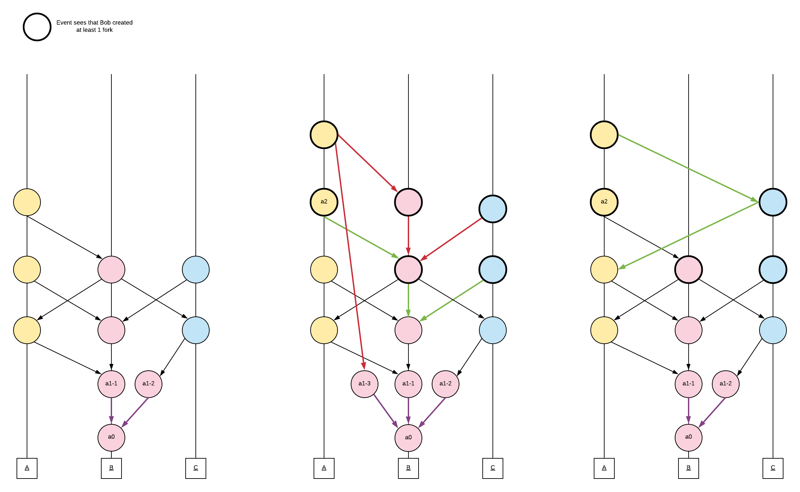
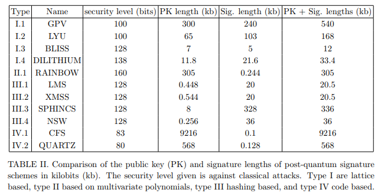

# How does Lachesis prevent attacks?

## Introduction

In a decentralized environment one of the key design considerations is
the presence of adversarial attackers. This is further compounded by the
financial nature of blockchains.

We will define common attacks and how they are circumvented as well as
speculate on potential new attack vectors that might arise due to our
design.

## Attack Vectors

#### Parasite Chain

In a DAG-based protocol, a parasite DAG is made with a malicious
purpose to revert the transactions history. Due to our aBFT protocol,
the finality may be violated only if more than 1/3W nodes are Byzantine (malicious).

We suppose that less than 1/3W of the stake holders are malicious.

#### Transaction Flooding

A malicious participant may run a large number of valid transactions
from their account under their control with the purpose of overloading
the network. In order to prevent such a case, the ledger intends to
impose a minimal transaction fee.
Since there is a transaction fee, it's very expensive to flood the transactions pool.

There's another way to flood the network with transactions -
emitting huge events with large number of conflicted transactions,
as fast as possible.
Each event consumes the certain amount of validator's gas power
(depending on GasLimit of originated transactions),
which limits the maximum number of transactions per second which
may be originated by a validator.

#### Events Flooding
A malicious validator can try to overload the network by emitting valid events as fast as possible.
Each events consumes the certain amount of validator's gas power,
which limits the maximum number of events per second.

A malicious validator can try to overload the network by emitting fork events as fast as possible.
If a fork is observed by self-parent of validator V, then validator V cannot
include events from the cheater as parents. It limits the maximum number of
fork events from the cheater as n (n is number of validators). Hence the total
number of fork events in a graph is limited by ```n^2```,
in a case if all the validators are cheaters.

In the example below, the red edges are forbidden, and green/black edges are allowed:


#### Double Spending

A double spend attack is when a malicious entity attempts to spend their
funds twice. Account A has 10 tokens, it sends 9.99 tokens to B and 9.99 tokens to C.
Both A->B and A->C transactions are valid, since A has the funds to send to B or C.
Yet transactions are dependent (in our example, transactions have equal nonce) -
they may both get into event(s) (which is unlikely due to internal protections,
but still possible),
but they cannot both get confirmed.

Our aBFT consensus algorithm determines the events order, which is equal on all the
nodes unless more than 1/3W nodes are Byzantine. Once the order is determined,
transactions get executed. One of the transactions {A->B, A->C} will get ordered before another
(let's assume it's A->B). Then A->B will be executed successfully, A->C will get
skipped because the tx nonce was already "occupied" by the A->B transaction.

'A' will pay fee only for A->B transaction.
Yet validator(s)'s gas power will get decreased by GasLimit of both transactions,
as a penalty for originating conflicting transactions.

#### Bribery attack

An adversary could bribe nodes to emit malicious fork events.
Since 2/3W participating nodes are required to create blocks in the malicious DAG,
this would require the
adversary to bribe &gt; 2/3W of all validators to begin a bribery
attack.

If a fork is observed by Atropos
(i.e. subgraph of Atropos includes a pair of events
with the same sequence number, from the same validator),
 then the penalty is applied against the validator.

#### Denial of Service

We are a leaderless system requiring 2/3W participation. An adversary
would have to deny &gt; 1/3W participants to be able to successfully
mount a DDoS attack.

#### Sybil

Validators are top-N (N is a network constant) participants with largest validation stakes.
Being in top-N is expensive enough to prevent a Sybil attack.

#### Quantum Attacks

Cryptographic protocols are susceptible to attack by the development of
a sufficiently large quantum computer. Of specific interest to
cryptocurrencies is how this relates to the elliptic curve signature scheme.
Optimistic estimates
state that this can be broken by a quantum computer as early as 2027, it
is therefore important to adopt a post-quantum signature scheme.

Our signatures are based on the Elliptic Curve Digital Signature
Algorithm secp256k1 curve. The security of this system is based on the
hardness of the Elliptic Curve Discrete Log Problem (ECDLP).

How quickly can a quantum computer compute the Elliptic Curve Discrete
Log Problem? An instance with a *n* bit prime field, can be solved using
9n + 2 \[log2(n)\]+10 logical qubits and (448log2(n)+4090)n3 Toffoli
gates. We use n=256 bit signatures.

For 10GHz clock speed and error rate of 10−5 , the signature is cracked
in 30 minutes using 485550 qubits.

So if all Elliptic Curve Digital Signature Algorithms are susceptible,
then how can you implement a quantum proof solution?



We're limited about signature and public key lengths,
since these have to be stored to fully verified.

Hash based schemes like XMSS have provable security. Grover’s algorithm
can still be used to attack. DILITHIUM at 138 bits require time 2125

A truly quantum proof cryptographic algorithm does not currently exist.
Instead, our architecture allows for multiple cryptographic
implementations to be plug and play, given the modular architecture
design. Since we aren’t focusing on tightly coupled architecture, it
means we could implement XMSS and DILITHIUM (and something new we
haven’t announced yet).
