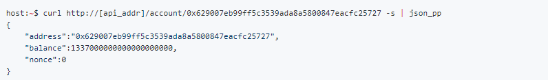
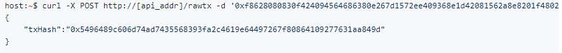

**[Setup](#setup) 0**

> [Option 1: Connect directly to testnet
> at;](#option-1-connect-directly-to-testnet-at) 0
>
> [Option 2: Host own local node;](#option-2-host-own-local-node) 1
>
> [Step 0 Docker](#step-0-docker) 1
>
> [Step 1 Installing Go (Ubuntu)](#step-1-installing-go-ubuntu) 1
>
> [Step 1 Setup](#step-1-setup) 1
>
> [Step 2 Clone Repo](#step-2-clone-repo) 1
>
> [Step 3 (Optional, hard mode)](#step-3-optional-hard-mode) 2
>
> [Running the node](#running-the-node) 3
>
> [Example Commands](#example-commands) 4

**[HTTP API](#http-api) 4**

> [Get controlled accounts](#get-controlled-accounts) 4
>
> [Get any account](#get-any-account) 4
>
> [Send transactions from controlled
> accounts](#send-transactions-from-controlled-accounts) 5
>
> [Get Transaction receipt](#get-transaction-receipt) 5
>
> [Send raw signed transactions](#send-raw-signed-transactions) 5

**[Deploying a contract](#deploying-a-contract) 7**

> [Create bytecode from solidity file](#create-bytecode-from-solidity) 7
>
> [Get Contract Address](#get-contract-address) 8
>
> [Call the Deployed Contract](#call-the-deployed-contract) 9

Setup
=====

Option 1: Connect directly to testnet at;
-----------------------------------------

http://18.221.128.6:8080

Example call; [http://18.221.128.6:8080/account/0xFD00A5fE03CB4672e4380046938cFe5A18456Df4](http://18.221.128.6:8080/account/0xFD00A5fE03CB4672e4380046938cFe5A18456Df4)

Option 2: Host own local node;
------------------------------

### Step 0 Docker

Create an 3 node lachesis cluster with:

n=3 BUILD\_DIR="$PWD" ./docker/builder/scale.bash

-   Docker

-   jq

-   Bash

-   glider base Docker Image with:

-   git clone https://github.com/andrecronje/evm \# or \`cd
    > $GOPATH/src/github.com/andrecronje\`  
    > cd evm/docker/glider  
    > docker build --compress --squash --force-rm --tag "${PWD\#\#\*/}"
    > .

-   Go

-   [ class="underline">batch-ethkey](https://github.com/SamuelMarks/batch-ethkey)
    > with: go get -v github.com/SamuelMarks/batch-ethkey

Step 1 Installing Go (Ubuntu)
-----------------------------

### Step 1 Setup

sudo apt-get update

sudo apt-get -y upgrade

sudo curl -O
https://storage.googleapis.com/golang/go1.9.1.linux-amd64.tar.gz

sudo tar -xvf go1.9.1.linux-amd64.tar.gz

sudo mv go /usr/local

sudo nano \~/.profile

export PATH=$PATH:/usr/local/go/bin

source \~/.profile

### Step 2 Clone Repo

mkdir -p $GOPATH/src/github.com/andrecronje/

cd $GOPATH/src/github.com/andrecronje

git clone https://github.com/andrecronje/lachesis.git

export GOPATH=$HOME/work

cd $GOPATH/src/github.com/andrecronje/lachesis

curl https://glide.sh/get \| sh

glide install

### Step 3 (Optional, hard mode)

sudo apt-get update

sudo apt-get -y upgrade

sudo curl -O
https://storage.googleapis.com/golang/go1.9.1.linux-amd64.tar.gz

sudo tar -xvf go1.9.1.linux-amd64.tar.gz

sudo mv go /usr/local

sudo nano \~/.profile

export PATH=$PATH:/usr/local/go/bin

source \~/.profile

mkdir $HOME/work

export GOPATH=$HOME/work

mkdir -p $HOME/work/src/github.com/user/

cd $HOME/work/src/github.com/user/

git clone https://github.com/andrecronje/lachesis.git

apt-get install -y build-essential

\#Lachesis

go get github.com/dgraph-io/badger

go get github.com/sirupsen/logrus

go get gopkg.in/urfave/cli.v1

make build

\#Lachesis

./build/lachesis keygen

mkdir -p /root/.lachesis/

vi /root/.lachesis/priv\_key.pem

vi /root/.lachesis/peers.json

\[

{

"NetAddr":"ip:12000",

"PubKeyHex":"0x0448C9212873C76DE0086DA680F9329735C40674B5FA05105886548B217273B0AFA02D73157F

4D96DACFE1D9E44DBB2608F5C60D037743DB18567B82D077CBAE40"

},

{

"NetAddr":"ip:12000",

"PubKeyHex":"0x04C503A238046D9095B548E61939CA58BE926C6809F7205CD2D671A88C4E8369754ADE343FB

B4FBE9A46118EB549753B76B18243369E0475A319989F06879CFE19"

},

{

"NetAddr":"ip:12000",

"PubKeyHex":"0x046A584F2FBDF61A36B8D30461C9285B817F60271D41B7B7EC445EF73DD2B363B1F782D5FE9

6D3D08B71750F4D07CC137AE7AD9A95574791737E6E407880015B3A"

}

\]

#### Running the node

The default data dir is currently;

$HOME/.lachesis/

In this folder it expects two files;

priv\_key.pem

peers.json

peers.json is the current node list (completely permissioned system
currently, it is defined as per below, the

PubKeyHex is the public key (with 0x) that corresponds to the private
key found in priv\_key.pem

\[

{

"NetAddr":"ip:12000",

"PubKeyHex":"0x0448C9212873C76DE0086DA680F9329735C40674B5FA05105886548B217273B0AFA02D73157F

4D96DACFE1D9E44DBB2608F5C60D037743DB18567B82D077CBAE40"

},

{

"NetAddr":"ip:12000",

"PubKeyHex":"0x04C503A238046D9095B548E61939CA58BE926C6809F7205CD2D671A88C4E8369754ADE343FB

B4FBE9A46118EB549753B76B18243369E0475A319989F06879CFE19"

},

{

"NetAddr":"ip:12000",

"PubKeyHex":"0x046A584F2FBDF61A36B8D30461C9285B817F60271D41B7B7EC445EF73DD2B363B1F782D5FE9

6D3D08B71750F4D07CC137AE7AD9A95574791737E6E407880015B3A"

}

\]

To run the nodes you execute;

\#service node

./build/lachesis run -node\_addr="ip:port" -service\_addr="ip:port"

\#proxy node

./build/lachesis run -node\_addr="ip:port" -proxy\_addr="ip:port"
-client\_addr="ip:port"

#### Example Commands

\#service node

./build/lachesis run -node\_addr="ip:12000" -service\_addr="ip:8000"

\#proxy node

./build/lachesis run -node\_addr="ip:12000" -proxy\_addr="ip:9000"
-client\_addr="ip:9000"

You can subscribe to service\_addr for http requests, so in above
example [http://ip:8000/stats](http://ip:8000/stats)

HTTP API
========

Get controlled accounts
-----------------------

This endpoint returns all the accounts that are controlled by the evm
instance. These are the accounts whose private keys are present in the
keystore. example:

Get any account
---------------

This method allows retrieving the information about any account, not
just the ones whose keys are included in the keystore.

Send transactions from controlled accounts
------------------------------------------

Send a transaction from an account controlled by the evm instance. The
transaction will be signed by the service since the corresponding
private key is present in the keystore. example: Send Ether between
accounts

Get Transaction receipt
-----------------------

Example:

Send raw signed transactions
----------------------------

Most of the time, one will require to send transactions from accounts
that are not controlled by the evm instance. The transaction will be
assembled, signed and encoded on the client side. The resulting raw
signed transaction bytes can be submitted to evm through the /rawtx
endpoint. example:

Below is how to interact, otherwise standard EVM rules.

// node.js

const axios = require('axios');

const EthereumTx = require('ethereumjs-tx')

const privateKey = Buffer.from('&lt;private key&gt;', 'hex')

const txParams = {

nonce: '0x00',

gasPrice: '0x000000000001',

gasLimit: '0x27100',

to: '0xFD00A5fE03CB4672e4380046938cFe5A18456Df4',

value: '0x00',

data: '0x',

// EIP 155 chainId - mainnet: 1, ropsten: 3

chainId: 1

}

const tx = new EthereumTx(txParams)

tx.sign(privateKey)

const serializedTx = tx.serialize()

const hexTx = '0x' + serializedTx.toString('hex')

axios.post('[http://ip:port/sendRawTransaction](http://18.221.128.6:8080/sendRawTransaction)',
hexTx)

.then(function (response) {

console.log(response.data);

})

.catch(function (error) {

console.log(error);

});

//50c4bf4dde1f383a172f52cb4624f089f685e67e00c6741a3ae03826c99cf082:0xFD00A5fE03CB4672e4380046938cFe5A18456Df4

//7c9d2f34f5869204fe8232442bc2280a613601783fab2b936cf91a054668537a:0xfd9AB87eCEdC912A63f5B8fa3b8d7667d33Fd981

// [http://](http://18.221.128.6:8080/account/629007eb99ff5c3539ada8a5800847eacfc25727)[ip:port](http://18.221.128.6:8080/sendRawTransaction)/account/629007eb99ff5c3539ada8a5800847eacfc25727

// http://ip:port/sendRawTransaction

// [http://](http://18.221.128.6:8080/transactions)[ip:port](http://18.221.128.6:8080/sendRawTransaction)/transactions

// [http://](http://18.221.128.6:8080/accounts)[ip:port](http://18.221.128.6:8080/sendRawTransaction)/accounts

// [http://](http://18.221.128.6:8080/transaction/%7B%7D)[ip:port](http://18.221.128.6:8080/sendRawTransaction)/transaction/{}

// [http://](http://18.221.128.6:8080/account/%7B%7D)[ip:port](http://18.221.128.6:8080/sendRawTransaction)/account/{}

/\*

[http://](http://18.221.128.6:8080/account/0xFD00A5fE03CB4672e4380046938cFe5A18456Df4)[ip:port](http://18.221.128.6:8080/sendRawTransaction)/account/0xFD00A5fE03CB4672e4380046938cFe5A18456Df4

{"address":"0xFD00A5fE03CB4672e4380046938cFe5A18456Df4","balance":9999790000000000000000,"nonce":1}

[http://](http://18.221.128.6:8080/transaction/0x68a07a9dc6ff0052e42f4e7afa117e90fb896eda168211f040da69606a2aeddc)[ip:port](http://18.221.128.6:8080/sendRawTransaction)/transaction/0x68a07a9dc6ff0052e42f4e7afa117e90fb896eda168211f040da69606a2aeddc

{"root":"0x7ed3e21533e05c18ded09e02d7bf6bf812c218a3a7af8c6b5cc23b5cb4951069","transactionHash":"0x68a07a9dc6ff0052e42f4e7afa117e90fb896eda168211f040da69606a2aeddc","from":"0xfd00a5fe03cb4672e4380046938cfe5a18456df4","to":"0xfd00a5fe03cb4672e4380046938cfe5a18456df4","gasUsed":21000,"cumulativeGasUsed":21000,"contractAddress":"0x0000000000000000000000000000000000000000","logs":\[\],"logsBloom":"0x00000000000000000000000000000000000000000000000000000000000000000000000000000000000000000000000000000000000000000000000000000000000000000000000000000000000000000000000000000000000000000000000000000000000000000000000000000000000000000000000000000000000000000000000000000000000000000000000000000000000000000000000000000000000000000000000000000000000000000000000000000000000000000000000000000000000000000000000000000000000000000000000000000000000000000000000000000000000000000000000000000000000000000000000000000000","failed":false}

function getNonce(tx) {

axios.get('[http://](http://18.221.128.6:8080/account/'+tx.from)[ip:port](http://18.221.128.6:8080/sendRawTransaction)[/account/'+tx.from](http://18.221.128.6:8080/account/'+tx.from))

.then(function (response) {

tx.nonce = response.data.nonce

generateRawTx(tx, priv)

})

.catch(function (error) {

console.log(error);

});

}

\*/

Deploying a contract
====================

Create bytecode from solidity
-----------------------------

JSONbig = require('json-bigint');

fs = require('fs')

solc = require('solc')

Web3 = require('web3')

web3 = new Web3()

function Contract(file, name) {

this.file = file

this.name = ':'+name

this.bytecode = ''

this.abi = ''

}

Contract.prototype.compile = function() {

input = fs.readFileSync(this.file)

output = solc.compile(input.toString(), 1)

console.log('compile output', output)

this.bytecode = output.contracts\[this.name\].bytecode

this.abi = output.contracts\[this.name\].interface

this.w3 = web3.eth.contract(JSONbig.parse(this.abi)).at('');

}

const contract = new Contract('./helloWorld.sol', 'HelloWorld')

contract.compile()

const EthereumTx = require('ethereumjs-tx')

const privateKey = Buffer.from('&lt;private\_key&gt;', 'hex')

const txParams = {

from: '0x5A7fcbE8e848E957166631E5DAbD683210f06E7c',

value: 0,

nonce: nonce,

chainId:1,

gas: 1000000,

gasPrice:0,

data: '0x' + contract.bytecode + constructorParams,

}

const tx = new EthereumTx(txParams)

tx.sign(privateKey)

const serializedTx = tx.serialize()

const hexTx = '0x' + serializedTx.toString('hex')

axios.post('http://18.224.109.107:8080/sendRawTransaction', hexTx)

.then(function (response) {

console.log(response.data);

})

.catch(function (error) {

console.log(error);

});

Get Contract Address
--------------------

Call [http://18.224.109.107:8080/tx/0x81163ffaa2e05720bfb772e58edec81bf5640f9dbebe0105720cfeb9066256da](http://18.224.109.107:8080/tx/0x81163ffaa2e05720bfb772e58edec81bf5640f9dbebe0105720cfeb9066256da)

{"root":"0x3c7b6e8900b625a5c0f5610ff1a6414ae078f6f9fbe3f69511074b642f7a30c8","transactionHash":"0x81163ffaa2e05720bfb772e58edec81bf5640f9dbebe0105720cfeb9066256da","from":"0x5a7fcbe8e848e957166631e5dabd683210f06e7c","to":null,"value":0,"gas":1000000,"gasUsed":242199,"gasPrice":0,"cumulativeGasUsed":242199,"contractAddress":"0x8efe306de45fe1f3cdf0338c8d5d1c30f60ba286","logs":\[\],"logsBloom":"0x00000000000000000000000000000000000000000000000000000000000000000000000000000000000000000000000000000000000000000000000000000000000000000000000000000000000000000000000000000000000000000000000000000000000000000000000000000000000000000000000000000000000000000000000000000000000000000000000000000000000000000000000000000000000000000000000000000000000000000000000000000000000000000000000000000000000000000000000000000000000000000000000000000000000000000000000000000000000000000000000000000000000000000000000000000000","error":"","failed":false}

contractAddres contains the newly created address.

Call the Deployed Contract
--------------------------

const contract = new Contract('./helloWorld.sol', 'HelloWorld')

contract.compile()

const callData = contract.w3.helloWorld.getData()

//Note the function name of the solidity function

const tx = {

from: '&lt;any from address&gt;',

value:0,

to: '&lt;contract\_address&gt;',

data: callData,

}

axios.post('http://18.224.109.107:8080/call', stx)

.then(function (response) {

console.log(response.data);

hexRes = Buffer.from(response.data.data).toString()

// If you want to parse the results &lt;function\_name&gt;

unpacked = contract.parseOutput('helloWorld', hexRes)

})

.catch(function (error) {

console.log(error);

});
