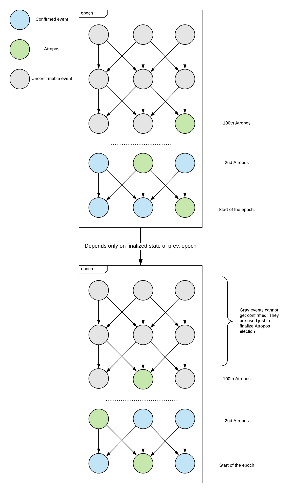

## Epochs
The Lachesis's events structure isn't a monolith DAG.
In more detail, it's a DAG which is separated into sub-DAGs,
where each sub-DAG is called ```epoch```.

The epoch is a DAG, which consists of no more than ```EPOCH_LEN``` ```decided frames```.
In other words, contains no more than ```EPOCH_LEN``` blocks.

When epoch has decided its ```EPOCH_LEN```'th block, it gets sealed. The inner epoch indexes
get pruned, and the new events for the sealed epochs are ignored. Each epoch is a separate DAG,
so parents from other epochs are not allowed.

As a sanity check, each event includes the hash of previous epoch.

The lowest possible epoch number is ```1```.

A note for experienced readers:
> It's possible to ignore
events for past (or future) epochs, because future epochs depend only on the finalized
state of a previous epoch. Due to the aBFT consensus, the state is final unless more
than 1/3W are Byzantine,
so it may be safely assumed that new events for an already sealed epoch won't bring any new
information (i.e. alter events order). It wouldn't be possible to prune old indexes
(or whole events)
with a monolith DAG, because event's parent could be from any past event,
so we would always need to keep all the indexes in DB, or implement the complex
redundant techniques or constraints.

#### Scheme


## Validators group

Validators are top-N (N is a network constant) participants with largest validation stakes.
Validator has a right to create events. Validator's stake is a consensus weight.
Validator's ID is an account address.

Validators group and their stakes are fixed for the whole epoch. When epoch
gets sealed, the new validators group is calculated, given with top-N stakes at the end of epoch.

If validator becomes a cheater, validators receives the economic penalty
after the first block where fork was observed.
But he isn't pruned from the validators group in the same epoch
where fork was confirmed, because epoch's validator group is a constant.
Instead, cheater's events will be ignored due to the
rule "If a fork is observed by self-parent of validator B, then validator B cannot
      include events from the cheater as parents".
