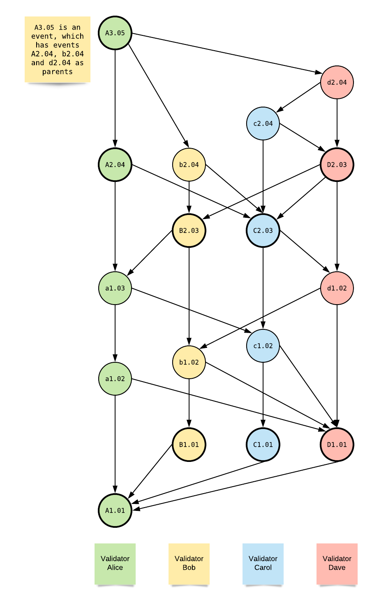

## Event

Event is a vertex in the graph. Event has a list of links to past events (parents),
which represent the graph edges. DAG is the structure of consensus messages.

Each consensus message has the meaning:

Event is a signed message from a validator, which states:
```I have observed and validated the following past events (and their parents), which are included as parents of this event. I originate the transactions list belonging to this event```.
Processing of a combination of such messages
allows to calculate the final order of transactions,
exact on all the nodes regardless of network delays, clock drifts,
malicious nodes and validators.
This is done by the aBFT [consensus](abft_consensus.md) algorithm.

#### Event structure
```go
// EventHeaderData is the graph vertex in the Lachesis consensus algorithm
// Doesn't contain transactions, only their hash
// Doesn't contain event signature
type EventHeaderData struct {
	Version uint32

	Epoch idx.Epoch
	Seq   idx.Event

	Frame  idx.Frame
	IsRoot bool

	Creator common.Address

	PrevEpochHash common.Hash
	Parents       hash.Events

	GasPowerLeft uint64
	GasPowerUsed uint64

	Lamport     idx.Lamport
	ClaimedTime Timestamp
	MedianTime  Timestamp

	TxHash common.Hash

	Extra []byte
}

// EventHeader is the graph vertex in the Lachesis consensus algorithm
// Doesn't contain transactions, only their hash
type EventHeader struct {
	EventHeaderData

	Sig []byte
}

// Event is the graph vertex in the Lachesis consensus algorithm
type Event struct {
	EventHeader
	
	Transactions types.Transactions
}
```

- event.Epoch - epoch number (see [epoch](epoch.md)). Not less than ```1```.
- event.Seq - sequence number. Equal to self-parent’s ```seq + 1```, if no self-parent, then ```1```.
- event.Frame - frame number (see [consensus](abft_consensus.md)). Not less than ```1```.
- event.IsRoot - true if event is root (see [consensus](abft_consensus.md)).
- event.Creator - account address of validator which created event.
- event.PrevEpochHash - hash of finalized state of previous epoch.
- event.Parents - list of parents (graph edges). May be empty. If ```Seq > 1```,
then first element is self-parent.
- event.GasPowerLeft - amount of not spent validator's gas power,
after connection of this event (see [gas_power](gas_power.md)).
- event.GasPowerUsed - amount of spent validator's gas power in this event (see [gas_power](gas_power.md)).
- event.Lamport - Lamport time. If parents list is not empty, then ```max(parent’s {Lamport time}s) + 1```
                                , else ```1```.
- event.ClaimedTime - UnixNano timestamp. Specified by the creator of event.
                      Cannot be lower than claimed time of self-parent (if self-parent exists).
                      CAN be too-far-in-future, or too-far-in-past.
- event.MedianTime - UnixNano timestamp. Weighted median of highest observed events (their ClaimedTime) from each validator.
Events from the cheater validators aren’t counted. It's protection against "too-far-in-future" and "too-far-in-past".
- event.TxHash - Merkle tree root of event transactions.
- event.Transactions - list of originated transactions.
- event.Sig - ECDSA256 secp256k1 validator's signature in the R/S/V format (65 bytes).
Verified via PubKey recovering, hashing and matching with ```event.Creator```.

#### Graph example

