**Gossip based consensus**

The concept of infinite scalability states that as node participation
increases, concurrent throughput can increase.

If 1 node can create a block every 1 second and a block can contain 10
transactions. Then 1 node can process 10 transactions per second.

By this notion, 10 nodes will process 100 transactions per second. As we
increase nodes, our throughput increases.

But how long does it take for the transaction from node *J* to reach
node *A*?

**Gossip based protocols**

In gossip protocols a node can chose 1 other node to communicate with
each round. There are push (node *A* sends (pushes) data to node *B*),
pull (node *A* requests (pulls) data from node *B*) and push&pull (node
*A* and *B* synchronize data) models.

So if each round is 1 second. It would take node *J* 10 seconds to
inform all the nodes of it’s data. 10 seconds until all nodes agree on
the data. 100 / 10 = 10 transactions per second.

We can however say that as soon as *2n/3* nodes agree, then the
transactions are accepted. 100 / 7 (2 x 10 / 3) = 14 transactions per
second.

10n, 100 (10 x 10) / 7 (2 x 10 / 3) = 14 tps

100n, 1,000 (100 x 10)/ 67 (2 x 100 / 3 )= 14 tps

1000n, 10,000 / 667 = 14 tps

Not very “‘infinitely” scalable.

The above assumes network propagation of O(n)

**Network Latency simulations (same region)**

2n, 0.05s

4n, 0.2s

8n, 0.9s

16n, 2s

32n, 5s

64n, 8s

128n, 20s

Adding the above back into our original simulation

2n, 20 / 0.05 = 400

4n, 40 / 0.2 = 200

8n, 80 / 0.9 = 88

16n, 160 / 2 = 80

32n, 320 / 5 = 64

64n, 640 / 8 = 80

128n, 1280 / 20 = 64

Previous work has shown us;

-   *O(log n)* rounds for push can be applied to different graphs[1]

-   The upper bound for general graphs is a function of the
    > *conductance, φ*, of the graph. *O( φ^-1 log n)* [2]

-   Upper bound of *O(log n)* for natural graphs[3]

-   Uniform gossip with push&pull results in *O(log n)* rounds[4]

-   Censor-Hillel et al.[5] showed that you can inform all nodes in
    > *O(D + polylog(n))* rounds where *D* is the graph diameter

-   Haeupler[6] proposed a deterministic algorithm that completes in
    > *2(D + log n) log n* rounds

What we expected

50n, 500 / 1.7 = 294

100n, 1000 / 2 = 500

150n, 1500 / 2.2 = 681

200n, 2000 / 2.3 = 869

What actually happened.

2n, 20 / 0.05 = 400

4n, 40 / 0.2 = 200

8n, 80 / 0.9 = 88

16n, 160 / 2 = 80

32n, 320 / 5 = 64

64n, 640 / 8 = 80

128n, 1280 / 20 = 64

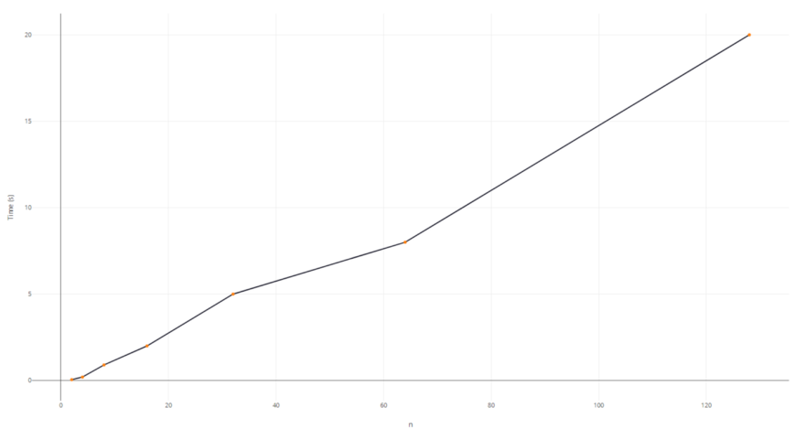

**Definitions**

A network is specified by an undirected graph G = (V, E) with node set V
and edge set E.

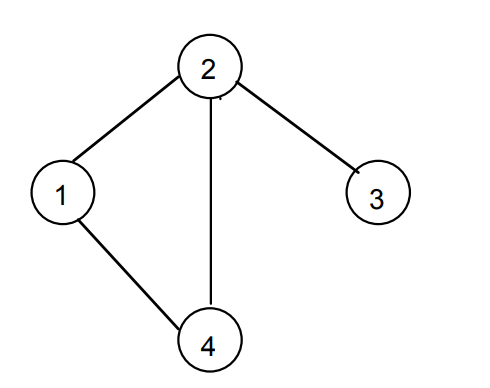

V = {1,2,3,4}

E = {(1,2),(2,3),(1,4),(2,4)}

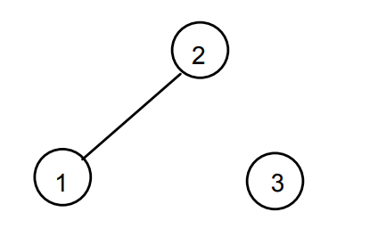

V = {1,2,3}

E = {(1,2)}

A walk is a sequence of nodes

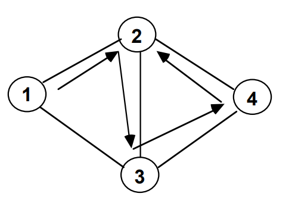

Walk (1,2,3,4,2)

A path is a walk with no repeated nodes

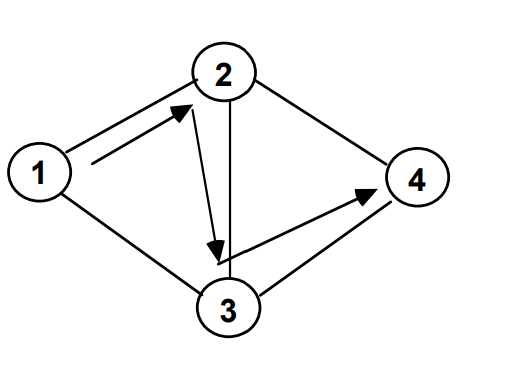

Path (1,2,3,4)

A cycle is a walk where the starting point is the ending point, and
there are more than 3 nodes involved with no repeated nodes except the
starting and ending point.

Cycle (1,2,4,3,1)

A connected graph has a path between all nodes.

Connected

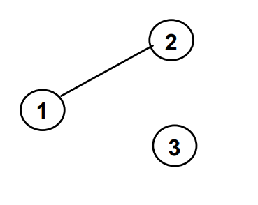

Unconnected

An acyclic graph is a graph with no cycles.

A tree is an acyclic connected graph.

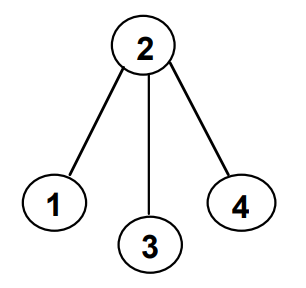

Acyclic, connected. Tree

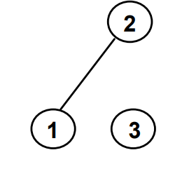

Unconnected, not a tree.

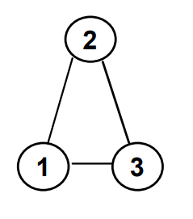

Cyclic, not a tree.

**Problem**

-   Can we use k-local broadcast for faster consensus

-   Can we improve on *O(log n)*

-   Can we make node selection deterministic

There are three specific algorithms we investigate;

**Information Exchange algorithm**[7]

1.  at time slot *t*, node *i* is chosen as the *initiator node*

2.  node *i* broadcasts its state to all neighboring nodes, denoted by
    > *N(i)*

3.  if *j* in *N(i) then*

4.  \- *j* updates its state

5.  \- all nodes in set *N(i)* send their updated states back to *i*

6.  \- once *i* receives all states it computes the consensus of the
    > received states

7.  \- *i* sends its newest state to its neighboring nodes again

8.  \- all neighboring nodes *j* in *N(i)* update their states

9.  end if

Performance analysis of Information Exchange algorithm (LAIE)

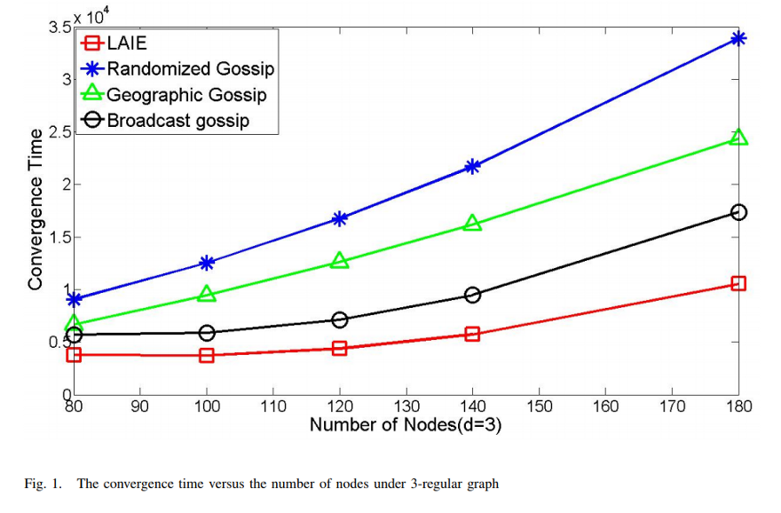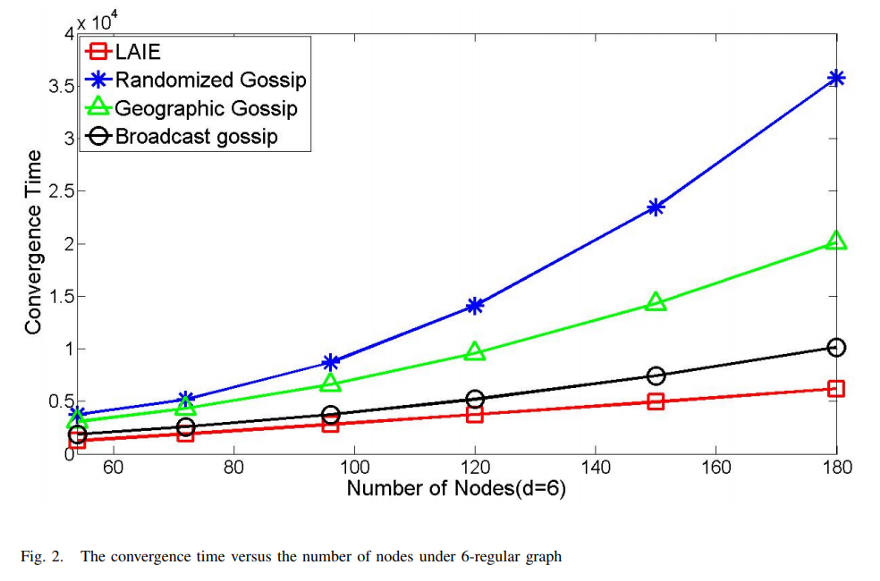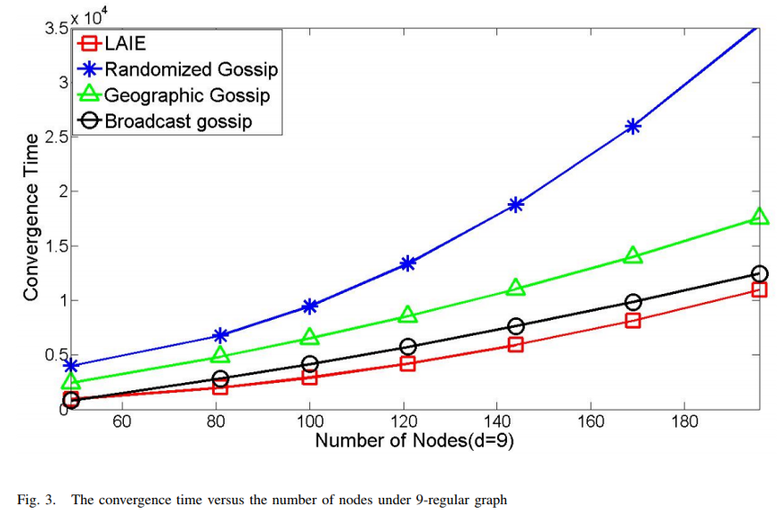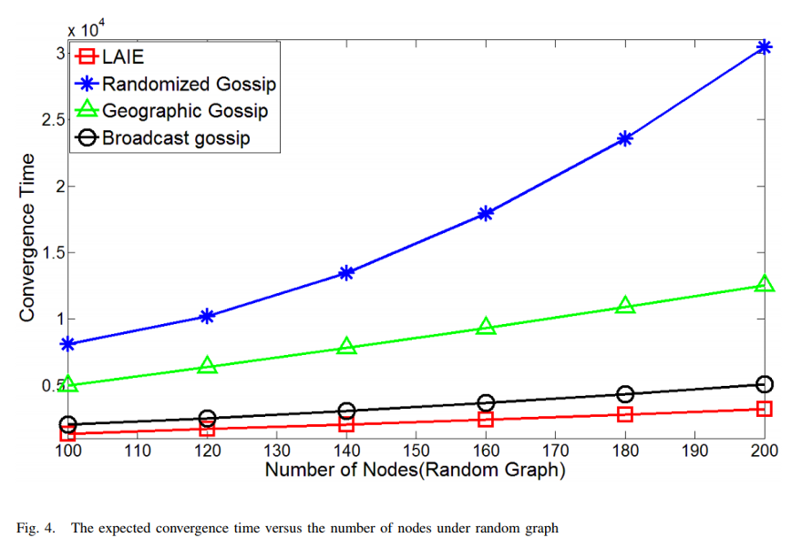

From the above we can see;

-   Randomized gossip *O(n² log n)*

-   Geographic gossip *O(n log n)*

-   Local Average and Information Exchange algorithm *O( n(d+1)log n /
    > (2+d+2(√(d-1))(d-2(√(d-1)))*

**Jumping-Push-Pull in *O( √(log n))*-time**[8]

1.  Each node flips a coin to decide whether it will be a leader or a
    > connector

2.  Connectors choose leaders via five pointer jumping sub-phases (-) to
    > select two leader addresses

3.  Leaders run the information exchange algorithm

4.  Each connector opens a channel to a randomly chosen leader. Each
    > connector transmits once in the next round using push
    > communication to its other leader. Each leader sends messages by
    > pull to all open connections.

5.  Every node performs a push&pull

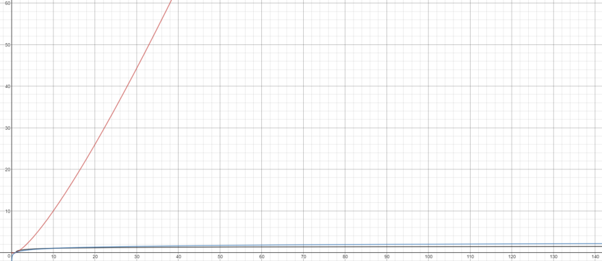

**Deterministic Gossip**[9]

There are essentially two problems

-   k-local broadcast problem

-   Global broadcast problem

In non-permissioned networks we can’t do global broadcasts since we
aren’t aware of all the participants. A few strategies exists

-   Explore and build a virtual knowledge graph

-   Apply broadcast patterns on virtual knowledge graph

-   Use the 1-local broadcast gossip solution

And we propose the k-local broadcast strategy.

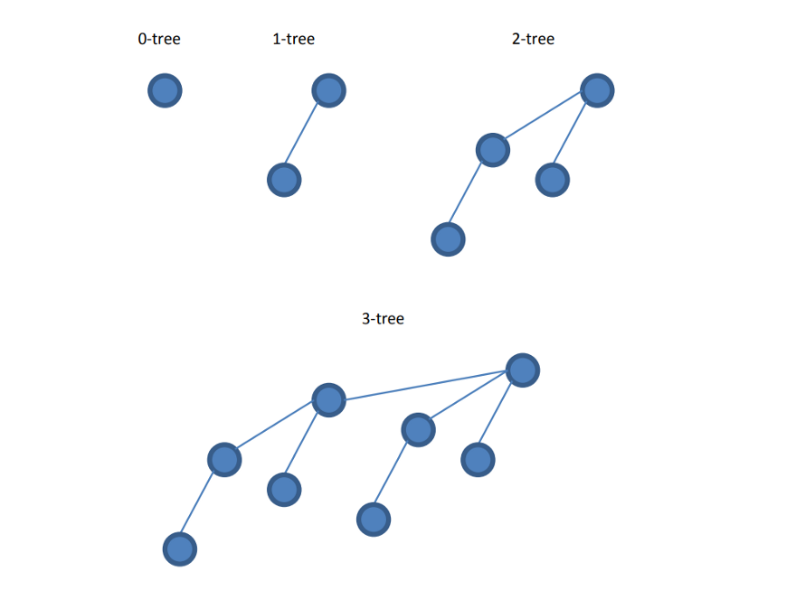

The above are binomial trees or i-trees. A 0-tree consists out of one
root. A 1-tree consists out of two nodes and one of the nodes becomes
the new root. Each tree can have multiple nodes but only a single root.

1.  Each node forms it’s own i=0-tree

2.  Node *A* does a push to node *B, A* will become the sub node of a
    > new 1 tree, with *B* as the root

3.  *A* and *B* select a new neighbor whose i-tree does not intersect
    > with its own i-tree.

4.  Repeat for all known k-participants

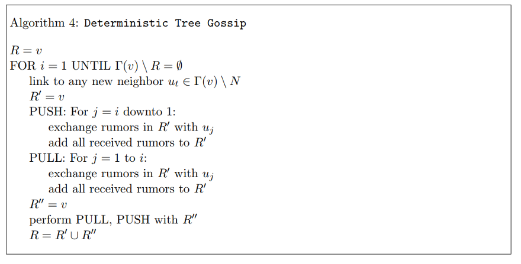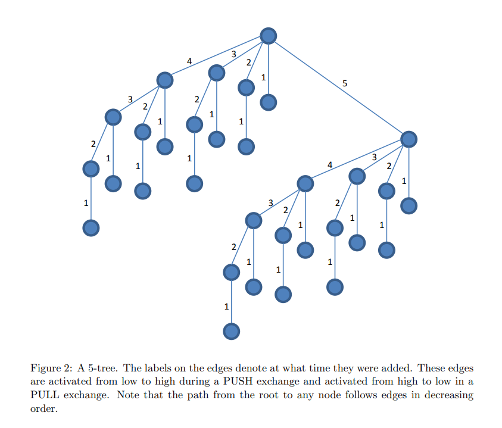

Above we assume 32 nodes, it would take 5 steps for the iteration to
complete.

Phase 1: Each node selects a random neighbor and synchronizes data. This
creates the 1-tree, each denoted by 1

Phase 2–5: Each node selects another node that does not intersect its
own i-tree. This creates the i+1-tree, each denoted by i+1

The above requires us to use the full blown algorithm for the first
1-local broadcast, and then simply reuse the established links by
repeating the tree-broadcast of the last iteration for the remaining
local broadcasts.

We need a *2 log n (log n + 1)* round for the first local broadcast, and
only *2 log n* rounds for each of the *k-1* remaining ones.

So for any *k* we have a deterministic gossip algorithm that runs for
*2(k log n + log² n) rounds*

**Analysis**

We have established;

-   Local Average and Information Exchange algorithm *O( n(d+1)log n /
    > (2+d+2(√(d-1))(d-2(√(d-1)))*

-   Jumping-Push-Pull in *O( √(log n))*-time

-   k-broadcast for *2(k log n + log² n)*

Each of the above have a different area of application. The Information
Exchange algorithm allows us to reach a k-based consensus quickly. The
jumping-push-pull allows us to gossip this information out to other
leaders efficiently, and lastly the k-broadcast allows us to optimize
the tree-broadcast selection for the Information Exchange algorithm.

**Forming a k-event**

Leader selection can be one of;

-   Coin toss

-   VRF

-   Cryptographic Sortition

A leader runs the information exchange algorithm with tree-broadcast and
consolidates all neighboring states. This creates a new event block that
includes;

-   All validated transactions

-   Creator signature

-   Consensus timestamp

-   Hashes of all k-neighbor participants

-   Hashes of all k-neighbor unique previous event blocks

This event gives us a fair bit of knowledge

-   k-neighbor consensus

-   gossip consensus information

-   consensus time ordering

The above also allows for an unlimited message complexity, so all
transactions can be exchanged between all nodes.

[1] *Fountoulakis, N., Panagiotou, K., and Sauerwald, T. Ultra-fast
rumor spreading in social networks. In Proc. 23rd Annual ACM-SIAM
Symposium on Discrete Algorithms (2012), pp. 1642–1660.*

[2] *Giakkoupis, G. Tight bounds for rumor spreading in graphs of a
given conductance. In 28th International Symposium on Theoretical
Aspects of Computer Science (2011), pp. 57–68*

[3] *Doerr, B., Fouz, M., and Friedrich, T. Social networks spread
rumors in sublogarithmic time. In Proc. 43rd Annual ACM Symposium on
Theory of Computing (2011), pp. 21–30.*

[4] *Doerr, B., Fouz, M., and Friedrich, T. Social networks spread
rumors in sublogarithmic time. In Proc. 43rd Annual ACM Symposium on
Theory of Computing (2011), pp. 21–30.*

[5] *Censor-Hillel, K., Haeupler, B., Kelner, J., and Maymounkov, P.
Global computation in a poorly connected world: Fast rumor spreading
with no dependence on conductance. In Proc. 44th ACM Symposium on Theory
of Computing (2012), pp. 961–970.*

[6] *Haeupler, B. Simple, fast and deterministic gossip and rumor
spreading. In Proc. 24th Annual ACM-SIAM Symposium on Discrete
Algorithms, (2013), pp. 705–716.*

[7] *Gang Wang, Zhiyue Wang, Jie Wu.* A local average broadcast gossip
algorithm for fast global consensus over graphs*, (2017).*

[8] *Chen Avin, Robert Elsasser.* Breaking the log n Barrier on Rumor
Spreading*, (2015).*

[9] *Bernhard Haeupler.* Simple, Fast and Deterministic Gossip and Rumor
Spreading*, (2014).*
