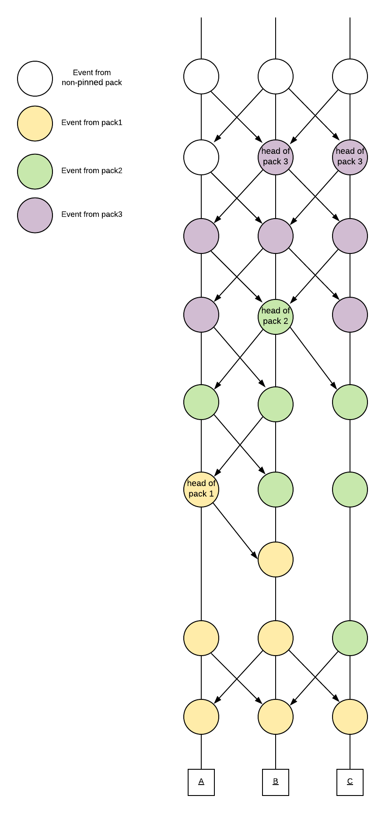
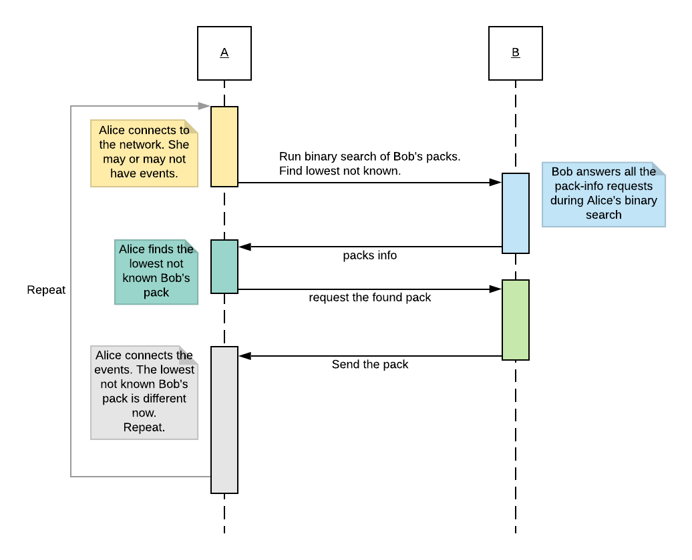

# Gossip

The doc describes the gossip algorithm, aimed to provide:

-   low-latency events propagation
-   fast initial download of events
-   tolerance to fork-events

The term “gossip” will mean the p2p messaging protocol between peers for exchanging
graph events.
Generally, it serves the same purpose as p2p protocols for
exchanging blocks in Blockchain-based ledgers, but it's a bit more complex due to the graph
structure.

In short, the algorithm is based on:

-   downloading events as a peer's prepared "chain" of event packs.
    This method is primarily active during initial events download.
-   broadcasting (and relaying) events among peers.
    This method is primarily active when node has already synced up.

The algorithm is a “transport” level, it doesn’t depend on consensus algorithm,
it just delivers events. It doesn’t matter who delivers events, 
as long as these events are valid. So there's no need to connect
to validator nodes on purpose.

## Intuition of event packs

#### We don't need to exchange blocks

We already divide our events by which Atroposes confirmed them.
Each Atropos confirms a set of events, orders them, and these events may be
written on disk in this order. These blocks are identical on all the nodes (due to aBFT).

Yet we don't use these blocks for gossip, because they don’t include all the
observed events (blocks are restricted to contain no more than
`MaxValidators`\*`MaxValidatorEventsInBlock` events),
and don’t include events from cheaters (to further decrease the size of block).

#### We exchange special packs of events

Instead, each node maintains a similar division of events into packs.
Similar to block, every pack is a set of events, observed by a
**set** (not by a single event, unlike block) of head events.
Pack includes all the observed events, including cheater’s.
We want packs to have uniform sizes, so basically we create a new pack
(by increasing packs counter and saving current global heads),
when the size/length of current pack is greater than N.

This way, every pack may be connected when and only when
all the previous packs are connected, we may
run a binary search to find a lowest not downloaded peer's pack, to avoid
downloading already connected events.

Each peer has its owns packs division, not identical to packs of other peers.

New nodes download events pack-by-pack.
The synced up nodes get the most of the events via events broadcasting,
and they don’t need to download packs normally.

#### Packs example



## Relay/broadcasting events

#### Sequence diagram


#### Is peer interested in event?

input: event ID, peer

Function returns false if peer probably knows about event.
I.e. no need to broadcast event hash (or full event, if propagation is aggressive)
to this peer.

```go
if Did peer send me this event ID?
	return false
if Did I send event ID to this peer?
	return false
return (event's epoch == peer.progress.Epoch OR
	    event's epoch == peer.progress.Epoch+1)
```

## Packs downloading

#### Sequence diagram



#### Is Pack Known?

input: packInfo, events DB

The function returns true if pack is already downloaded on this node.

```go
if I have connected all the events from {packInfo.Heads}
	return true
else
	return false
```

## Assembling packs

#### Ordering of events in pack

Events in packs must be partially ordered by Lamport time.
This way, events may be connected in order in which they are listed in pack.
Event ID starts with `epoch`:`lamport time`,
so the sorting is done on DB side, because DB sorts records lexicographically (by key).

#### On new event

input: e (event)

```go
packInfos[Last pack height].numOfEvents += 1
for each parent from e.parents
	if parent in {Global heads}
		{Global heads}.erase(parent)
{Global heads}.insert(e)
packs[Last pack height].insert(e.ID)
```

#### Pack pinning

The routine marks non-pinned packs as pinned when they become big enough.

```go
if packInfos[Last pack height].numOfEvent >= N
	infos[Last pack height].heads = Global heads
	Last pack height += 1
```

## Raw protocol messages

#### ProgressMsg

Signals about the current synchronization status.

The current peer's status is used during packs downloading,
and to estimate may peer be interested in the new event or not
(based on peer's epoch).

```go
type PeerProgress struct {
	Epoch        idx.Epoch
	NumOfBlocks  idx.Block
	LastPackInfo PackInfo
	LastBlock    hash.Event
}
```

#### NewEventHashesMsg

Non-aggressive events propagation. Signals about newly-connected
batch of events, sending only their IDs.

```go
hash.Events
```

#### GetEventsMsg

Request the batch of events by IDs.

```go
hash.Events
```

#### EventsMsg

Contains the batch of events. 
May be an answer to GetEventsMsg, or be sent during aggressive events propagation.

```go
[]Event
```

#### GetPackInfosMsg

Request pack infos by `epoch`:`pack indexes`

```go
type getPackInfosData struct {
	Epoch   idx.Epoch
	Indexes []idx.Pack
}
```

#### PackInfosMsg

Contains the requested pack infos. An answer to GetPackInfosMsg.

```go
type PackInfo struct {
	Index       idx.Pack
	Size        uint32
	NumOfEvents uint32
	Heads       hash.Events
}

type packInfosData struct {
	Epoch           idx.Epoch
	TotalNumOfPacks idx.Pack // in specified epoch
	Infos           []PackInfo
}
```

#### GetPackMsg

Request pack by `epoch`:`pack index`

```go
type getPackData struct {
	Epoch idx.Epoch
	Index idx.Pack
}
```

#### PackMsg

Contains the requested pack. An answer to GetPackMsg.

```go
type packData struct {
	Epoch idx.Epoch
	Index idx.Pack
	IDs   hash.Events
}
```

## Messages serialization

RLP is used for messages serialization.

## Transactions exchanging

Transactions exchanging is compatible with eth62 protocol.

## Discovery protocols

Lachesis fully supports ETH discv4/discv5 discovery protocols -
which are used to find connections in the network.
