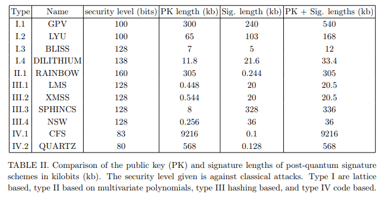

**Quantum Resistance**

Cryptographic protocols are susceptible to attack by the development of
a sufficiently large quantum computer. Of specific interest to
cryptocurrencies is how this relates to proof-of-work and more
specifically, the elliptic curve signature scheme. Optimistic estimates
state that this can be broken by a quantum computer as early as 2027, it
is therefore important to adopt a post-quantum signature scheme.

Signatures are often based on the Elliptic Curve Digital Signature
Algorithm secp256k1 curve. The security of this system is based on the
hardness of the Elliptic Curve Discrete Log Problem (ECDLP).

How quickly can a quantum computer compute the Elliptic Curve Discrete
Log Problem? An instance with a *n* bit prime field, can be solved using
9n + 2 \[log2(n)\]+10 logical qubits and
(448log2(n)+4090)n3 Toffoli gates. Bitcoin uses
n=256 bit signatures.[1]

For 10GHz clock speed and error rate of 10−5 , the signature is cracked
in 30 minutes using 485550 qubits. [2]

So if all Elliptic Curve Digital Signature Algorithms are susceptible,
then how can you implement a quantum proof solution?

In blockchain context we care about signature and public key lengths
(since these have to be stored to fully verify).

Hash based schemes like XMSS have provable security. Grover’s algorithm
can still be used to attack. DILITHIUM at 138 bits require time
2125

A truly quantum proof cryptographic algorithm does not currently exist.
Instead, the architecture allows for multiple cryptographic
implementations to be plug and play usable given the modular
architecture design. Since we aren’t focusing on tightly coupled
architecture, it means we could implement ECC, XMSS, and DILITHIUM.

[1] M Roetteler, M Naehrig, K.M. Svore, and K Lauter. Quantum resource
estimates for computing elliptic curve discrete logarithms.
arXiv:1706.06752, 2017.

[2] Divesh Aggarwal, Gavin K. Brennen, Troy Lee, Miklos Santha, Marco
Tomamichel. Quantum attacks on Bitcoin, and how to protect against them.
arXiv:1710.10377, 2017
