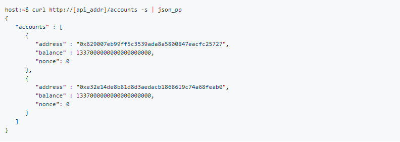
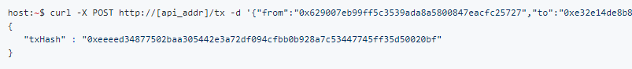
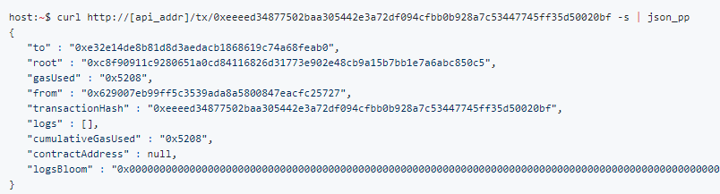

**[Airbnb FTM as a trigger to activate the Internet of
Things](#airbnb-ftm-as-a-trigger-to-activate-the-internet-of-things) 2**

> [Description](#description) 2
>
> [Implementation](#implementation) 2
>
> [Get controlled accounts](#get-controlled-accounts) 2
>
> [Get any account](#get-any-account) 2
>
> [Send transactions from controlled
> accounts](#send-transactions-from-controlled-accounts) 2
>
> [Get Transaction receipt](#get-transaction-receipt) 3
>
> [Send raw signed transactions](#send-raw-signed-transactions) 3
>
> [Solution outcome](#solution-outcome) 5
>
> [Testnet](#testnet) 5

**[Zero click Automated
MicroPayments](#zero-click-automated-micropayments) 9**

> [Description](#description-1) 9
>
> [Implementation](#implementation-1) 9
>
> [Get controlled accounts](#get-controlled-accounts-1) 9
>
> [Get any account](#get-any-account-1) 9
>
> [Send transactions from controlled
> accounts](#send-transactions-from-controlled-accounts-1) 9
>
> [Get Transaction receipt](#get-transaction-receipt-1) 10
>
> [Send raw signed transactions](#send-raw-signed-transactions-1) 10
>
> [Solution outcome](#solution-outcome-1) 12
>
> [Testnet](#testnet-1) 12

**[Pay to geofenced beacon](#pay-to-geofenced-beacon) 16**

> [Implementation](#implementation-2) 16
>
> [Get controlled accounts](#get-controlled-accounts-2) 16
>
> [Get any account](#get-any-account-2) 16
>
> [Send transactions from controlled
> accounts](#send-transactions-from-controlled-accounts-2) 17
>
> [Get Transaction receipt](#get-transaction-receipt-2) 17
>
> [Send raw signed transactions](#send-raw-signed-transactions-2) 17
>
> [Solution outcome](#solution-outcome-2) 19
>
> [Testnet](#testnet-2) 19

**[Subscription Service](#subscription-service) 23**

> [Description](#description-2) 23
>
> [Implementation](#implementation-3) 23
>
> [Get controlled accounts](#get-controlled-accounts-3) 23
>
> [Get any account](#get-any-account-3) 23
>
> [Send transactions from controlled
> accounts](#send-transactions-from-controlled-accounts-3) 23
>
> [Get Transaction receipt](#get-transaction-receipt-3) 24
>
> [Send raw signed transactions](#send-raw-signed-transactions-3) 24
>
> [Solution outcome](#solution-outcome-3) 26
>
> [Testnet](#testnet-3) 26

**[Intuitive FTM transfers](#intuitive-ftm-transfers) 30**

> [Description](#description-3) 30
>
> [Implementation](#implementation-4) 30
>
> [Get controlled accounts](#get-controlled-accounts-4) 30
>
> [Get any account](#get-any-account-4) 30
>
> [Send transactions from controlled
> accounts](#send-transactions-from-controlled-accounts-4) 30
>
> [Get Transaction receipt](#get-transaction-receipt-4) 31
>
> [Send raw signed transactions](#send-raw-signed-transactions-4) 31
>
> [Solution outcome](#solution-outcome-4) 33
>
> [Testnet](#testnet-4) 33

**[Joint payment plans /
Group-funding](#joint-payment-plans-group-funding) 37**

> [Description](#description-4) 37
>
> [Implementation](#implementation-5) 37
>
> [Get controlled accounts](#get-controlled-accounts-5) 37
>
> [Get any account](#get-any-account-5) 37
>
> [Send transactions from controlled
> accounts](#send-transactions-from-controlled-accounts-5) 38
>
> [Get Transaction receipt](#get-transaction-receipt-5) 38
>
> [Send raw signed transactions](#send-raw-signed-transactions-5) 38
>
> [Solution outcome](#solution-outcome-5) 40
>
> [Testnet](#testnet-5) 40

 
=

Airbnb FTM as a trigger to activate the Internet of Things
==========================================================

Description
-----------

Create an Airbnb style app where paying users would pay FTM to unlock
the house.

Assume some locking mechanism (can be an online lock, doesn’t have to be
physical).

Assume booking for the location must occur and that booking must
coincide with a FTM account.

Assume that an exact amount of FTM must be paid for the lock to open.

Implementation
--------------

### Get controlled accounts

This endpoint returns all the accounts that are controlled by the evm
instance. These are the accounts whose private keys are present in the
keystore. example:

### Get any account

This method allows retrieving the information about any account, not
just the ones whose keys are included in the keystore.

### Send transactions from controlled accounts

Send a transaction from an account controlled by the evm instance. The
transaction will be signed by the service since the corresponding
private key is present in the keystore. example: Send Ether between
accounts

### Get Transaction receipt

Example:

### Send raw signed transactions

Most of the time, one will require to send transactions from accounts
that are not controlled by the evm instance. The transaction will be
assembled, signed and encoded on the client side. The resulting raw
signed transaction bytes can be submitted to evm through the /rawtx
endpoint. example:

Below is how to interact, otherwise standard EVM rules.

// node.js

const axios = require('axios');

const EthereumTx = require('ethereumjs-tx')

const privateKey = Buffer.from('&lt;private key&gt;', 'hex')

const txParams = {

nonce: '0x00',

gasPrice: '0x000000000001',

gasLimit: '0x27100',

to: '0xFD00A5fE03CB4672e4380046938cFe5A18456Df4',

value: '0x00',

data: '0x',

// EIP 155 chainId - mainnet: 1, ropsten: 3

chainId: 1

}

const tx = new EthereumTx(txParams)

tx.sign(privateKey)

const serializedTx = tx.serialize()

const hexTx = '0x' + serializedTx.toString('hex')

axios.post('[http://ip:port/sendRawTransaction](http://18.221.128.6:8080/sendRawTransaction)',
hexTx)

.then(function (response) {

console.log(response.data);

})

.catch(function (error) {

console.log(error);

});

//50c4bf4dde1f383a172f52cb4624f089f685e67e00c6741a3ae03826c99cf082:0xFD00A5fE03CB4672e4380046938cFe5A18456Df4

//7c9d2f34f5869204fe8232442bc2280a613601783fab2b936cf91a054668537a:0xfd9AB87eCEdC912A63f5B8fa3b8d7667d33Fd981

// [http://](http://18.221.128.6:8080/account/629007eb99ff5c3539ada8a5800847eacfc25727)[ip:port](http://18.221.128.6:8080/sendRawTransaction)/account/629007eb99ff5c3539ada8a5800847eacfc25727

// http://ip:port/sendRawTransaction

// [http://](http://18.221.128.6:8080/transactions)[ip:port](http://18.221.128.6:8080/sendRawTransaction)/transactions

// [http://](http://18.221.128.6:8080/accounts)[ip:port](http://18.221.128.6:8080/sendRawTransaction)/accounts

// [http://](http://18.221.128.6:8080/transaction/%7B%7D)[ip:port](http://18.221.128.6:8080/sendRawTransaction)/transaction/{}

// [http://](http://18.221.128.6:8080/account/%7B%7D)[ip:port](http://18.221.128.6:8080/sendRawTransaction)/account/{}

/\*

[http://](http://18.221.128.6:8080/account/0xFD00A5fE03CB4672e4380046938cFe5A18456Df4)[ip:port](http://18.221.128.6:8080/sendRawTransaction)/account/0xFD00A5fE03CB4672e4380046938cFe5A18456Df4

{"address":"0xFD00A5fE03CB4672e4380046938cFe5A18456Df4","balance":9999790000000000000000,"nonce":1}

[http://](http://18.221.128.6:8080/transaction/0x68a07a9dc6ff0052e42f4e7afa117e90fb896eda168211f040da69606a2aeddc)[ip:port](http://18.221.128.6:8080/sendRawTransaction)/transaction/0x68a07a9dc6ff0052e42f4e7afa117e90fb896eda168211f040da69606a2aeddc

{"root":"0x7ed3e21533e05c18ded09e02d7bf6bf812c218a3a7af8c6b5cc23b5cb4951069","transactionHash":"0x68a07a9dc6ff0052e42f4e7afa117e90fb896eda168211f040da69606a2aeddc","from":"0xfd00a5fe03cb4672e4380046938cfe5a18456df4","to":"0xfd00a5fe03cb4672e4380046938cfe5a18456df4","gasUsed":21000,"cumulativeGasUsed":21000,"contractAddress":"0x0000000000000000000000000000000000000000","logs":\[\],"logsBloom":"0x00000000000000000000000000000000000000000000000000000000000000000000000000000000000000000000000000000000000000000000000000000000000000000000000000000000000000000000000000000000000000000000000000000000000000000000000000000000000000000000000000000000000000000000000000000000000000000000000000000000000000000000000000000000000000000000000000000000000000000000000000000000000000000000000000000000000000000000000000000000000000000000000000000000000000000000000000000000000000000000000000000000000000000000000000000000","failed":false}

function getNonce(tx) {

axios.get('[http://](http://18.221.128.6:8080/account/'+tx.from)[ip:port](http://18.221.128.6:8080/sendRawTransaction)[/account/'+tx.from](http://18.221.128.6:8080/account/'+tx.from))

.then(function (response) {

tx.nonce = response.data.nonce

generateRawTx(tx, priv)

})

.catch(function (error) {

console.log(error);

});

}

\*/

Solution outcome
----------------

See a listing of bookings (can be hardcoded). Register for a specific
booking. Open the lock (physical or digital) by making an in app
payment.

Solution can be web or mobile.

Solution should run on Fantom VM.

Any language choice.

Testnet
-------

Option 1: Connect directly to testnet at;

http://18.221.128.6:8080

Example call; [http://18.221.128.6:8080/account/0xFD00A5fE03CB4672e4380046938cFe5A18456Df4](http://18.221.128.6:8080/account/0xFD00A5fE03CB4672e4380046938cFe5A18456Df4)

Option 2: Host own local node;

Startup

Step 0 Docker

Create an 3 node lachesis cluster with:

n=3 BUILD\_DIR="$PWD" ./docker/builder/scale.bash

-   Docker

-   jq

-   Bash

-   glider base Docker Image with:

-   git clone https://github.com/andrecronje/evm \# or \`cd
    > $GOPATH/src/github.com/andrecronje\`  
    > cd evm/docker/glider  
    > docker build --compress --squash --force-rm --tag "${PWD\#\#\*/}"
    > .

-   Go

-   [ class="underline">batch-ethkey](https://github.com/SamuelMarks/batch-ethkey)
    > with: go get -v github.com/SamuelMarks/batch-ethkey

Step 1 Installing Go (Ubuntu)

sudo apt-get update

sudo apt-get -y upgrade

sudo curl -O
https://storage.googleapis.com/golang/go1.9.1.linux-amd64.tar.gz

sudo tar -xvf go1.9.1.linux-amd64.tar.gz

sudo mv go /usr/local

sudo nano \~/.profile

export PATH=$PATH:/usr/local/go/bin

source \~/.profile

Step 2 Clone Repo

mkdir -p $GOPATH/src/github.com/andrecronje/

cd $GOPATH/src/github.com/andrecronje

git clone https://github.com/andrecronje/lachesis.git

export GOPATH=$HOME/work

cd $GOPATH/src/github.com/andrecronje/lachesis

curl https://glide.sh/get \| sh

glide install

Step 3 (Optional, hard mode)

sudo apt-get update

sudo apt-get -y upgrade

sudo curl -O
https://storage.googleapis.com/golang/go1.9.1.linux-amd64.tar.gz

sudo tar -xvf go1.9.1.linux-amd64.tar.gz

sudo mv go /usr/local

sudo nano \~/.profile

export PATH=$PATH:/usr/local/go/bin

source \~/.profile

mkdir $HOME/work

export GOPATH=$HOME/work

mkdir -p $HOME/work/src/github.com/user/

cd $HOME/work/src/github.com/user/

git clone https://github.com/andrecronje/lachesis.git

apt-get install -y build-essential

\#Lachesis

go get github.com/dgraph-io/badger

go get github.com/sirupsen/logrus

go get gopkg.in/urfave/cli.v1

make build

\#Lachesis

./build/lachesis keygen

mkdir -p /root/.lachesis/

vi /root/.lachesis/priv\_key.pem

vi /root/.lachesis/peers.json

\[

{

"NetAddr":"ip:12000",

"PubKeyHex":"0x0448C9212873C76DE0086DA680F9329735C40674B5FA05105886548B217273B0AFA02D73157F

4D96DACFE1D9E44DBB2608F5C60D037743DB18567B82D077CBAE40"

},

{

"NetAddr":"ip:12000",

"PubKeyHex":"0x04C503A238046D9095B548E61939CA58BE926C6809F7205CD2D671A88C4E8369754ADE343FB

B4FBE9A46118EB549753B76B18243369E0475A319989F06879CFE19"

},

{

"NetAddr":"ip:12000",

"PubKeyHex":"0x046A584F2FBDF61A36B8D30461C9285B817F60271D41B7B7EC445EF73DD2B363B1F782D5FE9

6D3D08B71750F4D07CC137AE7AD9A95574791737E6E407880015B3A"

}

\]

Running the node

The default data dir is currently;

$HOME/.lachesis/

In this folder it expects two files;

priv\_key.pem

peers.json

peers.json is the current node list (completely permissioned system
currently, it is defined as per below, the

PubKeyHex is the public key (with 0x) that corresponds to the private
key found in priv\_key.pem

\[

{

"NetAddr":"ip:12000",

"PubKeyHex":"0x0448C9212873C76DE0086DA680F9329735C40674B5FA05105886548B217273B0AFA02D73157F

4D96DACFE1D9E44DBB2608F5C60D037743DB18567B82D077CBAE40"

},

{

"NetAddr":"ip:12000",

"PubKeyHex":"0x04C503A238046D9095B548E61939CA58BE926C6809F7205CD2D671A88C4E8369754ADE343FB

B4FBE9A46118EB549753B76B18243369E0475A319989F06879CFE19"

},

{

"NetAddr":"ip:12000",

"PubKeyHex":"0x046A584F2FBDF61A36B8D30461C9285B817F60271D41B7B7EC445EF73DD2B363B1F782D5FE9

6D3D08B71750F4D07CC137AE7AD9A95574791737E6E407880015B3A"

}

\]

To run the nodes you execute;

\#service node

./build/lachesis run -node\_addr="ip:port" -service\_addr="ip:port"

\#proxy node

./build/lachesis run -node\_addr="ip:port" -proxy\_addr="ip:port"
-client\_addr="ip:port"

Example Commands

\#service node

./build/lachesis run -node\_addr="ip:12000" -service\_addr="ip:8000"

\#proxy node

./build/lachesis run -node\_addr="ip:12000" -proxy\_addr="ip:9000"
-client\_addr="ip:9000"

You can subscribe to service\_addr for http requests, so in above
example http://ip:8000/stats

 
=

Zero click Automated MicroPayments
==================================

Description
-----------

Create an automated FTM payments system Chrome extension that allows for
zero click automated payments.

Based off of the specification here;

[https://docs.google.com/document/d/1PR14e2oa-eRb9pRpQHMz428CPMYU0l\_IUgkIxr1Y0N0/edit](https://docs.google.com/document/d/1PR14e2oa-eRb9pRpQHMz428CPMYU0l_IUgkIxr1Y0N0/edit)

Sample video;

[https://devpost.com/software/zero-click-bitcoin-micropayments](https://devpost.com/software/zero-click-bitcoin-micropayments)

Implementation
--------------

### Get controlled accounts

This endpoint returns all the accounts that are controlled by the evm
instance. These are the accounts whose private keys are present in the
keystore. example:

### Get any account

This method allows retrieving the information about any account, not
just the ones whose keys are included in the keystore.

### Send transactions from controlled accounts

Send a transaction from an account controlled by the evm instance. The
transaction will be signed by the service since the corresponding
private key is present in the keystore. example: Send Ether between
accounts

### Get Transaction receipt

Example:

### Send raw signed transactions

Most of the time, one will require to send transactions from accounts
that are not controlled by the evm instance. The transaction will be
assembled, signed and encoded on the client side. The resulting raw
signed transaction bytes can be submitted to evm through the /rawtx
endpoint. example:

Below is how to interact, otherwise standard EVM rules.

// node.js

const axios = require('axios');

const EthereumTx = require('ethereumjs-tx')

const privateKey = Buffer.from('&lt;private key&gt;', 'hex')

const txParams = {

nonce: '0x00',

gasPrice: '0x000000000001',

gasLimit: '0x27100',

to: '0xFD00A5fE03CB4672e4380046938cFe5A18456Df4',

value: '0x00',

data: '0x',

// EIP 155 chainId - mainnet: 1, ropsten: 3

chainId: 1

}

const tx = new EthereumTx(txParams)

tx.sign(privateKey)

const serializedTx = tx.serialize()

const hexTx = '0x' + serializedTx.toString('hex')

axios.post('[http://ip:port/sendRawTransaction](http://18.221.128.6:8080/sendRawTransaction)',
hexTx)

.then(function (response) {

console.log(response.data);

})

.catch(function (error) {

console.log(error);

});

//50c4bf4dde1f383a172f52cb4624f089f685e67e00c6741a3ae03826c99cf082:0xFD00A5fE03CB4672e4380046938cFe5A18456Df4

//7c9d2f34f5869204fe8232442bc2280a613601783fab2b936cf91a054668537a:0xfd9AB87eCEdC912A63f5B8fa3b8d7667d33Fd981

// [http://](http://18.221.128.6:8080/account/629007eb99ff5c3539ada8a5800847eacfc25727)[ip:port](http://18.221.128.6:8080/sendRawTransaction)/account/629007eb99ff5c3539ada8a5800847eacfc25727

// http://ip:port/sendRawTransaction

// [http://](http://18.221.128.6:8080/transactions)[ip:port](http://18.221.128.6:8080/sendRawTransaction)/transactions

// [http://](http://18.221.128.6:8080/accounts)[ip:port](http://18.221.128.6:8080/sendRawTransaction)/accounts

// [http://](http://18.221.128.6:8080/transaction/%7B%7D)[ip:port](http://18.221.128.6:8080/sendRawTransaction)/transaction/{}

// [http://](http://18.221.128.6:8080/account/%7B%7D)[ip:port](http://18.221.128.6:8080/sendRawTransaction)/account/{}

/\*

[http://](http://18.221.128.6:8080/account/0xFD00A5fE03CB4672e4380046938cFe5A18456Df4)[ip:port](http://18.221.128.6:8080/sendRawTransaction)/account/0xFD00A5fE03CB4672e4380046938cFe5A18456Df4

{"address":"0xFD00A5fE03CB4672e4380046938cFe5A18456Df4","balance":9999790000000000000000,"nonce":1}

[http://](http://18.221.128.6:8080/transaction/0x68a07a9dc6ff0052e42f4e7afa117e90fb896eda168211f040da69606a2aeddc)[ip:port](http://18.221.128.6:8080/sendRawTransaction)/transaction/0x68a07a9dc6ff0052e42f4e7afa117e90fb896eda168211f040da69606a2aeddc

{"root":"0x7ed3e21533e05c18ded09e02d7bf6bf812c218a3a7af8c6b5cc23b5cb4951069","transactionHash":"0x68a07a9dc6ff0052e42f4e7afa117e90fb896eda168211f040da69606a2aeddc","from":"0xfd00a5fe03cb4672e4380046938cfe5a18456df4","to":"0xfd00a5fe03cb4672e4380046938cfe5a18456df4","gasUsed":21000,"cumulativeGasUsed":21000,"contractAddress":"0x0000000000000000000000000000000000000000","logs":\[\],"logsBloom":"0x00000000000000000000000000000000000000000000000000000000000000000000000000000000000000000000000000000000000000000000000000000000000000000000000000000000000000000000000000000000000000000000000000000000000000000000000000000000000000000000000000000000000000000000000000000000000000000000000000000000000000000000000000000000000000000000000000000000000000000000000000000000000000000000000000000000000000000000000000000000000000000000000000000000000000000000000000000000000000000000000000000000000000000000000000000000","failed":false}

function getNonce(tx) {

axios.get('[http://](http://18.221.128.6:8080/account/'+tx.from)[ip:port](http://18.221.128.6:8080/sendRawTransaction)[/account/'+tx.from](http://18.221.128.6:8080/account/'+tx.from))

.then(function (response) {

tx.nonce = response.data.nonce

generateRawTx(tx, priv)

})

.catch(function (error) {

console.log(error);

});

}

\*/

Solution outcome
----------------

Access online paid for content by activating the chrome extension.

Solution can be web or mobile.

Solution should run on Fantom VM.

Any language choice.

Testnet
-------

Option 1: Connect directly to testnet at;

http://18.221.128.6:8080

Example call; [http://18.221.128.6:8080/account/0xFD00A5fE03CB4672e4380046938cFe5A18456Df4](http://18.221.128.6:8080/account/0xFD00A5fE03CB4672e4380046938cFe5A18456Df4)

Option 2: Host own local node;

Startup

Step 0 Docker

Create an 3 node lachesis cluster with:

n=3 BUILD\_DIR="$PWD" ./docker/builder/scale.bash

-   Docker

-   jq

-   Bash

-   glider base Docker Image with:

-   git clone https://github.com/andrecronje/evm \# or \`cd
    > $GOPATH/src/github.com/andrecronje\`  
    > cd evm/docker/glider  
    > docker build --compress --squash --force-rm --tag "${PWD\#\#\*/}"
    > .

-   Go

-   [ class="underline">batch-ethkey](https://github.com/SamuelMarks/batch-ethkey)
    > with: go get -v github.com/SamuelMarks/batch-ethkey

Step 1 Installing Go (Ubuntu)

sudo apt-get update

sudo apt-get -y upgrade

sudo curl -O
https://storage.googleapis.com/golang/go1.9.1.linux-amd64.tar.gz

sudo tar -xvf go1.9.1.linux-amd64.tar.gz

sudo mv go /usr/local

sudo nano \~/.profile

export PATH=$PATH:/usr/local/go/bin

source \~/.profile

Step 2 Clone Repo

mkdir -p $GOPATH/src/github.com/andrecronje/

cd $GOPATH/src/github.com/andrecronje

git clone https://github.com/andrecronje/lachesis.git

export GOPATH=$HOME/work

cd $GOPATH/src/github.com/andrecronje/lachesis

curl https://glide.sh/get \| sh

glide install

Step 3 (Optional, hard mode)

sudo apt-get update

sudo apt-get -y upgrade

sudo curl -O
https://storage.googleapis.com/golang/go1.9.1.linux-amd64.tar.gz

sudo tar -xvf go1.9.1.linux-amd64.tar.gz

sudo mv go /usr/local

sudo nano \~/.profile

export PATH=$PATH:/usr/local/go/bin

source \~/.profile

mkdir $HOME/work

export GOPATH=$HOME/work

mkdir -p $HOME/work/src/github.com/user/

cd $HOME/work/src/github.com/user/

git clone https://github.com/andrecronje/lachesis.git

apt-get install -y build-essential

\#Lachesis

go get github.com/dgraph-io/badger

go get github.com/sirupsen/logrus

go get gopkg.in/urfave/cli.v1

make build

\#Lachesis

./build/lachesis keygen

mkdir -p /root/.lachesis/

vi /root/.lachesis/priv\_key.pem

vi /root/.lachesis/peers.json

\[

{

"NetAddr":"ip:12000",

"PubKeyHex":"0x0448C9212873C76DE0086DA680F9329735C40674B5FA05105886548B217273B0AFA02D73157F

4D96DACFE1D9E44DBB2608F5C60D037743DB18567B82D077CBAE40"

},

{

"NetAddr":"ip:12000",

"PubKeyHex":"0x04C503A238046D9095B548E61939CA58BE926C6809F7205CD2D671A88C4E8369754ADE343FB

B4FBE9A46118EB549753B76B18243369E0475A319989F06879CFE19"

},

{

"NetAddr":"ip:12000",

"PubKeyHex":"0x046A584F2FBDF61A36B8D30461C9285B817F60271D41B7B7EC445EF73DD2B363B1F782D5FE9

6D3D08B71750F4D07CC137AE7AD9A95574791737E6E407880015B3A"

}

\]

Running the node

The default data dir is currently;

$HOME/.lachesis/

In this folder it expects two files;

priv\_key.pem

peers.json

peers.json is the current node list (completely permissioned system
currently, it is defined as per below, the

PubKeyHex is the public key (with 0x) that corresponds to the private
key found in priv\_key.pem

\[

{

"NetAddr":"ip:12000",

"PubKeyHex":"0x0448C9212873C76DE0086DA680F9329735C40674B5FA05105886548B217273B0AFA02D73157F

4D96DACFE1D9E44DBB2608F5C60D037743DB18567B82D077CBAE40"

},

{

"NetAddr":"ip:12000",

"PubKeyHex":"0x04C503A238046D9095B548E61939CA58BE926C6809F7205CD2D671A88C4E8369754ADE343FB

B4FBE9A46118EB549753B76B18243369E0475A319989F06879CFE19"

},

{

"NetAddr":"ip:12000",

"PubKeyHex":"0x046A584F2FBDF61A36B8D30461C9285B817F60271D41B7B7EC445EF73DD2B363B1F782D5FE9

6D3D08B71750F4D07CC137AE7AD9A95574791737E6E407880015B3A"

}

\]

To run the nodes you execute;

\#service node

./build/lachesis run -node\_addr="ip:port" -service\_addr="ip:port"

\#proxy node

./build/lachesis run -node\_addr="ip:port" -proxy\_addr="ip:port"
-client\_addr="ip:port"

Example Commands

\#service node

./build/lachesis run -node\_addr="ip:12000" -service\_addr="ip:8000"

\#proxy node

./build/lachesis run -node\_addr="ip:12000" -proxy\_addr="ip:9000"
-client\_addr="ip:9000"

You can subscribe to service\_addr for http requests, so in above
example http://ip:8000/stats

 
=

Pay to geofenced beacon
=======================

Using geofencing and the [payment
protocol](https://github.com/bitcoin/bips/blob/master/bip-0070.mediawiki)
allow for geo location based payments.

1.  I inform my server when I’m ready to pay at a restaurant.

2.  When I start my client app, my phone could use either geofencing
    > (online coordinates database) or a local device (Bluetooth etc)
    > placed at the venue to show me a list of potential payees.

3.  The payment screen could allow me to select what to pay for (just in
    > case there are multiple invoices to be settled). The items can be
    > shown and the payment protocol should help identify the
    > organization paid (by showing the cert owner on the top of the
    > screen).

4.  I should be able to pay and leave without using the phone keyboard.

It’s worth noting that this can be achieved without the need for a
native app (though that would be preferable).

Implementation
--------------

### Get controlled accounts

This endpoint returns all the accounts that are controlled by the evm
instance. These are the accounts whose private keys are present in the
keystore. example:

### Get any account

This method allows retrieving the information about any account, not
just the ones whose keys are included in the keystore.

### Send transactions from controlled accounts

Send a transaction from an account controlled by the evm instance. The
transaction will be signed by the service since the corresponding
private key is present in the keystore. example: Send Ether between
accounts

### Get Transaction receipt

Example:

### Send raw signed transactions

Most of the time, one will require to send transactions from accounts
that are not controlled by the evminstance. The transaction will be
assembled, signed and encoded on the client side. The resulting raw
signed transaction bytes can be submitted to evm through the /rawtx
endpoint. example:

Below is how to interact, otherwise standard EVM rules.

// node.js

const axios = require('axios');

const EthereumTx = require('ethereumjs-tx')

const privateKey = Buffer.from('&lt;private key&gt;', 'hex')

const txParams = {

nonce: '0x00',

gasPrice: '0x000000000001',

gasLimit: '0x27100',

to: '0xFD00A5fE03CB4672e4380046938cFe5A18456Df4',

value: '0x00',

data: '0x',

// EIP 155 chainId - mainnet: 1, ropsten: 3

chainId: 1

}

const tx = new EthereumTx(txParams)

tx.sign(privateKey)

const serializedTx = tx.serialize()

const hexTx = '0x' + serializedTx.toString('hex')

axios.post('[http://ip:port/sendRawTransaction](http://18.221.128.6:8080/sendRawTransaction)',
hexTx)

.then(function (response) {

console.log(response.data);

})

.catch(function (error) {

console.log(error);

});

//50c4bf4dde1f383a172f52cb4624f089f685e67e00c6741a3ae03826c99cf082:0xFD00A5fE03CB4672e4380046938cFe5A18456Df4

//7c9d2f34f5869204fe8232442bc2280a613601783fab2b936cf91a054668537a:0xfd9AB87eCEdC912A63f5B8fa3b8d7667d33Fd981

// [http://](http://18.221.128.6:8080/account/629007eb99ff5c3539ada8a5800847eacfc25727)[ip:port](http://18.221.128.6:8080/sendRawTransaction)/account/629007eb99ff5c3539ada8a5800847eacfc25727

// http://ip:port/sendRawTransaction

// [http://](http://18.221.128.6:8080/transactions)[ip:port](http://18.221.128.6:8080/sendRawTransaction)/transactions

// [http://](http://18.221.128.6:8080/accounts)[ip:port](http://18.221.128.6:8080/sendRawTransaction)/accounts

// [http://](http://18.221.128.6:8080/transaction/%7B%7D)[ip:port](http://18.221.128.6:8080/sendRawTransaction)/transaction/{}

// [http://](http://18.221.128.6:8080/account/%7B%7D)[ip:port](http://18.221.128.6:8080/sendRawTransaction)/account/{}

/\*

[http://](http://18.221.128.6:8080/account/0xFD00A5fE03CB4672e4380046938cFe5A18456Df4)[ip:port](http://18.221.128.6:8080/sendRawTransaction)/account/0xFD00A5fE03CB4672e4380046938cFe5A18456Df4

{"address":"0xFD00A5fE03CB4672e4380046938cFe5A18456Df4","balance":9999790000000000000000,"nonce":1}

[http://](http://18.221.128.6:8080/transaction/0x68a07a9dc6ff0052e42f4e7afa117e90fb896eda168211f040da69606a2aeddc)[ip:port](http://18.221.128.6:8080/sendRawTransaction)/transaction/0x68a07a9dc6ff0052e42f4e7afa117e90fb896eda168211f040da69606a2aeddc

{"root":"0x7ed3e21533e05c18ded09e02d7bf6bf812c218a3a7af8c6b5cc23b5cb4951069","transactionHash":"0x68a07a9dc6ff0052e42f4e7afa117e90fb896eda168211f040da69606a2aeddc","from":"0xfd00a5fe03cb4672e4380046938cfe5a18456df4","to":"0xfd00a5fe03cb4672e4380046938cfe5a18456df4","gasUsed":21000,"cumulativeGasUsed":21000,"contractAddress":"0x0000000000000000000000000000000000000000","logs":\[\],"logsBloom":"0x00000000000000000000000000000000000000000000000000000000000000000000000000000000000000000000000000000000000000000000000000000000000000000000000000000000000000000000000000000000000000000000000000000000000000000000000000000000000000000000000000000000000000000000000000000000000000000000000000000000000000000000000000000000000000000000000000000000000000000000000000000000000000000000000000000000000000000000000000000000000000000000000000000000000000000000000000000000000000000000000000000000000000000000000000000000","failed":false}

function getNonce(tx) {

axios.get('[http://](http://18.221.128.6:8080/account/'+tx.from)[ip:port](http://18.221.128.6:8080/sendRawTransaction)[/account/'+tx.from](http://18.221.128.6:8080/account/'+tx.from))

.then(function (response) {

tx.nonce = response.data.nonce

generateRawTx(tx, priv)

})

.catch(function (error) {

console.log(error);

});

}

\*/

Solution outcome
----------------

Open application. Retrieve local listing of outstanding invoices. Settle
invoice with payment.

Solution can be web or mobile.

Solution should run on Fantom VM.

Any language choice.

Testnet
-------

Option 1: Connect directly to testnet at;

http://18.221.128.6:8080

Example call; [http://18.221.128.6:8080/account/0xFD00A5fE03CB4672e4380046938cFe5A18456Df4](http://18.221.128.6:8080/account/0xFD00A5fE03CB4672e4380046938cFe5A18456Df4)

Option 2: Host own local node;

Startup

Step 0 Docker

Create an 3 node lachesis cluster with:

n=3 BUILD\_DIR="$PWD" ./docker/builder/scale.bash

-   Docker

-   jq

-   Bash

-   glider base Docker Image with:

-   git clone https://github.com/andrecronje/evm \# or \`cd
    > $GOPATH/src/github.com/andrecronje\`  
    > cd evm/docker/glider  
    > docker build --compress --squash --force-rm --tag "${PWD\#\#\*/}"
    > .

-   Go

-   [ class="underline">batch-ethkey](https://github.com/SamuelMarks/batch-ethkey)
    > with: go get -v github.com/SamuelMarks/batch-ethkey

Step 1 Installing Go (Ubuntu)

sudo apt-get update

sudo apt-get -y upgrade

sudo curl -O
https://storage.googleapis.com/golang/go1.9.1.linux-amd64.tar.gz

sudo tar -xvf go1.9.1.linux-amd64.tar.gz

sudo mv go /usr/local

sudo nano \~/.profile

export PATH=$PATH:/usr/local/go/bin

source \~/.profile

Step 2 Clone Repo

mkdir -p $GOPATH/src/github.com/andrecronje/

cd $GOPATH/src/github.com/andrecronje

git clone https://github.com/andrecronje/lachesis.git

export GOPATH=$HOME/work

cd $GOPATH/src/github.com/andrecronje/lachesis

curl https://glide.sh/get \| sh

glide install

Step 3 (Optional, hard mode)

sudo apt-get update

sudo apt-get -y upgrade

sudo curl -O
https://storage.googleapis.com/golang/go1.9.1.linux-amd64.tar.gz

sudo tar -xvf go1.9.1.linux-amd64.tar.gz

sudo mv go /usr/local

sudo nano \~/.profile

export PATH=$PATH:/usr/local/go/bin

source \~/.profile

mkdir $HOME/work

export GOPATH=$HOME/work

mkdir -p $HOME/work/src/github.com/user/

cd $HOME/work/src/github.com/user/

git clone https://github.com/andrecronje/lachesis.git

apt-get install -y build-essential

\#Lachesis

go get github.com/dgraph-io/badger

go get github.com/sirupsen/logrus

go get gopkg.in/urfave/cli.v1

make build

\#Lachesis

./build/lachesis keygen

mkdir -p /root/.lachesis/

vi /root/.lachesis/priv\_key.pem

vi /root/.lachesis/peers.json

\[

{

"NetAddr":"ip:12000",

"PubKeyHex":"0x0448C9212873C76DE0086DA680F9329735C40674B5FA05105886548B217273B0AFA02D73157F

4D96DACFE1D9E44DBB2608F5C60D037743DB18567B82D077CBAE40"

},

{

"NetAddr":"ip:12000",

"PubKeyHex":"0x04C503A238046D9095B548E61939CA58BE926C6809F7205CD2D671A88C4E8369754ADE343FB

B4FBE9A46118EB549753B76B18243369E0475A319989F06879CFE19"

},

{

"NetAddr":"ip:12000",

"PubKeyHex":"0x046A584F2FBDF61A36B8D30461C9285B817F60271D41B7B7EC445EF73DD2B363B1F782D5FE9

6D3D08B71750F4D07CC137AE7AD9A95574791737E6E407880015B3A"

}

\]

Running the node

The default data dir is currently;

$HOME/.lachesis/

In this folder it expects two files;

priv\_key.pem

peers.json

peers.json is the current node list (completely permissioned system
currently, it is defined as per below, the

PubKeyHex is the public key (with 0x) that corresponds to the private
key found in priv\_key.pem

\[

{

"NetAddr":"ip:12000",

"PubKeyHex":"0x0448C9212873C76DE0086DA680F9329735C40674B5FA05105886548B217273B0AFA02D73157F

4D96DACFE1D9E44DBB2608F5C60D037743DB18567B82D077CBAE40"

},

{

"NetAddr":"ip:12000",

"PubKeyHex":"0x04C503A238046D9095B548E61939CA58BE926C6809F7205CD2D671A88C4E8369754ADE343FB

B4FBE9A46118EB549753B76B18243369E0475A319989F06879CFE19"

},

{

"NetAddr":"ip:12000",

"PubKeyHex":"0x046A584F2FBDF61A36B8D30461C9285B817F60271D41B7B7EC445EF73DD2B363B1F782D5FE9

6D3D08B71750F4D07CC137AE7AD9A95574791737E6E407880015B3A"

}

\]

To run the nodes you execute;

\#service node

./build/lachesis run -node\_addr="ip:port" -service\_addr="ip:port"

\#proxy node

./build/lachesis run -node\_addr="ip:port" -proxy\_addr="ip:port"
-client\_addr="ip:port"

Example Commands

\#service node

./build/lachesis run -node\_addr="ip:12000" -service\_addr="ip:8000"

\#proxy node

./build/lachesis run -node\_addr="ip:12000" -proxy\_addr="ip:9000"
-client\_addr="ip:9000"

You can subscribe to service\_addr for http requests, so in above
example http://ip:8000/stats

 
=

Subscription Service
====================

Description
-----------

Crypto enables push transactions (as opposed to pull transactions with
credit cards), and this model has made it difficult for merchants to
accept recurring payments.

If I were subscribing to various services in FTM, I’d like to receive a
monthly list of subscriptions so that I could pay for them all in one
place. This could be a page where I could check off the subscriptions
that I’d like to continue (e.g. Amazon Prime, Snack-box-a-month, domain
renewal, etc) and to automatically cancel the others. The challenge
would be in creating a way for the merchants to initiate such a service.

Any solution that allows for subscription based services are welcome.

Implementation
--------------

### Get controlled accounts

This endpoint returns all the accounts that are controlled by the evm
instance. These are the accounts whose private keys are present in the
keystore. example:

### Get any account

This method allows retrieving the information about any account, not
just the ones whose keys are included in the keystore.

### Send transactions from controlled accounts

Send a transaction from an account controlled by the evm instance. The
transaction will be signed by the service since the corresponding
private key is present in the keystore. example: Send Ether between
accounts

### Get Transaction receipt

Example:

### Send raw signed transactions

Most of the time, one will require to send transactions from accounts
that are not controlled by the evm instance. The transaction will be
assembled, signed and encoded on the client side. The resulting raw
signed transaction bytes can be submitted to evm through the /rawtx
endpoint. example:

Below is how to interact, otherwise standard EVM rules.

// node.js

const axios = require('axios');

const EthereumTx = require('ethereumjs-tx')

const privateKey = Buffer.from('&lt;private key&gt;', 'hex')

const txParams = {

nonce: '0x00',

gasPrice: '0x000000000001',

gasLimit: '0x27100',

to: '0xFD00A5fE03CB4672e4380046938cFe5A18456Df4',

value: '0x00',

data: '0x',

// EIP 155 chainId - mainnet: 1, ropsten: 3

chainId: 1

}

const tx = new EthereumTx(txParams)

tx.sign(privateKey)

const serializedTx = tx.serialize()

const hexTx = '0x' + serializedTx.toString('hex')

axios.post('[http://ip:port/sendRawTransaction](http://18.221.128.6:8080/sendRawTransaction)',
hexTx)

.then(function (response) {

console.log(response.data);

})

.catch(function (error) {

console.log(error);

});

//50c4bf4dde1f383a172f52cb4624f089f685e67e00c6741a3ae03826c99cf082:0xFD00A5fE03CB4672e4380046938cFe5A18456Df4

//7c9d2f34f5869204fe8232442bc2280a613601783fab2b936cf91a054668537a:0xfd9AB87eCEdC912A63f5B8fa3b8d7667d33Fd981

// [http://](http://18.221.128.6:8080/account/629007eb99ff5c3539ada8a5800847eacfc25727)[ip:port](http://18.221.128.6:8080/sendRawTransaction)/account/629007eb99ff5c3539ada8a5800847eacfc25727

// http://ip:port/sendRawTransaction

// [http://](http://18.221.128.6:8080/transactions)[ip:port](http://18.221.128.6:8080/sendRawTransaction)/transactions

// [http://](http://18.221.128.6:8080/accounts)[ip:port](http://18.221.128.6:8080/sendRawTransaction)/accounts

// [http://](http://18.221.128.6:8080/transaction/%7B%7D)[ip:port](http://18.221.128.6:8080/sendRawTransaction)/transaction/{}

// [http://](http://18.221.128.6:8080/account/%7B%7D)[ip:port](http://18.221.128.6:8080/sendRawTransaction)/account/{}

/\*

[http://](http://18.221.128.6:8080/account/0xFD00A5fE03CB4672e4380046938cFe5A18456Df4)[ip:port](http://18.221.128.6:8080/sendRawTransaction)/account/0xFD00A5fE03CB4672e4380046938cFe5A18456Df4

{"address":"0xFD00A5fE03CB4672e4380046938cFe5A18456Df4","balance":9999790000000000000000,"nonce":1}

[http://](http://18.221.128.6:8080/transaction/0x68a07a9dc6ff0052e42f4e7afa117e90fb896eda168211f040da69606a2aeddc)[ip:port](http://18.221.128.6:8080/sendRawTransaction)/transaction/0x68a07a9dc6ff0052e42f4e7afa117e90fb896eda168211f040da69606a2aeddc

{"root":"0x7ed3e21533e05c18ded09e02d7bf6bf812c218a3a7af8c6b5cc23b5cb4951069","transactionHash":"0x68a07a9dc6ff0052e42f4e7afa117e90fb896eda168211f040da69606a2aeddc","from":"0xfd00a5fe03cb4672e4380046938cfe5a18456df4","to":"0xfd00a5fe03cb4672e4380046938cfe5a18456df4","gasUsed":21000,"cumulativeGasUsed":21000,"contractAddress":"0x0000000000000000000000000000000000000000","logs":\[\],"logsBloom":"0x00000000000000000000000000000000000000000000000000000000000000000000000000000000000000000000000000000000000000000000000000000000000000000000000000000000000000000000000000000000000000000000000000000000000000000000000000000000000000000000000000000000000000000000000000000000000000000000000000000000000000000000000000000000000000000000000000000000000000000000000000000000000000000000000000000000000000000000000000000000000000000000000000000000000000000000000000000000000000000000000000000000000000000000000000000000","failed":false}

function getNonce(tx) {

axios.get('[http://](http://18.221.128.6:8080/account/'+tx.from)[ip:port](http://18.221.128.6:8080/sendRawTransaction)[/account/'+tx.from](http://18.221.128.6:8080/account/'+tx.from))

.then(function (response) {

tx.nonce = response.data.nonce

generateRawTx(tx, priv)

})

.catch(function (error) {

console.log(error);

});

}

\*/

Solution outcome
----------------

Retrieve a listing of subscription services. Allow to bulk pay,
selectively pay, or cancel subscriptions. Merchants should be able to
initiate a subscription service to the chain.

Solution can be web or mobile.

Solution should run on Fantom VM.

Any language choice.

Testnet
-------

Option 1: Connect directly to testnet at;

http://18.221.128.6:8080

Example call; [http://18.221.128.6:8080/account/0xFD00A5fE03CB4672e4380046938cFe5A18456Df4](http://18.221.128.6:8080/account/0xFD00A5fE03CB4672e4380046938cFe5A18456Df4)

Option 2: Host own local node;

Startup

Step 0 Docker

Create an 3 node lachesis cluster with:

n=3 BUILD\_DIR="$PWD" ./docker/builder/scale.bash

-   Docker

-   jq

-   Bash

-   glider base Docker Image with:

-   git clone https://github.com/andrecronje/evm \# or \`cd
    > $GOPATH/src/github.com/andrecronje\`  
    > cd evm/docker/glider  
    > docker build --compress --squash --force-rm --tag "${PWD\#\#\*/}"
    > .

-   Go

-   [ class="underline">batch-ethkey](https://github.com/SamuelMarks/batch-ethkey)
    > with: go get -v github.com/SamuelMarks/batch-ethkey

Step 1 Installing Go (Ubuntu)

sudo apt-get update

sudo apt-get -y upgrade

sudo curl -O
https://storage.googleapis.com/golang/go1.9.1.linux-amd64.tar.gz

sudo tar -xvf go1.9.1.linux-amd64.tar.gz

sudo mv go /usr/local

sudo nano \~/.profile

export PATH=$PATH:/usr/local/go/bin

source \~/.profile

Step 2 Clone Repo

mkdir -p $GOPATH/src/github.com/andrecronje/

cd $GOPATH/src/github.com/andrecronje

git clone https://github.com/andrecronje/lachesis.git

export GOPATH=$HOME/work

cd $GOPATH/src/github.com/andrecronje/lachesis

curl https://glide.sh/get \| sh

glide install

Step 3 (Optional, hard mode)

sudo apt-get update

sudo apt-get -y upgrade

sudo curl -O
https://storage.googleapis.com/golang/go1.9.1.linux-amd64.tar.gz

sudo tar -xvf go1.9.1.linux-amd64.tar.gz

sudo mv go /usr/local

sudo nano \~/.profile

export PATH=$PATH:/usr/local/go/bin

source \~/.profile

mkdir $HOME/work

export GOPATH=$HOME/work

mkdir -p $HOME/work/src/github.com/user/

cd $HOME/work/src/github.com/user/

git clone https://github.com/andrecronje/lachesis.git

apt-get install -y build-essential

\#Lachesis

go get github.com/dgraph-io/badger

go get github.com/sirupsen/logrus

go get gopkg.in/urfave/cli.v1

make build

\#Lachesis

./build/lachesis keygen

mkdir -p /root/.lachesis/

vi /root/.lachesis/priv\_key.pem

vi /root/.lachesis/peers.json

\[

{

"NetAddr":"ip:12000",

"PubKeyHex":"0x0448C9212873C76DE0086DA680F9329735C40674B5FA05105886548B217273B0AFA02D73157F

4D96DACFE1D9E44DBB2608F5C60D037743DB18567B82D077CBAE40"

},

{

"NetAddr":"ip:12000",

"PubKeyHex":"0x04C503A238046D9095B548E61939CA58BE926C6809F7205CD2D671A88C4E8369754ADE343FB

B4FBE9A46118EB549753B76B18243369E0475A319989F06879CFE19"

},

{

"NetAddr":"ip:12000",

"PubKeyHex":"0x046A584F2FBDF61A36B8D30461C9285B817F60271D41B7B7EC445EF73DD2B363B1F782D5FE9

6D3D08B71750F4D07CC137AE7AD9A95574791737E6E407880015B3A"

}

\]

Running the node

The default data dir is currently;

$HOME/.lachesis/

In this folder it expects two files;

priv\_key.pem

peers.json

peers.json is the current node list (completely permissioned system
currently, it is defined as per below, the

PubKeyHex is the public key (with 0x) that corresponds to the private
key found in priv\_key.pem

\[

{

"NetAddr":"ip:12000",

"PubKeyHex":"0x0448C9212873C76DE0086DA680F9329735C40674B5FA05105886548B217273B0AFA02D73157F

4D96DACFE1D9E44DBB2608F5C60D037743DB18567B82D077CBAE40"

},

{

"NetAddr":"ip:12000",

"PubKeyHex":"0x04C503A238046D9095B548E61939CA58BE926C6809F7205CD2D671A88C4E8369754ADE343FB

B4FBE9A46118EB549753B76B18243369E0475A319989F06879CFE19"

},

{

"NetAddr":"ip:12000",

"PubKeyHex":"0x046A584F2FBDF61A36B8D30461C9285B817F60271D41B7B7EC445EF73DD2B363B1F782D5FE9

6D3D08B71750F4D07CC137AE7AD9A95574791737E6E407880015B3A"

}

\]

To run the nodes you execute;

\#service node

./build/lachesis run -node\_addr="ip:port" -service\_addr="ip:port"

\#proxy node

./build/lachesis run -node\_addr="ip:port" -proxy\_addr="ip:port"
-client\_addr="ip:port"

Example Commands

\#service node

./build/lachesis run -node\_addr="ip:12000" -service\_addr="ip:8000"

\#proxy node

./build/lachesis run -node\_addr="ip:12000" -proxy\_addr="ip:9000"
-client\_addr="ip:9000"

You can subscribe to service\_addr for http requests, so in above
example http://ip:8000/stats

 
=

Intuitive FTM transfers
=======================

Description
-----------

We need only look at examples of how products like Venmo, WhatsApp and
Bump have leveraged social networks and locational services to link
people up with each other. [Venmo](https://venmo.com/about/product/) uses
the Facebook graph, [WhatsApp](http://www.whatsapp.com/faq/en/iphone/20910703)
uses your phone contacts to pre-populate people to talk with, and [Bump](http://stackoverflow.com/questions/3383447/how-does-bump-technology-work)
intelligently paired you up with people in close proximity. Using a
combination of these techniques, we should be able to better solve peer
to peer money transfer such that it doesn’t require the use of a camera
or on-screen keyboard.

Implementation
--------------

### Get controlled accounts

This endpoint returns all the accounts that are controlled by the evm
instance. These are the accounts whose private keys are present in the
keystore. example:

### Get any account

This method allows retrieving the information about any account, not
just the ones whose keys are included in the keystore.

### Send transactions from controlled accounts

Send a transaction from an account controlled by the evm instance. The
transaction will be signed by the service since the corresponding
private key is present in the keystore. example: Send Ether between
accounts

### Get Transaction receipt

Example:

### Send raw signed transactions

Most of the time, one will require to send transactions from accounts
that are not controlled by the evm instance. The transaction will be
assembled, signed and encoded on the client side. The resulting raw
signed transaction bytes can be submitted to evm through the /rawtx
endpoint. example:

Below is how to interact, otherwise standard EVM rules.

// node.js

const axios = require('axios');

const EthereumTx = require('ethereumjs-tx')

const privateKey = Buffer.from('&lt;private key&gt;', 'hex')

const txParams = {

nonce: '0x00',

gasPrice: '0x000000000001',

gasLimit: '0x27100',

to: '0xFD00A5fE03CB4672e4380046938cFe5A18456Df4',

value: '0x00',

data: '0x',

// EIP 155 chainId - mainnet: 1, ropsten: 3

chainId: 1

}

const tx = new EthereumTx(txParams)

tx.sign(privateKey)

const serializedTx = tx.serialize()

const hexTx = '0x' + serializedTx.toString('hex')

axios.post('[http://ip:port/sendRawTransaction](http://18.221.128.6:8080/sendRawTransaction)',
hexTx)

.then(function (response) {

console.log(response.data);

})

.catch(function (error) {

console.log(error);

});

//50c4bf4dde1f383a172f52cb4624f089f685e67e00c6741a3ae03826c99cf082:0xFD00A5fE03CB4672e4380046938cFe5A18456Df4

//7c9d2f34f5869204fe8232442bc2280a613601783fab2b936cf91a054668537a:0xfd9AB87eCEdC912A63f5B8fa3b8d7667d33Fd981

// [http://](http://18.221.128.6:8080/account/629007eb99ff5c3539ada8a5800847eacfc25727)[ip:port](http://18.221.128.6:8080/sendRawTransaction)/account/629007eb99ff5c3539ada8a5800847eacfc25727

// http://ip:port/sendRawTransaction

// [http://](http://18.221.128.6:8080/transactions)[ip:port](http://18.221.128.6:8080/sendRawTransaction)/transactions

// [http://](http://18.221.128.6:8080/accounts)[ip:port](http://18.221.128.6:8080/sendRawTransaction)/accounts

// [http://](http://18.221.128.6:8080/transaction/%7B%7D)[ip:port](http://18.221.128.6:8080/sendRawTransaction)/transaction/{}

// [http://](http://18.221.128.6:8080/account/%7B%7D)[ip:port](http://18.221.128.6:8080/sendRawTransaction)/account/{}

/\*

[http://](http://18.221.128.6:8080/account/0xFD00A5fE03CB4672e4380046938cFe5A18456Df4)[ip:port](http://18.221.128.6:8080/sendRawTransaction)/account/0xFD00A5fE03CB4672e4380046938cFe5A18456Df4

{"address":"0xFD00A5fE03CB4672e4380046938cFe5A18456Df4","balance":9999790000000000000000,"nonce":1}

[http://](http://18.221.128.6:8080/transaction/0x68a07a9dc6ff0052e42f4e7afa117e90fb896eda168211f040da69606a2aeddc)[ip:port](http://18.221.128.6:8080/sendRawTransaction)/transaction/0x68a07a9dc6ff0052e42f4e7afa117e90fb896eda168211f040da69606a2aeddc

{"root":"0x7ed3e21533e05c18ded09e02d7bf6bf812c218a3a7af8c6b5cc23b5cb4951069","transactionHash":"0x68a07a9dc6ff0052e42f4e7afa117e90fb896eda168211f040da69606a2aeddc","from":"0xfd00a5fe03cb4672e4380046938cfe5a18456df4","to":"0xfd00a5fe03cb4672e4380046938cfe5a18456df4","gasUsed":21000,"cumulativeGasUsed":21000,"contractAddress":"0x0000000000000000000000000000000000000000","logs":\[\],"logsBloom":"0x00000000000000000000000000000000000000000000000000000000000000000000000000000000000000000000000000000000000000000000000000000000000000000000000000000000000000000000000000000000000000000000000000000000000000000000000000000000000000000000000000000000000000000000000000000000000000000000000000000000000000000000000000000000000000000000000000000000000000000000000000000000000000000000000000000000000000000000000000000000000000000000000000000000000000000000000000000000000000000000000000000000000000000000000000000000","failed":false}

function getNonce(tx) {

axios.get('[http://](http://18.221.128.6:8080/account/'+tx.from)[ip:port](http://18.221.128.6:8080/sendRawTransaction)[/account/'+tx.from](http://18.221.128.6:8080/account/'+tx.from))

.then(function (response) {

tx.nonce = response.data.nonce

generateRawTx(tx, priv)

})

.catch(function (error) {

console.log(error);

});

}

\*/

Solution outcome
----------------

Allow for an intuitive localized payment option service that does not
involve QR codes.

Solution can be web or mobile.

Solution should run on Fantom VM.

Any language choice.

Testnet
-------

Option 1: Connect directly to testnet at;

http://18.221.128.6:8080

Example call; [http://18.221.128.6:8080/account/0xFD00A5fE03CB4672e4380046938cFe5A18456Df4](http://18.221.128.6:8080/account/0xFD00A5fE03CB4672e4380046938cFe5A18456Df4)

Option 2: Host own local node;

Startup

Step 0 Docker

Create an 3 node lachesis cluster with:

n=3 BUILD\_DIR="$PWD" ./docker/builder/scale.bash

-   Docker

-   jq

-   Bash

-   glider base Docker Image with:

-   git clone https://github.com/andrecronje/evm \# or \`cd
    > $GOPATH/src/github.com/andrecronje\`  
    > cd evm/docker/glider  
    > docker build --compress --squash --force-rm --tag "${PWD\#\#\*/}"
    > .

-   Go

-   [ class="underline">batch-ethkey](https://github.com/SamuelMarks/batch-ethkey)
    > with: go get -v github.com/SamuelMarks/batch-ethkey

Step 1 Installing Go (Ubuntu)

sudo apt-get update

sudo apt-get -y upgrade

sudo curl -O
https://storage.googleapis.com/golang/go1.9.1.linux-amd64.tar.gz

sudo tar -xvf go1.9.1.linux-amd64.tar.gz

sudo mv go /usr/local

sudo nano \~/.profile

export PATH=$PATH:/usr/local/go/bin

source \~/.profile

Step 2 Clone Repo

mkdir -p $GOPATH/src/github.com/andrecronje/

cd $GOPATH/src/github.com/andrecronje

git clone https://github.com/andrecronje/lachesis.git

export GOPATH=$HOME/work

cd $GOPATH/src/github.com/andrecronje/lachesis

curl https://glide.sh/get \| sh

glide install

Step 3 (Optional, hard mode)

sudo apt-get update

sudo apt-get -y upgrade

sudo curl -O
https://storage.googleapis.com/golang/go1.9.1.linux-amd64.tar.gz

sudo tar -xvf go1.9.1.linux-amd64.tar.gz

sudo mv go /usr/local

sudo nano \~/.profile

export PATH=$PATH:/usr/local/go/bin

source \~/.profile

mkdir $HOME/work

export GOPATH=$HOME/work

mkdir -p $HOME/work/src/github.com/user/

cd $HOME/work/src/github.com/user/

git clone https://github.com/andrecronje/lachesis.git

apt-get install -y build-essential

\#Lachesis

go get github.com/dgraph-io/badger

go get github.com/sirupsen/logrus

go get gopkg.in/urfave/cli.v1

make build

\#Lachesis

./build/lachesis keygen

mkdir -p /root/.lachesis/

vi /root/.lachesis/priv\_key.pem

vi /root/.lachesis/peers.json

\[

{

"NetAddr":"ip:12000",

"PubKeyHex":"0x0448C9212873C76DE0086DA680F9329735C40674B5FA05105886548B217273B0AFA02D73157F

4D96DACFE1D9E44DBB2608F5C60D037743DB18567B82D077CBAE40"

},

{

"NetAddr":"ip:12000",

"PubKeyHex":"0x04C503A238046D9095B548E61939CA58BE926C6809F7205CD2D671A88C4E8369754ADE343FB

B4FBE9A46118EB549753B76B18243369E0475A319989F06879CFE19"

},

{

"NetAddr":"ip:12000",

"PubKeyHex":"0x046A584F2FBDF61A36B8D30461C9285B817F60271D41B7B7EC445EF73DD2B363B1F782D5FE9

6D3D08B71750F4D07CC137AE7AD9A95574791737E6E407880015B3A"

}

\]

Running the node

The default data dir is currently;

$HOME/.lachesis/

In this folder it expects two files;

priv\_key.pem

peers.json

peers.json is the current node list (completely permissioned system
currently, it is defined as per below, the

PubKeyHex is the public key (with 0x) that corresponds to the private
key found in priv\_key.pem

\[

{

"NetAddr":"ip:12000",

"PubKeyHex":"0x0448C9212873C76DE0086DA680F9329735C40674B5FA05105886548B217273B0AFA02D73157F

4D96DACFE1D9E44DBB2608F5C60D037743DB18567B82D077CBAE40"

},

{

"NetAddr":"ip:12000",

"PubKeyHex":"0x04C503A238046D9095B548E61939CA58BE926C6809F7205CD2D671A88C4E8369754ADE343FB

B4FBE9A46118EB549753B76B18243369E0475A319989F06879CFE19"

},

{

"NetAddr":"ip:12000",

"PubKeyHex":"0x046A584F2FBDF61A36B8D30461C9285B817F60271D41B7B7EC445EF73DD2B363B1F782D5FE9

6D3D08B71750F4D07CC137AE7AD9A95574791737E6E407880015B3A"

}

\]

To run the nodes you execute;

\#service node

./build/lachesis run -node\_addr="ip:port" -service\_addr="ip:port"

\#proxy node

./build/lachesis run -node\_addr="ip:port" -proxy\_addr="ip:port"
-client\_addr="ip:port"

Example Commands

\#service node

./build/lachesis run -node\_addr="ip:12000" -service\_addr="ip:8000"

\#proxy node

./build/lachesis run -node\_addr="ip:12000" -proxy\_addr="ip:9000"
-client\_addr="ip:9000"

You can subscribe to service\_addr for http requests, so in above
example http://ip:8000/stats

 
=

Joint payment plans / Group-funding
===================================

Description
-----------

There are many crowd-funding websites but they take large amounts of
fees, and are not always suitable for personal use (amongst people who
know each other). With Bitcoin, we can quickly create a simple and
inexpensive way for multiple people to buy a gift together.

1.  “Gift starter” chooses a gift (e.g. a Vase on Overstock) and the
    > amount gets converted into BTC to be funded. A wallet with
    > different receive addresses for each contributor can be created
    > (on a multi-sig service like BitGo).

2.  A page is set up (similar to a kickstarter page) on the service,
    > asking for funding for the item (and displaying the wallet receive
    > addresses), and giving a deadline. Meanwhile the item is
    > “reserved” or placed on layaway on the merchant site. Individual
    > users contributions can be tracked since there’s a separate
    > address given to each one of them.

3.  When the wallet has sufficient funds, the service processes the
    > order. If the wallet does not reach the “tipping” point, then all
    > funds are returned to the original owners.

Implementation
--------------

### Get controlled accounts

This endpoint returns all the accounts that are controlled by the evm
instance. These are the accounts whose private keys are present in the
keystore. example:

### Get any account

This method allows retrieving the information about any account, not
just the ones whose keys are included in the keystore.

### Send transactions from controlled accounts

Send a transaction from an account controlled by the evm instance. The
transaction will be signed by the service since the corresponding
private key is present in the keystore. example: Send Ether between
accounts

### Get Transaction receipt

Example:

### Send raw signed transactions

Most of the time, one will require to send transactions from accounts
that are not controlled by the evm instance. The transaction will be
assembled, signed and encoded on the client side. The resulting raw
signed transaction bytes can be submitted to evm through the /rawtx
endpoint. example:

Below is how to interact, otherwise standard EVM rules.

// node.js

const axios = require('axios');

const EthereumTx = require('ethereumjs-tx')

const privateKey = Buffer.from('&lt;private key&gt;', 'hex')

const txParams = {

nonce: '0x00',

gasPrice: '0x000000000001',

gasLimit: '0x27100',

to: '0xFD00A5fE03CB4672e4380046938cFe5A18456Df4',

value: '0x00',

data: '0x',

// EIP 155 chainId - mainnet: 1, ropsten: 3

chainId: 1

}

const tx = new EthereumTx(txParams)

tx.sign(privateKey)

const serializedTx = tx.serialize()

const hexTx = '0x' + serializedTx.toString('hex')

axios.post('[http://ip:port/sendRawTransaction](http://18.221.128.6:8080/sendRawTransaction)',
hexTx)

.then(function (response) {

console.log(response.data);

})

.catch(function (error) {

console.log(error);

});

//50c4bf4dde1f383a172f52cb4624f089f685e67e00c6741a3ae03826c99cf082:0xFD00A5fE03CB4672e4380046938cFe5A18456Df4

//7c9d2f34f5869204fe8232442bc2280a613601783fab2b936cf91a054668537a:0xfd9AB87eCEdC912A63f5B8fa3b8d7667d33Fd981

// [http://](http://18.221.128.6:8080/account/629007eb99ff5c3539ada8a5800847eacfc25727)[ip:port](http://18.221.128.6:8080/sendRawTransaction)/account/629007eb99ff5c3539ada8a5800847eacfc25727

// http://ip:port/sendRawTransaction

// [http://](http://18.221.128.6:8080/transactions)[ip:port](http://18.221.128.6:8080/sendRawTransaction)/transactions

// [http://](http://18.221.128.6:8080/accounts)[ip:port](http://18.221.128.6:8080/sendRawTransaction)/accounts

// [http://](http://18.221.128.6:8080/transaction/%7B%7D)[ip:port](http://18.221.128.6:8080/sendRawTransaction)/transaction/{}

// [http://](http://18.221.128.6:8080/account/%7B%7D)[ip:port](http://18.221.128.6:8080/sendRawTransaction)/account/{}

/\*

[http://](http://18.221.128.6:8080/account/0xFD00A5fE03CB4672e4380046938cFe5A18456Df4)[ip:port](http://18.221.128.6:8080/sendRawTransaction)/account/0xFD00A5fE03CB4672e4380046938cFe5A18456Df4

{"address":"0xFD00A5fE03CB4672e4380046938cFe5A18456Df4","balance":9999790000000000000000,"nonce":1}

[http://](http://18.221.128.6:8080/transaction/0x68a07a9dc6ff0052e42f4e7afa117e90fb896eda168211f040da69606a2aeddc)[ip:port](http://18.221.128.6:8080/sendRawTransaction)/transaction/0x68a07a9dc6ff0052e42f4e7afa117e90fb896eda168211f040da69606a2aeddc

{"root":"0x7ed3e21533e05c18ded09e02d7bf6bf812c218a3a7af8c6b5cc23b5cb4951069","transactionHash":"0x68a07a9dc6ff0052e42f4e7afa117e90fb896eda168211f040da69606a2aeddc","from":"0xfd00a5fe03cb4672e4380046938cfe5a18456df4","to":"0xfd00a5fe03cb4672e4380046938cfe5a18456df4","gasUsed":21000,"cumulativeGasUsed":21000,"contractAddress":"0x0000000000000000000000000000000000000000","logs":\[\],"logsBloom":"0x00000000000000000000000000000000000000000000000000000000000000000000000000000000000000000000000000000000000000000000000000000000000000000000000000000000000000000000000000000000000000000000000000000000000000000000000000000000000000000000000000000000000000000000000000000000000000000000000000000000000000000000000000000000000000000000000000000000000000000000000000000000000000000000000000000000000000000000000000000000000000000000000000000000000000000000000000000000000000000000000000000000000000000000000000000000","failed":false}

function getNonce(tx) {

axios.get('[http://](http://18.221.128.6:8080/account/'+tx.from)[ip:port](http://18.221.128.6:8080/sendRawTransaction)[/account/'+tx.from](http://18.221.128.6:8080/account/'+tx.from))

.then(function (response) {

tx.nonce = response.data.nonce

generateRawTx(tx, priv)

})

.catch(function (error) {

console.log(error);

});

}

\*/

Solution outcome
----------------

Buy a gift, source the funds, receive the gift.

Solution can be web or mobile.

Solution should run on Fantom VM.

Any language choice.

Testnet
-------

Option 1: Connect directly to testnet at;

http://18.221.128.6:8080

Example call; [http://18.221.128.6:8080/account/0xFD00A5fE03CB4672e4380046938cFe5A18456Df4](http://18.221.128.6:8080/account/0xFD00A5fE03CB4672e4380046938cFe5A18456Df4)

Option 2: Host own local node;

Startup

Step 0 Docker

Create an 3 node lachesis cluster with:

n=3 BUILD\_DIR="$PWD" ./docker/builder/scale.bash

-   Docker

-   jq

-   Bash

-   glider base Docker Image with:

-   git clone https://github.com/andrecronje/evm \# or \`cd
    > $GOPATH/src/github.com/andrecronje\`  
    > cd evm/docker/glider  
    > docker build --compress --squash --force-rm --tag "${PWD\#\#\*/}"
    > .

-   Go

-   [ class="underline">batch-ethkey](https://github.com/SamuelMarks/batch-ethkey)
    > with: go get -v github.com/SamuelMarks/batch-ethkey

Step 1 Installing Go (Ubuntu)

sudo apt-get update

sudo apt-get -y upgrade

sudo curl -O
https://storage.googleapis.com/golang/go1.9.1.linux-amd64.tar.gz

sudo tar -xvf go1.9.1.linux-amd64.tar.gz

sudo mv go /usr/local

sudo nano \~/.profile

export PATH=$PATH:/usr/local/go/bin

source \~/.profile

Step 2 Clone Repo

mkdir -p $GOPATH/src/github.com/andrecronje/

cd $GOPATH/src/github.com/andrecronje

git clone https://github.com/andrecronje/lachesis.git

export GOPATH=$HOME/work

cd $GOPATH/src/github.com/andrecronje/lachesis

curl https://glide.sh/get \| sh

glide install

Step 3 (Optional, hard mode)

sudo apt-get update

sudo apt-get -y upgrade

sudo curl -O
https://storage.googleapis.com/golang/go1.9.1.linux-amd64.tar.gz

sudo tar -xvf go1.9.1.linux-amd64.tar.gz

sudo mv go /usr/local

sudo nano \~/.profile

export PATH=$PATH:/usr/local/go/bin

source \~/.profile

mkdir $HOME/work

export GOPATH=$HOME/work

mkdir -p $HOME/work/src/github.com/user/

cd $HOME/work/src/github.com/user/

git clone https://github.com/andrecronje/lachesis.git

apt-get install -y build-essential

\#Lachesis

go get github.com/dgraph-io/badger

go get github.com/sirupsen/logrus

go get gopkg.in/urfave/cli.v1

make build

\#Lachesis

./build/lachesis keygen

mkdir -p /root/.lachesis/

vi /root/.lachesis/priv\_key.pem

vi /root/.lachesis/peers.json

\[

{

"NetAddr":"ip:12000",

"PubKeyHex":"0x0448C9212873C76DE0086DA680F9329735C40674B5FA05105886548B217273B0AFA02D73157F

4D96DACFE1D9E44DBB2608F5C60D037743DB18567B82D077CBAE40"

},

{

"NetAddr":"ip:12000",

"PubKeyHex":"0x04C503A238046D9095B548E61939CA58BE926C6809F7205CD2D671A88C4E8369754ADE343FB

B4FBE9A46118EB549753B76B18243369E0475A319989F06879CFE19"

},

{

"NetAddr":"ip:12000",

"PubKeyHex":"0x046A584F2FBDF61A36B8D30461C9285B817F60271D41B7B7EC445EF73DD2B363B1F782D5FE9

6D3D08B71750F4D07CC137AE7AD9A95574791737E6E407880015B3A"

}

\]

Running the node

The default data dir is currently;

$HOME/.lachesis/

In this folder it expects two files;

priv\_key.pem

peers.json

peers.json is the current node list (completely permissioned system
currently, it is defined as per below, the

PubKeyHex is the public key (with 0x) that corresponds to the private
key found in priv\_key.pem

\[

{

"NetAddr":"ip:12000",

"PubKeyHex":"0x0448C9212873C76DE0086DA680F9329735C40674B5FA05105886548B217273B0AFA02D73157F

4D96DACFE1D9E44DBB2608F5C60D037743DB18567B82D077CBAE40"

},

{

"NetAddr":"ip:12000",

"PubKeyHex":"0x04C503A238046D9095B548E61939CA58BE926C6809F7205CD2D671A88C4E8369754ADE343FB

B4FBE9A46118EB549753B76B18243369E0475A319989F06879CFE19"

},

{

"NetAddr":"ip:12000",

"PubKeyHex":"0x046A584F2FBDF61A36B8D30461C9285B817F60271D41B7B7EC445EF73DD2B363B1F782D5FE9

6D3D08B71750F4D07CC137AE7AD9A95574791737E6E407880015B3A"

}

\]

To run the nodes you execute;

\#service node

./build/lachesis run -node\_addr="ip:port" -service\_addr="ip:port"

\#proxy node

./build/lachesis run -node\_addr="ip:port" -proxy\_addr="ip:port"
-client\_addr="ip:port"

Example Commands

\#service node

./build/lachesis run -node\_addr="ip:12000" -service\_addr="ip:8000"

\#proxy node

./build/lachesis run -node\_addr="ip:12000" -proxy\_addr="ip:9000"
-client\_addr="ip:9000"

You can subscribe to service\_addr for http requests, so in above
example http://ip:8000/stats
