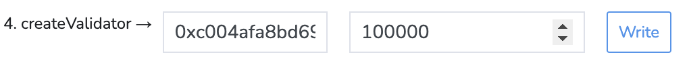

# Run a Validator Node (Testnet)

> [!CAUTION]
> Running a validator node is a complex process and requires a lot of technical knowledge. We're not kidding here!

Run a full node as described [here](../../README.md) and allow it to **fully sync**, then follow the instructions below to run a validator node.

**Once again, allow the node to fully sync! You should see the "New block" log with the latest block on the [explorer](https://explorer.x1-testnet.xen.network/).**

1. Fund your validator wallet with enough XN to become a validator. At the time of writing, you need at least 100,000 XN to become a validator.
   **We highly recommend using a hardware wallet.**

2. Create a new validator key.

   To create a validator private key to sign consensus messages, use go-x1.
   Take note of the validator public key; we will need it later.

   > Create validator key
    ```shell
    x1 validator new
    ```

   After entering the command, you will be prompted to enter a password—use a strong one!
   You can, for example, use a password manager to generate a strong password to secure your wallet.

3. Place the validator password in a file.

    ```shell
    echo "MY_STRONG_PASSWORD" > ~/.x1/.password
    ```

4. Navigate to the [SFC Contract](https://explorer.x1-testnet.xen.network/address/0xFC00FACE00000000000000000000000000000000/write-contract#address-tabs) on the explorer.

5. Click the "Connect wallet" button and connect to your validator wallet.

   [](connect-wallet.png)

6. Enter your validator public key and the amount of XN you want to stake, then click "Write".

   [](create-validator.png)

7. Confirm the transaction in your wallet.

8. Verify that your validator is registered by looking up your validator ID on the [PWA explorer](https://pwa-explorer.x1-testnet.xen.network/staking).

9. Stop your node, add the `--validator.id` and `--validator.pubkey` flags to your node's command line, and restart your node.

   Replace `VALIDATOR_ID` with your validator ID and `VALIDATOR_PUBKEY` with your validator's public key.

    ```shell
    x1 --testnet --validator.id VALIDATOR_ID --validator.pubkey VALIDATOR_PUBKEY --validator.password ~/.x1/.password
    ```

   Congratulations, you are now running an X1 validator node! Make sure to keep your node up and running 24 hours a day.

## Register a Name and Icon

See the [X1 Validator Info](https://docs.xen.network/x1-validator-info/) contract for more information on registering your validator with a name and icon.
