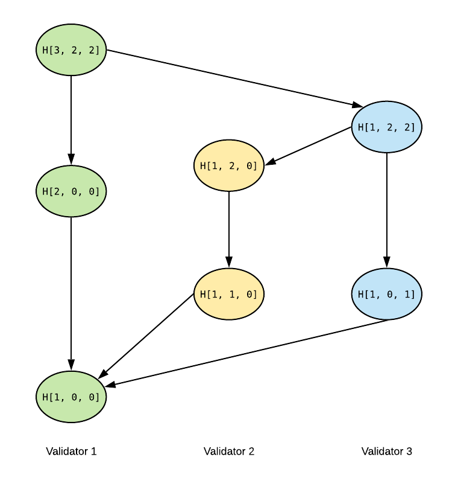
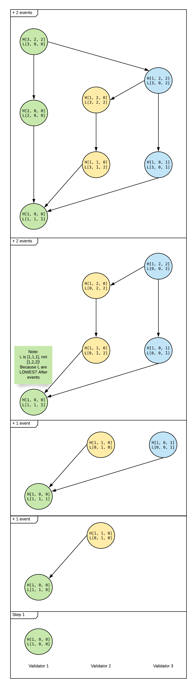
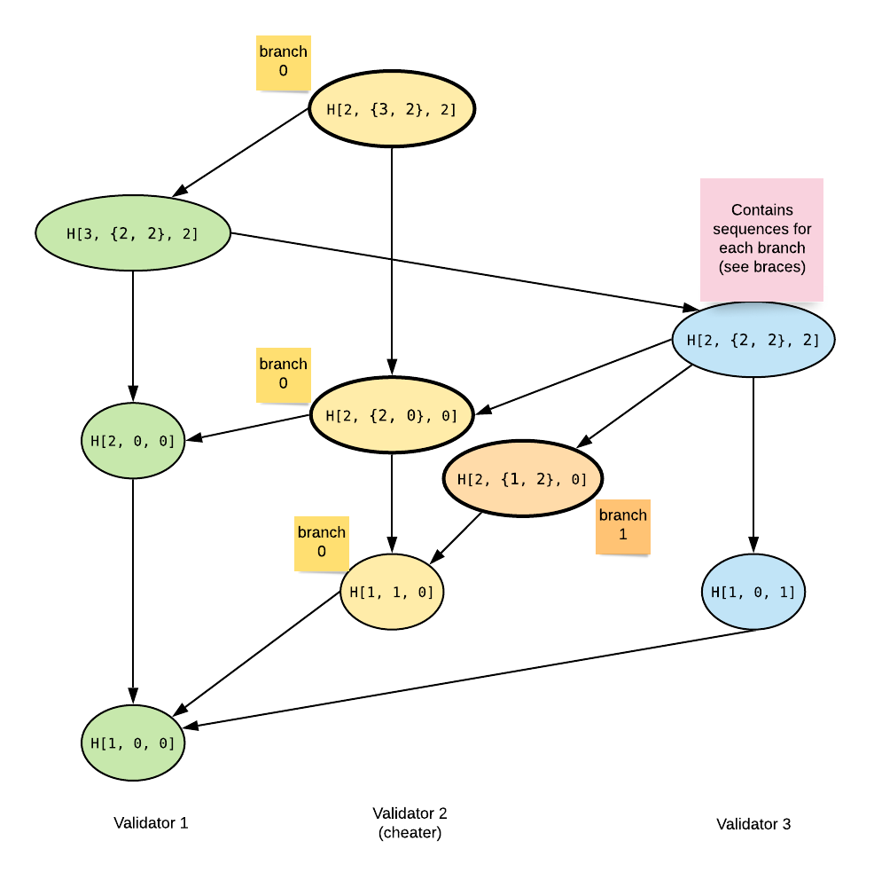

## Vector clock

In computer science, the "vector clock" is an algorithm to partially order events by their
causality (by relation ```happened-before```) - its purpose is similar to Lamport timestamp,
but, unlike Lamport timestamp, vector clock is accurate
(doesn't have ```false positive errors```).

The ```vector clock``` is exactly what the name states - ```vector clock```
is a vector of sequence numbers of highest observed events from each validator.
If there's no forks, the length of ```vector clock``` is always equal to the number
of validators in current epoch.

In Lachesis, however, the vector clock is used not for determining events causality, but to
calculate ```forklessCause``` relation. To be able to do so, 2 vector clocks with
opposite directions are needed at once:
- x.HighestBefore[v] is a vector of sequence numbers of
"highest observed by ```x event```" events from each ```validator v```.
- x.LowestAfter[v] is a vector of sequence numbers of
"lowest which observe ```x event```" events from each ```validator v```.

If validator is a cheater, then the vectors have more complex structure, storing
sequences for each validator's branch and having more elements than the number of validators.
The exact algorithms may be found in the ```vector``` package.

#### Example of HighestBefore vector
The HighestBefore depends only on event's subgraph -
so, once it's calculated, it doesn't change.



#### Example of LowestAfter vector

Unlike HighestBefore, LowestAfter of a past event may
get updated after connection of the present event.
So, to illustrate LowestAfter, we have to show the
vector step-by-step after connection of each event.



#### forklessCause calculation
The definition of ```forklessCause``` may be found in [consensus](abft_consensus.md).

To calculate the ```forklessCause```, the following algorithm is used:
```go
function forklessCause(eventA, eventB)
    counter = 0
    if eventA observes a fork from eventB creator
        return false
    for v in validators
        a = eventA.HighestBefore[v]
        b = eventB.LowestAfter[v]
        if b <= a AND b != 0 AND not(eventA observes a fork from v)
            counter += validator.Stake
    return counter >= {QUORUM}
```

The secret behind this simple function is that if
```eventA.HighestBefore[v]```<=```eventB.LowestAfter[v]```, then and only then
highest observed event by eventA, from the validator ```v```, observes eventB.

For a case when there's a fork, the calculation is more complex. The exact algorithms may be found
in the ```vector``` package.

#### Example of HighestBefore vector with a fork

The main idea of a fork in vector clock is simple: when a fork event occurs,
the validator virtually splits into 2 honest validators (branches).
The full algorithms may be found in ```vector``` package.


