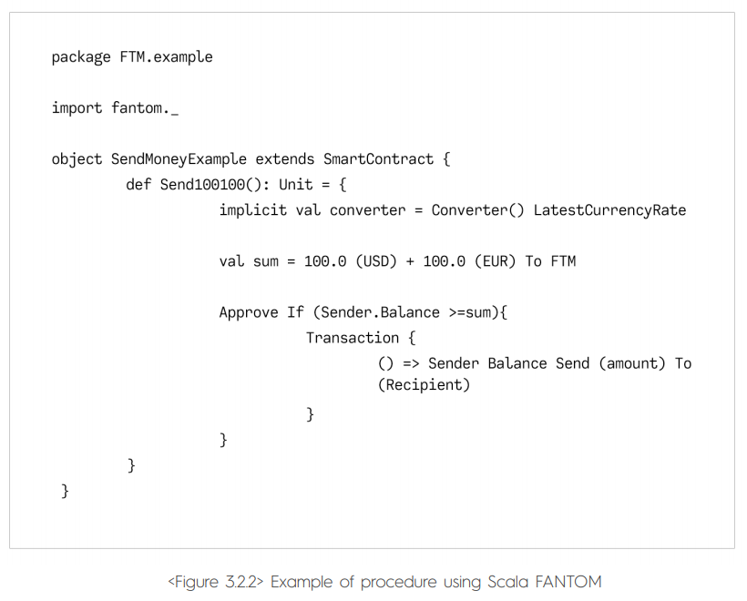
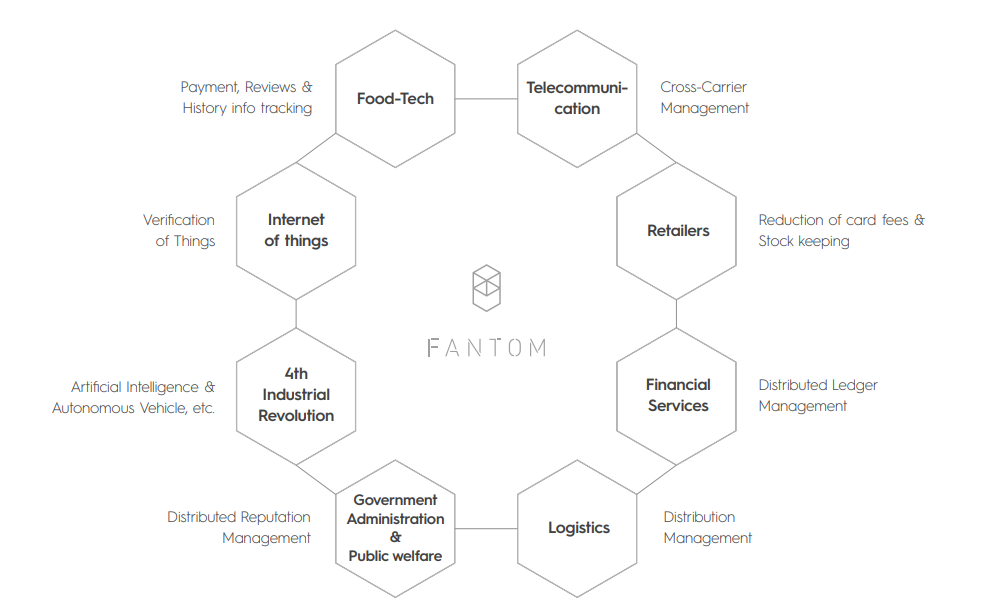

**Fantom:**

**Virtual Machine**

**[Introduction](#introduction) 3**

**[Background](#background) 3**

> [Register Based VM](#register-based-vm) 3
>
> [Stack-Based Model](#stack-based-model) 3
>
> [Register-Based Model](#register-based-model) 4

**[Virtual Machine](#virtual-machine) 5**

> [Secure, Powerful VM with
> Turing-completeness](#secure-powerful-vm-with-turing-completeness) 5
>
> [Smart Contract Language](#smart-contract-language) 5
>
> [Scala Based Compiler](#scala-based-compiler) 6
>
> [Smart Contract Production Tools](#smart-contract-production-tools) 7
>
> [Smart Contract Protocol](#smart-contract-protocol) 8

**[Applications](#applications) 9**

> [Example Application: Food
> Delivery](#example-application-food-delivery) 9

**[Research](#research) 11**

> [Background](#background-1) 11
>
> [Architectural Overview](#architectural-overview) 11
>
> [Trustless Verifiable Computing](#trustless-verifiable-computing) 11
>
> [Trustless VM](#trustless-vm) 13
>
> [Stateless Computing](#stateless-computing) 14
>
> [Achieving Fast Attestations](#achieving-fast-attestations) 15
>
> [Execution Trust](#execution-trust) 16
>
> [Decoupling Token Value](#decoupling-token-value) 16
>
> [Pledge Penalty](#pledge-penalty) 16
>
> [Contract Life Cycle](#contract-life-cycle) 17
>
> [Privacy Preserving](#privacy-preserving) 17

**[Additional Improvements](#additional-improvements) 19**

> [FastVM](#fastvm) 19
>
> [Solidity++](#solidity) 19
>
> [Event Driven](#event-driven) 19

Introduction
============

Current blockchain based virtual machines have inefficiencies in terms
of speed, optimization and cost. Opcodes have fixed execution cost fees,
causing execution to be prohibitively expensive. Execution can not be
parallelized, and each consensus participating node must execute the
state transition to have the same state outcome.

Fantom proposes an asynchronous, optimized, register based virtual
machine, capable of verifiable computing, while decoupling the token
model to provide a distributed execution marketplace with probabilistic
payments.

Background
==========

Register Based VM
-----------------

Virtual machines (VMs) used by existing cryptocurrency platforms are
mostly stack-based, such as the Ethereum Virtual Machine (EVM).
Stack-based VMs can easily execute instructions using the stack data
structure. However, as explained below, stack-based machines have longer
code lengths and slower performance speeds in general compared to a
register-based machines. As a solution to machine. Storage in DAG event
blocks are expensive. As code uses such storage, a large number of
instructions are expensive. **The Fantom Virtual Machine (FVM) intends
to extensively reduce capacity and increase processing speed**.
Publications[1] indicate that register-based virtual machines can reduce
OPCODE execution costs by over 50% and improve performance capacity by
nearly double.

Stack-Based Model
-----------------

The Stack is a basic data structure. A stack-based virtual machine uses
the stack to perform operations. Assuming that we are performing a
simple addition, four command lines are required to perform additional
manipulation using PUSH and POP manipulation. The advantage of a
stack-based model is that the operand is implicitly processed by the
stack pointer: calling a stack pointer provides the next operand (POP),
and there is no need to explicitly state the operand address. In a
stack-based VM, all arithmetic and logical operations work by first
popping and calculating the value pushed on the stack, and then by
pushing the performance outcome to the stack, for example:

• **LOAD A**: Store Local Variable A to stack

• **LOAD B**: Store Local Variable B to stack

• **ADD**: Add the two values

• **STORE C**: Store operation result to Local Variable C

Register-Based Model
--------------------

In storing the operand, a register-based virtual machine models CPU
registers. While there is no PUSH or POP instruction, a command must
include the name of the pointer, the operand for a command is explicitly
stated. For example, when performing an addition on a register-based
virtual system, the command may be expressed as follows. You can see
that this code is shorter than the earlier stack-based version:

• **ADD AX, BX, CX** ; Adds AX with BX and stores to CX.

As previously mentioned, there are no POP or PUSH instructions, so there
is only one line of code. However, unlike a stack, the addresses of
operands, such AX, BX, and CX, must be explicitly stated. On the other
hand, there is no overhead from pushes and pops using a stack, and
accordingly, the command of register-based VM is faster.

Another strength of a register-based model is that it is possible to
perform optimization which cannot be conducted in a stack-based
approach. For example, if the same calculation is performed twice, the
register model code can be optimized to make only a single calculation
and stores the value to the register for reuse, increasing execution
speed for the code.

The weakness of a register-based model is that it needs to explicitly
state the operand address, increasing the average size of a command
compared to a stack-based model. While a stack-based VM is very short,
since it does not need to explicitly state the stack address, a
register-based VM must include the location of the operand in OPCODE,
increasing the size of individual commands. However, as was proven by
Dalvik in comparison with the Java Virtual Machine (JVM), the size of
the entire code base can be extensively reduced.[2]

 
=

Virtual Machine
===============

Secure, Powerful VM with Turing-completeness
--------------------------------------------

Since we cannot know what types of operations will be needed in the
future, providing Turing completeness is critical for establishment of
the DApp ecosystem. However, providing Turing completeness inevitably
leads to the issue of decision impossibility. To address this, Ethereum
introduced the concept of “GAS” in order to avoid the halting problem.
**However, the amount of gas consumption is hard-coded in the Ethereum
code, and it is impossible to change this flexibly without a
hard-fork.** Also, although operations are critical since it is the
executor who determines whether to perform a contract, inexpensive
programs may or may not perform the operation. The DDOS attack on the
EVM in September 2016 actually slowed down the network speed almost to a
halt, as the attacker was able to attack the network by taking advantage
of low gas prices.[3] Fantom intends to design the FVM with **flexible
execution costs** in mind, with the **authority of the operation node
being limited** as well. Also, Fantom believes that using the **LCA
means that there is no need to execute the same instruction set by all
nodes**. Even if an attack is possible, it should have limited impact on
the network due to its flexibility.

The issues of security and feasibility are not limited to the EVM – they
are shared by many distributed ledger projects . Some projects (such as
Bitcoin) are mitigating such limitations by removing Turing completeness
or, like Ethereum, by providing a large number of Smart Contract
templates that enable formal verification. However, an absence of
outcome functionality makes it difficult to implement a proper DApp.

The FVM looks to **provide better security as well as Turing
completeness**. Furthermore, it looks to provide the core functionality
for properly establishing a DApp ecosystem, such as **External Code
Linking, Library, and Import, as well as strong scalability that can be
operated with a grid supercomputer**. **While a Fantom-based Smart
Contract can work in stand-alone, it can also work jointly with other
contracts, functioning as a component of the DApp Infrastructure**.

Smart Contract Language
-----------------------

Fantom provides a **SCALA-like functional programming language for
executing Smart Contracts** on top of its own Virtual Machine known as
the Fantom Virtual Machine (FVM). The FVM will allow executive smart
contract byte code efficiency and across all operating systems

Scala Based Compiler
--------------------

In order to attract vast numbers of developers, Fantom intends to design
a Fantom virtual machine for writing contracts using existing languages.
Scala, a well-known and supported functional programming language, is
intended to be the initial language. The strengths of Scala are
described below.

Scala, which was developed to remove the inconvenience of Java, allows
developers to write organized and clean code. The strongly-typed
functions of Scala can promote development and improve performance. For
example, functions, macros, and tuples are only a part of the multiple
advanced functions that are provided by Scala. Scala is a well-designed
language which integrates functional and object-oriented programming.
String pattern matching or Mixins, which include functions in class
definitions, make coding enjoyable as well. A language with
comprehensive documentation, Fantom believes Scala is an excellent
choice for developers with any level of experience. Closers and
functions are also a part of the language. The biggest advantage of
Scala is that it provides object-oriented and functional coding
paradigms at the same time. Developers can utilize the two methods with
strength to easily write “concise” and “functional” programs.

Testing and development are convenient as well. Scala can perform the
same work as Java using smaller coding lines. While Java also has
several methods for reducing the code length, such methods are
deviations from standard coding style, making the code less readable and
leading to reduced productivity. Thanks to the properties of Scala,
coding is reduced and testing and distribution become faster. Scala
includes a non-expanding API library which is concise but possesses all
necessary functions. Writing scalable software using Scala can make code
writing, testing, debugging, and distribution easier. The language is
versatile and can be used in all areas including desktop software,
games, web application programs, mobile solutions, and software
services. It is also a good fit for writing Smart Contracts.

Scala is a widely used functional programming language. A web App
framework called Play is written in Scala, and it has successfully been
established on numerous IT platforms such as Amazon and Coursera. The
strengths of Scala have already been proven through practical
applications in industry. Haskell, although an excellent functional
programming language supported by mathematicians, does not have nearly
as many users as Scala. Scala is comparatively easy to learn, and is a
popular language with a large community of users. Development is
facilitated since it also supports object-oriented programming. Also, it
has all the strengths of a well-designed functional programming
language. By removing “Side Effects”, many coding errors as well as any
changeable aspects can be identified beforehand, which also allows the
easy transfer of code to a distributed environment.

**Scala can introduce stringent coding techniques for compilation and
formal verification**. Formal verification is a mathematical methodology
which is used to prove the accuracy of a computer program. This
methodology has been used in protecting the software and hardware of
military systems, transport infrastructure, encryption, and
microprocessors. The value of formal verification in Smart Contract
codes has recently been recognized as well, in particular on the
Ethereum blockchain.[4]

Smart Contract Production Tools
-------------------------------

The Fantom Opera chain **provides a Smart Contract script editor**. It
facilitates writing Smart Contracts by **allowing the entry of various
transaction conditions that fit the characteristics of a DApp**. The
Smart Contract script of the Opera chain processes transactions types
that typically arise for each participant in **industries such as
communications, finance, logistics, and electric vehicle provision**.
Smart Contracts are coded in Scala and compiled to bytecode through the
FVM, and therefore have **Turing completeness**.

Smart Contract Protocol
-----------------------

The **Smart Contract protocol is a piece of code that facilitates,
verifies, or executes contract requirements, online without a contract
document or third party. A Smart Contract reproduces the logic of a
contract’s provisions.**

A Smart Contract, running on a distributed ledger, allows for the
exchange of money, assets, stock, or any other valuables in a
transparent manner without the need for a broker or third party. A
“traditional” contract requires third party intervention from brokers,
government institutions, banks, attorneys, or notaries, as well as the
required processing time, before receiving the goods and services.
However, using Smart Contract technology, much of the above can be
automated.

This Smart Contract technology could be compared to a vending machine. A
vending machine is designed to run automatically according to
pre-programmed rules, and its output is determined once certain
conditions are met. When using a vending machine, a user deposits money
in the machine and inputs a precise amount, after which the desired
product can be collected. Under a Smart Contract, money will be escrowed
and preserved in the Opera chain, and once certain conditions are met,
will be designed to be immediately transferred to the transaction
counterpart.

The Smart Contract protocol of Fantom’s Opera Chain processes
transactions that arise between participants according to the conditions
and requirements of each industry.

Opera’s Story is created when certain conditions within a Smart Contract
are met and the contract is fulfilled, and stores details in the Story
data segment for transactions and Smart Contracts.

Applications
============

Fantom will become the first platform to disrupt the existing
infrastructure for payments and supply-chain management. dApps built on
top of the Fantom Opera Chain will provide transparency and cost
reductions for industries including, but not limited to, food
technology, telecommunication, banking, electricity and real estate to
autonomous vehicles using instant payments with near zero cost while
maintaining hundreds of thousands of transactions per second.

Example Application: Food Delivery
----------------------------------

An applications written by smart contracts running on the Opera Chain
would be intended to allow consumers to pay costs after ordering food
online and receiving it (or at a predetermined time such as the time of
ordering). A consumer orders food using a food delivery application
host, and sends tokens. Once food is delivered, the transaction tokens
paid by the consumer would be transferred to the restaurant according to
the predefined Smart Contract.

If food is not delivered properly, consumers would demand the
replacement of food or refund of costs. The smart contract(s) would be
designed to allow the restaurant or the deliverer to make refunds to the
consumer, which is performed by the Opera payment protocol.

The restaurant or the deliverer would also approve a refund using the
application host (according to the conditions of a Smart Contract). Once
an approval is made, a refund is made according to the predefined Smart
Contract, transferring the corresponding ratio of transaction tokens (as
calculated by the infrastructure algorithm) to the consumer. Restaurants
can also make payments to the application host for advertisements.

 
=

Research
========

Background
----------

The original design of the EVM was to provide a generalized world
computer. Leveraging the total available resources of the network to
create a new supercomputer. Instead, given how execution occurs, the
network has only as much compute power as the slowest participating
consensus node. Each participant has to execute the full VM
instructions. If execution would take 3 hours to complete, then each
participating node would need to execute the full 3 hours of execution.
For this reason execution has fee and gas limits. These intrinsic limits
do not allow for complex computing or allow for execution capability to
be leveraged on a global scale.

To achieve a generalized compute engine we need to be able to decoupling
execution and create a bidder based marketplace. Execution itself
however effects state, and as such we still need to apply state changes
without needing to execute the full system state. This does mean that
there needs to be a realistic limit to on-chain state.

Architectural Overview
----------------------

-   Registration, reputation, and transparency in payments and penalties
    > for the workers occurs on-chain

-   Workers provide computational power to the system

-   Verifiers are staked entities that issue tasks and verify results

Off-chain protocol between Verifiers and Workers for execution results,
receipts, histories, and blockchain payments.

Probabilistic Payment Model that allows for trustless, stateless
payments that scale with number of tasks.

Trustless Verifiable Computing
------------------------------

The objective is trusted computing. We have a job provider *j*, and we
have a worker *w*, with computation *c(a, b)*. *j* wishes to incentivize
*w* to perform *c(a, b)*. *w* is assumed malicious. *w* could perform
zero calculation and provide output *ϕ*. *j* has no way to verify the
validity of *ϕ*. *j* rewards *w*.

Strategy One, *j* gives computation *c(a, b)* to *w1,
w2, w3, ... wn*. In order mentioned
they provide *ϕ*, *ϕ*, *ϕ*, 𝜚, *j* can assume *ϕ* is correct. *j* needs
to reward *w1,w2, w3*, till
*wn.* This is consensus based trustless computing. *j*
rewarded for each successful result. *This is expensive.*

Strategy Two, trusted hardware. Trusted hardware ensures execution.
Intel SGX is the most widely adopted. Requires pre-compilation of *c(a,
b)* into the enclave. Ensures *c(a, b)* is trusted. Cloud providers do
not currently have SGX mass adoption. This excludes a large of a user
base.

Strategy Three, zk-SNARKs (Strategy Three b, zk-STARKs, not currently
production ready). Trusted execution. Can be deployed to any system, no
hardware limitation, one to one usage.

We will use libsnark and Zokrates to demonstrate how zk-SNARKs can solve
trustless computing.

Given function *c(a, b)* we can define it in as

def main(a,b):

return a+b

Compiled via Zokrates, we receive output

Compiling add.code

Compiled program:

def main(a,b):

return (a + b)

Compiled code written to 'out',

Human readable code to 'out.code'.

Number of constraints: 1

Now we need to generate proof, given a witness of “a”: 1, ”b”: 1, ”out":
2 and inputs of 1, 1, 1, 2, we generate proof*π*and verification key *ν*

Given Proof *π*, and Inputs *i* we can use Verification Key *υ*, to
validate Inputs *i* (public inputs *a, b* and outputs *o*) for
computation *c(a, b)*

To understand the above, let us discuss interactive proofs in a
practical example. *b* want to buy item x from *a* for 1 token ( *1tk*
). *a* wants to make sure that *b* has *1tk*, *b* show *a* their wallet
address *0xb*, *a* can confirm it contains *1tk*. *a* is unsure that *b*
is the owner of wallet *0xb*, so they use the public key (or wallet
address) *0xA* to sign message *m*, that creates hash *h*. *a* gives *b*
hash *h*. *b* uses their private key *pk* to decrypt hash *h* and read
message *m*, *b* respond to *a* with message *m* (or instead as answer
to a question phrased in message *m*).

*a* has proof that *b* owns *0xb*. This was an interactive proof.

If instead *b* wanted to preempt *a’s* request for proof. *b* could
create message *m* (With the time and *a*’s name) which outputs hash
*h*. If *b* then gives *a* *m*, *h* and *0xb*, *a* can confirm that *h*
was created from *m* by the *pk* for *0xA*. This was a non interactive
(or zero knowledge) proof.

Consider this same concept for zk-SNARKs, we can confirm that
Verification Key *ν* is generated by compiling *c(a, b)*, and given
inputs *i* and outputs *o* the worker *w* can create a Proving Key *pk*
that can be used along with *ν* to confirm the output.

This allows us to achieve verifiable computing in a trustless space.

Trustless VM
------------

We have established that variable computing is possible in a trustless
space. Next, we look at the Virtual Machine.

A Virtual Machine (VM) is an encapsulated execution environment.
Following our previous example of Worker *w*, Job Provider *j*, and
computation *c(a, b)*, *w* does not wish to execute arbitrary function
*c(a, b)* provided by *j* since *j* might be malicious and attempt to
damage *w*’s systems. So instead *w* executes *c(a, b)* in a virtual
machine.

The VM does not execute *c(a, b)*, *c(a, b)* is compiled to bytecode *b*
and then *b* lives inside the VM. This then allows *b:c(a, b)* to be
called.

The above separation is important for understanding the (Ethereum)
Virtual Machine.

At the bottom layer we have the VM (EVM), as the second layer, living
inside of the EVM we have the binary (compiled contracts and Application
Binary Interface (ABI)), and at the top layer we have solidity
contracts.

For those familiar with Java, this is the same as the JVM (Java VM),
ByteCode (class files) and Java source code. We would have
HelloWorld.java, compile it via the Java Compiler (javac) to
HelloWorld.class, and then we can execute via the JVM.

For the EVM, we have HelloWorld.sol, we compile and deploy to address
*0xc*. We can execute functions inside of *0xc*.

Consider *0xc* as the address pointer.

For this article, we consider a stateless EVM. No data will be saved.
Consider the stateless function;

def f(a,b):

return a+b

Two important parts here. One, did the EVM compile the code correctly,
and Two, if we execute *f(1, 1)*, does it execute correctly.

For both of these, we provide a zk-SNARK enabled compiler, and a
zk-SNARK enabled EVM.

Execution of *f(a, b)* will provide witness “b" : 2, ‘a" : 1, “out0" : 3
as well as the Proving Key *pk*.

Execution in the EVM (or other compatible VMs) is ensured in a trustless
environment. Consensus is no longer required for execution, EVM
processing can be asynchronously parallelized, allowing for trusted
off-chain execution.

Stateless Computing
-------------------

The above however describes stateless computing.

Use cases include;

-   Machine Learning

<!-- -->

-   Protein Folding

<!-- -->

-   Image classification

For dApps stateful computation is required. Standard options are
available;

-   IPFS

<!-- -->

-   Standard centralized data stores

<!-- -->

-   Anchoring Chain

-   Decentralized Storage

To achieve state we must defer to consensus. Current options;

-   Each node executes the full state transition (Ethereum)

<!-- -->

-   State updates are applied after verification (Leader based)

<!-- -->

-   State differences are applied after attestation

In TEE or Zero Knowledge proof systems attestation can be used.
Attestation could be more expensive than the actual execution. Also has
concerns towards forked states and resolution.

Achieving Fast Attestations
---------------------------

We will use graph computation algorithms to achieve fast attestations
among a large-scale network of distributed nodes.

We use mutual attestations and gossip protocols among nodes to
collaboratively construct a web-of-trust.

A node attests the integrity of other nodes. It collects the attestation
results. which are modelled as its Direct trust to a target node and
stored in its local database.

Di,j(*t*) = *Σ**tn*
*ϵ*AHj(*t*)2k-*δ*(t(tn))

*Di*,j(*t*) is calculated by combining the
timestamps maintained in the attestation history, which records the
attestation tickets towards the neighbour (*Nj* ). It is an
integer interpreted as a bitmap vector with the length of *k*. Each bit
represents a timestamp one step away from its higher adjacent bit, and
the highest bit indicates the time *t*. A bit is set to 1 when an
attestation is performed at the step it stands for. Thus, the direct
trust, calculated as above, reflects all the recent successful
attestations up to time *t*. *AHj(t)* denotes the attestation
history for node *N*j at time *t*. As a step is defined as
minimum attestation interval, different timestamps *t* in *AH* do not
indicate a same bit index. We can thus safely use summation instead of
bitwise OR (“\|") for setting the corresponding bits.

This definition allows two evaluation values be compared. The larger one
indicates the more recent an attestation is performed, and hence
indicates a higher trust credibility. This property is used for
modelling the Transitive Trust.

Direct trust values are propagated among the logical surrounding
neighbours by exchanging the corresponding kernel contents using the
gossip protocols. Therefore, from the kernel, a node is able to
determine how its neighbours attest to each other. This thus helps
modelling the Transitive Trust, which is represented by a path of
connections.

The gossip protocols allow each node to disseminate the trust
relationship it gathers to other related nodes, so that redundant
attestations will be reduced. There are three ways of gossip
dissemination;

-   Gossip about gossip: when the local node and a target node only have
    > few common in their Kernels, the gossip about gossip protocol is
    > initiated to directly exchange their Kernels.

-   Gossip about reduced gossip: when the local node and a target node
    > have much common in their Kernels, the gossip about reduced gossip
    > protocol is initiated to only exchanged the complemental parts.

-   Targeted gossip: any time when a local node updates its Kernel, it
    > identifies the set of target nodes who will be benet from the
    > updated data and sends the updated data package directly to the
    > set of nodes.

Gossip about gossip enforces batched exchanges of attestation
relationship data, this allows a new node to quickly obtain the
up-to-date global data. Reduced gossip allows two “not-too-closed" nodes
to exchange their data in batches, while reducing networking overheads.
Targeted gossip allows new attestation relationship information to
quickly propagate among the “closely-related" nodes to without putting
too much burden on the network traffic.

The combination of these three gossip strategies achieves both quick
information propagation rate with low networking overheads. With
transitive trust relationship gathered by remote attestations and gossip
protocols, The graph further builds a\`Conspiracy Breaching' model for
nodes to illustrate how intense a target node is attested by other
nodes. This model helps locating the nodes who have the greatest
\`diculties to lie'. Meanwhile, small world network algorithm improves
the networks' robustness.

Execution Trust
---------------

Even at a software architectural level we can assume the above gossip
about gossip protocol to achieve a trust score for adjacent nodes and
spread this information via a graph structure. This allows us to achieve
trust ratings, this could branch out into one of two choices;

-   High trust score, apply state diff

-   Low trust score, execute state transition

Decoupling Token Value
----------------------

A fee based token economy marketplace will be used to ensure fair value.

Tasks are associated with a bid: the amount of coin offered for
performing the task. Bidders can adjust the bid on their pending tasks
to expedite their execution. Workers will decide if a bid is sucient for
them to execute upon. Since this is a competitive market, workers will
execute work when profitable for them to do so.

When work is completed the attestation and state diff are provided. The
state engine updates state diff based on attestation score and assigns
the bid to the workers coinbase.

Pledge Penalty
--------------

Workers will submit a signed pledge of staked coins as collateral. This
becomes forfeit if attestation proves malicious behavior.

Contract Life Cycle
-------------------

User *a* creates ERC20 smart contract *sc*

def transfer(to,val):

to.add(val)

this.from.sub(val)

Compute nodes need local state as well as a global shared state. (State
Redundancy)

Transaction in Ethereum are ACID (Atomicity, Consistency, Isolation,
Durability)[5].

For scalability this should be BASE (Basically Available, Soft state,
Eventual consistency)[6].

We assume *n* nodes in the ecosystem.

We assume *k* nodes are willing to execute an instruction.

*k/n* nodes create *sc.*

*k/n* nodes provide attestation and state trie. (Redundant step\*)

*a* has a balance of 10, *a* sends 10 to *b* in *tx1* and 10
to *c* in *tx2*

Compute Node *cn1* processes tx1, valid state.

Compute Node *cn2* processes tx2, valid state.

Consensus layer can only accept one state and must inform the other of
incorrect execution.

Privacy Preserving
------------------

Encrypted state

Additional Improvements
=======================

FastVM
------

-   Reducing the data word size from 256 bit to 128 bit

-   Introducing LLVM JIT as the execution engine

[https://github.com/aionnetwork/aion\_fastvm](https://github.com/aionnetwork/aion_fastvm)

Solidity++
----------

-   EVM compatibility

-   Asynchronous Semantics

-   Contract Scheduling

-   Standard libraries

    -   String manipulation

    -   Floating-point operations

    -   Basic mathematical operations

    -   Containers

    -   Sorting

Event Driven[7]
---------------

In the protocol of Ethereum, a transaction or message may affect the
status of multiple accounts. For example, a contract invocation
transaction may cause the status of multiple contract accounts to change
at the same time through message calls. These changes occur either at
the same time, or none at all. Therefore, the transaction in the
Ethereum is actually a kind of rigid transaction that satisfies the
characteristics of ACID (Atomicity, Consistency, Isolation,
Durability)[8], which is also an important reason for the lack of
expansibility in the Ethereum.

Based on considerations of scalability and performance, we adopted a
final consistency scheme satisfying BASE (Basically Available, Soft
state, Eventual consistency)[9] semantics.

Specifically, we design an Event-Driven Architecture (EDA)[10]. Each
smart contract is considered to be an independent service, and messages
can be communicated between contracts, but no state is shared.
Therefore, we need to cancel the semantics of synchronous function calls
across contracts, and only allow message communication between
contracts. The EVM instructions affected are mainly CALL and STATICCALL.
These two instructions can’t be executed immediately, nor can they
return the result of the call. They only generate a request transaction
to write to the ledger. Therefore, the semantics of function calls will
not be included in this instruction, but rather sends messages to an
account.

[1] Yunhe Shi, David Gregg, Andrew Beatty. Virtual Machine Showdown:
Stack Versus Registers. 2005.

[2] David Ehringer. The Dalvik Virtual Machine Architecture. p5, 2010.

[3] https://blog.ethereum.org/2016/09/22/
ethereum-network-currently-undergoing-dos-attack/

[4] http://antoine.delignat-lavaud.fr/doc/plas16.pdf

[5] Theo Haerder and Andreas Reuter. Principles of transaction-oriented
database recovery. ACM Comput. Surv., 15(4):287–317, December 1983.

[6] Dan Pritchett. Base: An acid alternative. Queue, 6(3):48–55, May
2008

[7] https://www.vite.org/whitepaper/vite\_en.pdf

[8] Theo Haerder and Andreas Reuter. Principles of transaction-oriented
database recovery. ACM Comput. Surv., 15(4):287–317, December 1983.

[9] Dan Pritchett. Base: An acid alternative. Queue, 6(3):48–55, May
2008

[10] Jeff Hanson. Event-driven services in soa. URL
https://www.javaworld.com/article/2072262/soa/event-drivenservices-in-soa.html.
